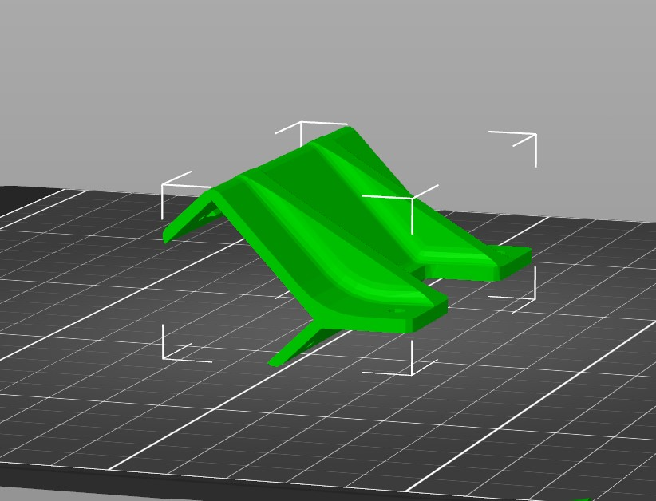

- AVR-CAM-ZED-MINI-MOUNT (x1)
  - STL Files: [AVR-CAM-ZED-MINI-MOUNT.stl](https://cad.onshape.com/documents/3111e54b1b04514aeae7a864/w/143325ef8d6ebdd537b470ee/e/b22e3b7065b1cd4f7302c1af?renderMode=0&uiState=6306944891cbbe0c90ef6159)
  - STEP Files: [AVR-CAM-ZED-MINI-MOUNT.stp](https://cad.onshape.com/documents/275a94e0083da92079e53590)
- AVR-BATTERY-STANDOFF-SMC (X1)
  - STL Files: [AVR-BATTERY-STANDOFF-SMC.stl](https://cad.onshape.com/documents/7e88ec918372d236e4c1704a)
  - STEP Files: [AVR-BATTERY-STANDOFF-SMC.stp](https://cad.onshape.com/documents/275a94e0083da92079e53590)

An infill of 15% should be sufficient for these parts.

For best prints, it is advised that you rotate the part onto its back for printing.

