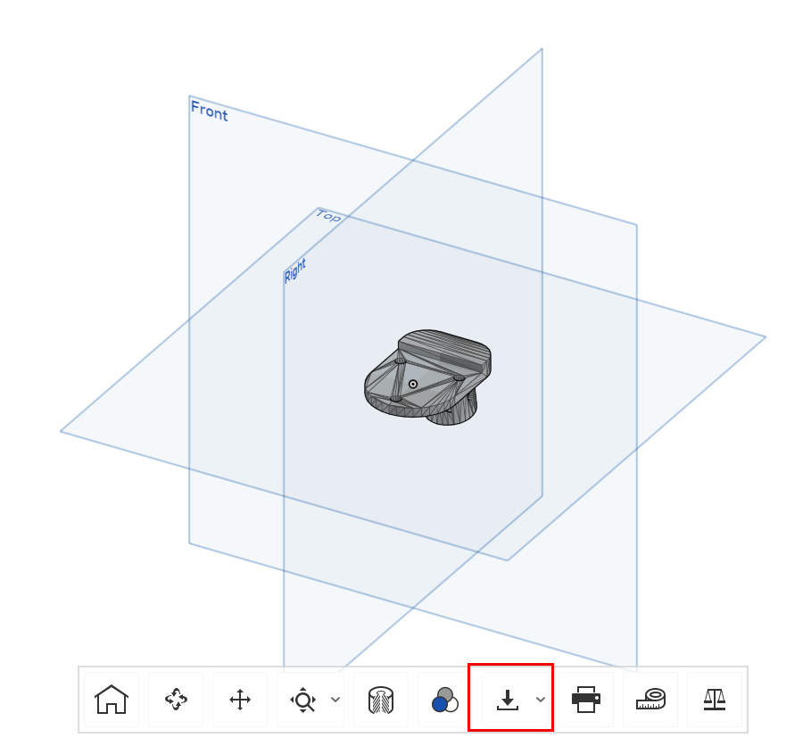
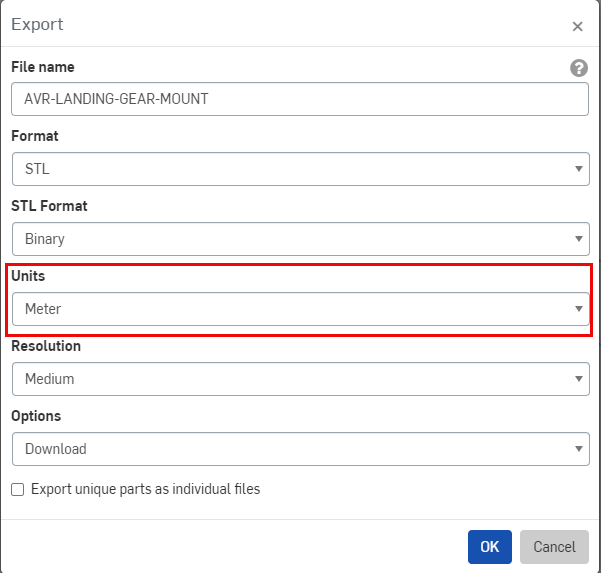
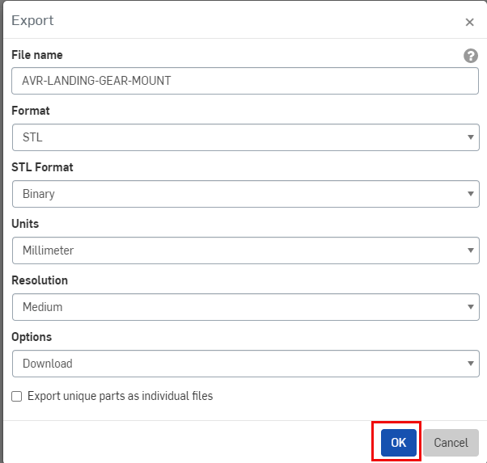

For AVR, you'll need to 3D print some parts for your drone.
While not needed immediately, these are good to get started with:

Explore each of the subsections to see what you'll need to print.

## Downloading

To download parts select the download button.

Change the units from Meters to Millimeters.

The export page should resemble the following.
Press OK.

