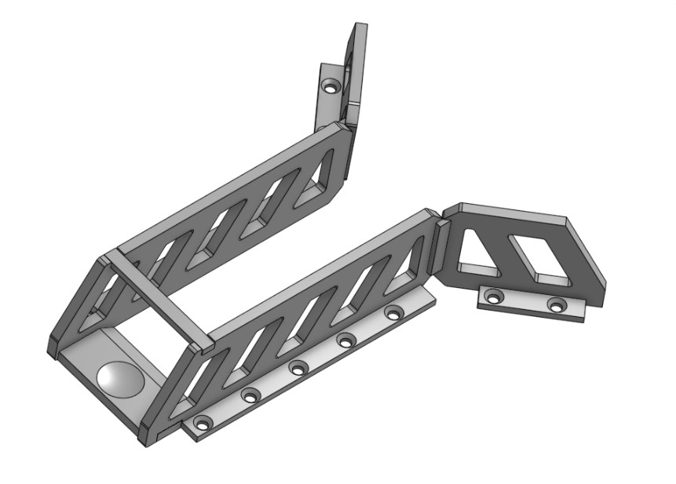

- CROSSBAR (x1)

  - STL file: [CROSSBAR.stl](https://cad.onshape.com/documents/0a00991ad04b3b3fcc73a95b)
  - STEP FILE: [CROSSBAR.step](https://cad.onshape.com/documents/b5616384cd64ee317b7f3233)

- FUNNEL-LEFT-1 (x1)

  - STL FILE: [FUNNEL-LEFT-1.stl](https://cad.onshape.com/documents/be491536e1bb08bbbc6272c3)
  - STEP FILE: [FUNNEL-LEFT-1.step](https://cad.onshape.com/documents/d6c46ccdc91dbc607be75f7a)

- FUNNEL-LEFT-2 (x1)

  - STL FILE: [FUNNEL-LEFT-2.stl](https://cad.onshape.com/documents/b65fb70a62071217f8e70f97)
  - STEP FILE: [FUNNEL-LEFT-2.step](https://cad.onshape.com/documents/9100d7b49563a8ffe3bad66d)

- FUNNEL-RIGHT-1 (x1)

  - STL FILE: [FUNNEL-RIGHT-1.stl](https://cad.onshape.com/documents/274985516e48cfac1de5a268)
  - STEP FILE: [FUNNEL-RIGHT-1.step](https://cad.onshape.com/documents/efafc10693f9f90dd0642c1d)

- FUNNEL-RIGHT-2 (x1)

  - STL FILE: [FUNNEL-RIGHT-2.stl](https://cad.onshape.com/documents/2aa468af82dede733df25947)
  - STEP FILE: [FUNNEL-RIGHT-2.step](https://cad.onshape.com/documents/1e80878336cfb94636082a36)

- GOLFBALL-HOLDER-PLATE (x1)
  - STL FILE: [GOLFBALL-HOLDER-PLATE.stl](https://cad.onshape.com/documents/8528a808215b93d124089e7e)
  - STEP FILE: [GOLFBALL-HOLDER-PLATE.step](https://cad.onshape.com/documents/e0418fcfaa11514ea343f796)

The fire escape platform was designed to be assembled using hot glue and should look
like the image below when completed. 15% infill should suffice for this assembly.

