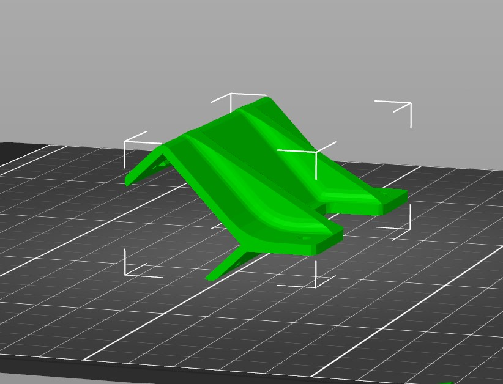
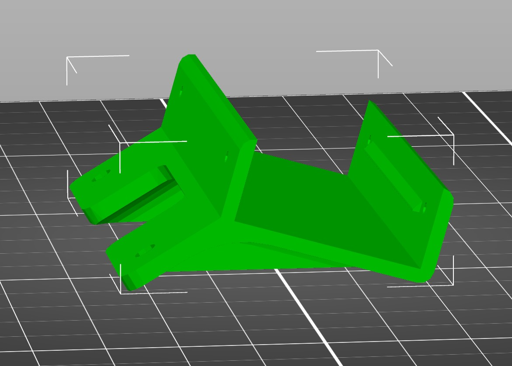

- AVR-CAM-ZED-MINI-MOUNT (x1)
  - STL file: [AVR-CAM-ZED-MINI-MOUNT.stl](https://cad.onshape.com/documents/275a94e0083da92079e53590/w/e0e9c910fe8fe3d17c846072/e/a02e64b6117d28952632b5bb)
  - STEP file: [AVR-CAM-ZED-MINI-MOUNT.stp](https://cad.onshape.com/documents/583faa803348f8994e357cc1)
- AVR-BATTERY-STANDOFF-SMC (X1)
  - STL file: [AVR-BATTERY-STANDOFF-SMC.stl](https://cad.onshape.com/documents/05fa168a306fc9b02dcde363)
  - STEP file: [AVR-BATTERY-STANDOFF-SMC.stp](https://cad.onshape.com/documents/7e88ec918372d236e4c1704a)

An infill of 15% should be sufficient for these parts.

For best prints, it is advised that you rotate the part onto its back for printing.

