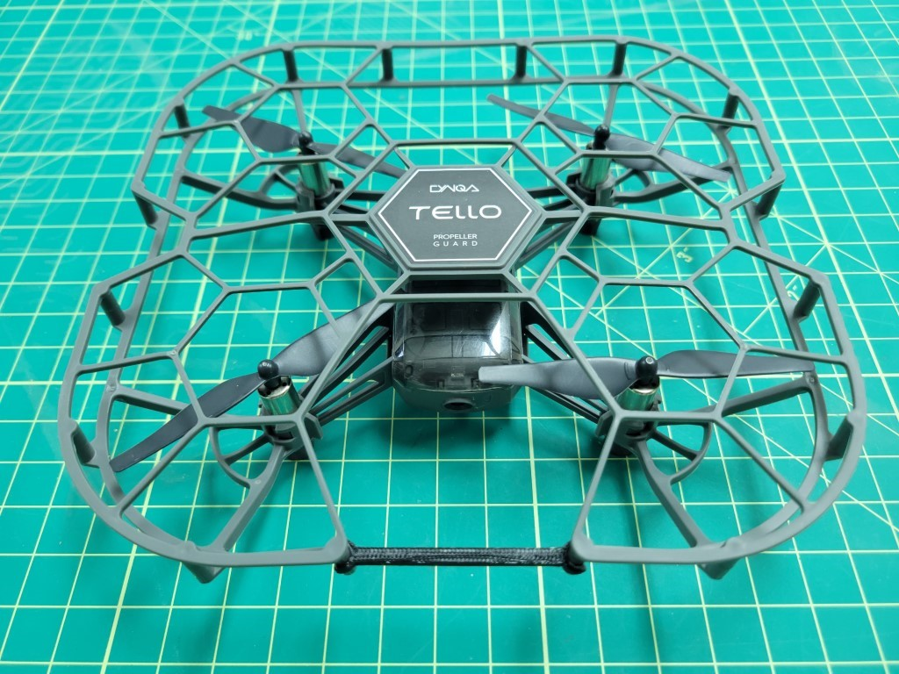

- AVR-TELLO-CAGE-BRACKET (x1)
  - STL file: [AVR-TELLO-CAGE-BRACKET.stl](https://cad.onshape.com/documents/48983f6b36ff3822e8dc8726/w/2a2bc308590d3bfe38b56c55/e/80e492c7ebf9fb31af4a6b3e)

This bracket goes on the front of the Tello to prevent it from getting stuck in the AVR net.

