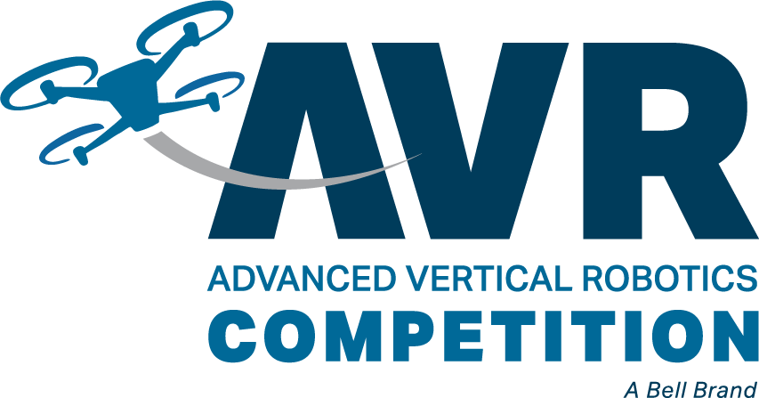

## Introduction

Welcome to the documentation for the Bell Advanced Vertical Robotics competition!
Be sure to pay attention to the navigation links on the left and please keep in mind
that this documentation is a **living document** that will be constantly updated over time.
There will be new sections added, typos fixed, and bugs squashed throughout
this process.

{}
It is **incredibly important** to follow the steps outlined in this documentation in
order. The navigation on the left provides a sequential ordering of steps.
{}

## Requirements

To be able to successfully compete in AVR, you must have the following
available to you:

- A 3D printer (8.5" cubed) with 1 roll of ABS filament
- A laptop with one of the following:
  - Windows 10/11 with admin privileges
  - x86 MacOS (M1 chips are not supported yet for AVR)
  - Ubuntu 20.04+-based Linux (Pop!\_OS, Mint, etc) with `sudo` privileges
- Basic shop tools and supplies:
  - Zip ties
  - Soldering iron
  - Screwdrivers
  - Basic nut drivers / hex keys (mostly metric M3 / M2.5 sizes)
  - Scissors / wire cutters
  - Heat shrink
  - etc.

A good kit that contains most of the tools that you will need can be found here:
[Tool Kit](https://www.amazon.com/Hobbypark-Professional-Screwdriver-Quadcopter-Helicopter/dp/B07MM2MZDK/)

## Useful Links

- [RoboticsEducation.org](https://www.roboticseducation.org/teams/bell-advanced-vertical-robotics/)
- [Game Manual](https://www.roboticseducation.org/documents/2022/08/emergency-firefighting-challenge-bell-avr-competition-game-manual.pdf/)
- [Game Video](https://youtu.be/iJml75fcsLg)
- [Bell AVR Forum](https://www.bellavrforum.org/)
- [Software Source Code](https://github.com/bellflight/AVR-2022)
