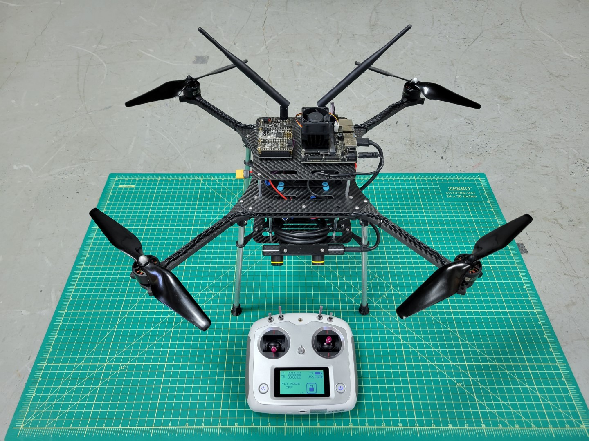
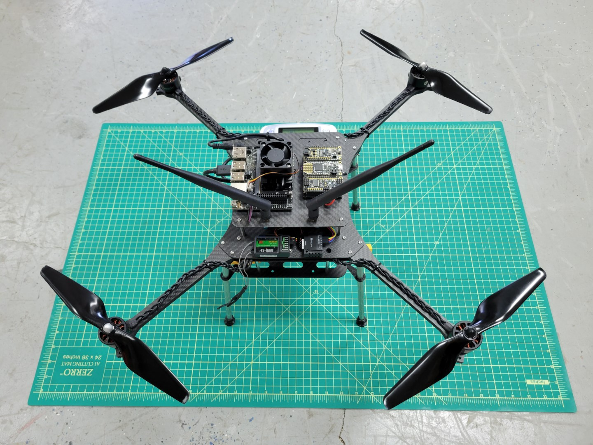
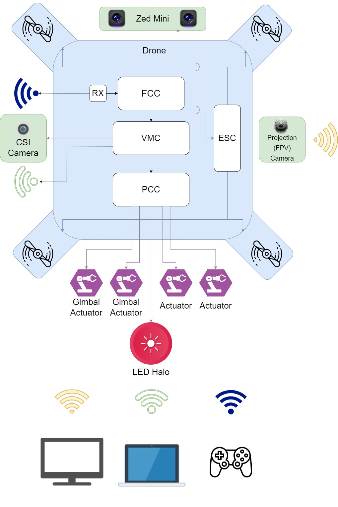

Please make sure you've successfully **built** and **flown** your basic AVR drone.
You will be making some extensive modifications to your drone in
preparation for advanced assembly.

The modifications for advanced assembly will require some disassembly and the following
additions to your drone:

- **3D printed components**
  - For mounting various cameras and peripherals
- **Power setup for VMC and PCC**
  - Power distribution board soldering
  - Y-cable to split power between PDB and ESC
  - Buck converters for powering VMC and PCC
- **Telemetry cable**
  - For communication between VMC and FC
- **Vehicle Management Computer (VMC)**
  - Runs AVR code
  - Interfaces with external sensors
  - Provides wireless interface with PX4
- **Peripheral Control Computer (PCC)**
  - For LED and servo actuation
- **ZED Mini Tracking Camera**
  - For real-time mapping of the environment
  - For position hold

