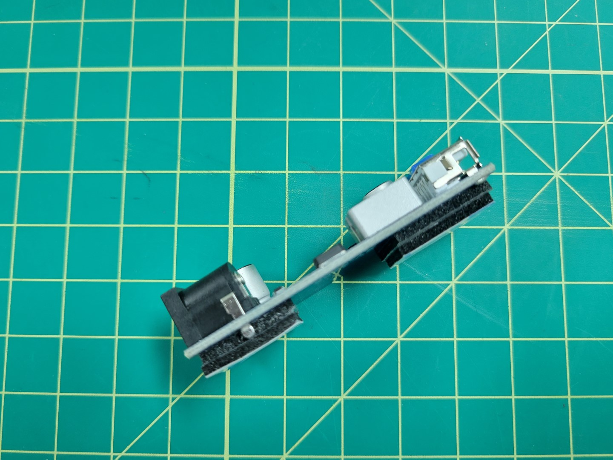

## Overview

Wire management is an important part of any drone build.
It will make your build easier to maintain, look professional, and keep wires from potentially getting caught in your drone's propellers.
In the previous section we pre-soldered the VMC/PCC power wires and mounted the PDB.
Now we will focus on wiring and mounting the buck converters.

The power wires from the PDB will be run through the mid-plate assembly to the front of the AVR drone.
This is necessary to make sure the wires do not interfere with battery mounting, which we'll cover in an upcoming section.

{}
A quick reminder that we try to supply you with best practices for your drone assembly.
In some cases you may chose to venture out and find a better way to accomplish a task.
That's completely fine and you're highly encouraged to do so!
We even encourage you to share a given solution in
<a href="https://www.bellavrforum.org/" target="_blank">our forums</a>.
{}

## Wiring

The PDB and ESC are both mounted near the right rear of the frame.
The buck converters will be mounted near the front of the frame.
This means we need to run the cables up through the mid-plate assembly and drop them down in the front of the frame.

Feed the wires into the mid-plate assembly and zip tie them to the mid-bottom plate as shown in the photo below.
Securing these wires is important as you don't want them to interfere with battery mounting.

Drop the wires down through the two large oval cutouts in the mid-bottom plate as shown in the photo below.

{}
It is much easier to feed the wires through the mid plate assembly by temporarily pulling
your excess motor/ESC wire out of the frame to free up space.
Be sure not to accidentally disconnect them!
{}

## Mounting

We will mount the buck converters using the 3M double-sided tape provided in your AVR kit.
The solder joints on the bottom of the buck converters stick out a good bit so we will double-stack tape on each end.
The reason for this is that we do not want to the solder joints to accidentally make contact with the carbon fiber plate.
This could lead to a short circuit. Cut one of the 3M squares into four pieces as shown in the photo below.

Double stack the tape on each end of the buck converter as shown in the photo below.
Repeat the process for the other buck converter.

Before securing the buck converters to the AVR frame we will connect the input leads to the screw terminals on each buck converter as shown below.

{}
Make sure you are connecting the input power leads to the terminals labeled **VIN+** and **VIN-** on the buck converter.
These are located next to the barrel jack.
{}

{}
You want to tightly screw down on the wires otherwise they may come loose.
If you find the wires are coming loose you can always remove them, tin them with solder, and try screwing down on them again.
{}

Take the remaining 18 gauge wire (the wire you used to supply input power from the PDB to each buck converter) and connect it to the output terminals on the PCC buck converter.
The PCC buck converter will be on the left side as drone is facing you.
You can see the output wires on the left side of the photo below.

VMC power is supplied with a barrel plug. Find the cable with the barrel plug in your kit and cut it to 8".
Remove the shielding and expose about 1/8" from the positive and negative wires as shown in the photo below.

Connect the positive and negative leads to the output terminals on the VMC buck converter.
Once again, screw down tightly on the terminals so that the wires do not come loose.

Stick the PCC buck converter on the left side of the bottom mid-plate and the VMC buck converter on the right (as the front of the drone is facing you).
Place each buck converter at a 45 degree angle with the output leads pointed towards each side of the frame.
The photo below shows the PCC leads on the left side of the frame and the VMC barrel plug on the right.

{}
Make note of the yellow circles in the photo below. These are the access holes for mounting the standoffs for the top accessory plate.
Be sure not to cover these holes when mounting the buck converters.
{}

The photo below shows the right side of the frame and clearance for the battery to slide into the tray.
The PCC will be mounted and powered from this side of the frame.

The photo below shows the left side of the frame where the battery can slide into place without any obstruction from the buck converters.
The barrel plug hangs off this side of the frame and will be used to power the VMC.

Take a quick look at the wiring orientation from a top down perspective.
In the next section we will build the top plate assembly and install it over the FC.

