## Overview

It's important that the FC and VMC can communicate with each other.
This bi-directional communication will allow us to receive telemetry
data from the FC and send data to it from the VMC. If you recall,
before we communicated with the FC using a micro-USB cable connected to a
PC running QGroundControl. What you will be able to do now is communicate over a
WiFi network, which will make this process easier.

In addition to a wireless link between the AVR drone and QGC you will learn
how to configure position hold capabilities using external cameras. You may
have noticed with the basic drone that the drone required constant input from the
pilot to maintain position in **stabilized** flight mode. With the assistance
of these cameras you will be able to hover in **position** mode with ease!
The cable we build in this section makes this all possible.

Locate the following components in the photo below:

- 6 pin cable from the Pixhawk box
- 40 pin connector housing
- 3 female to female wires (black, purple, and grey)

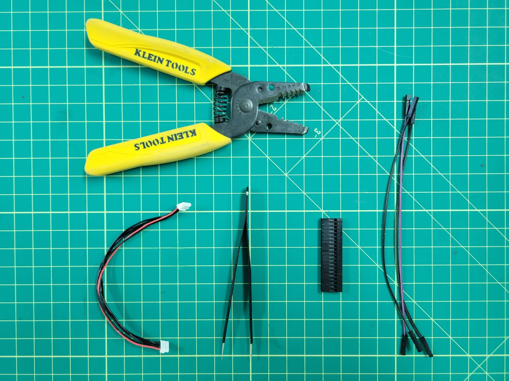

## Creating the Cable

Before we start building the telemetry cable let's take a quick look at the following wiring diagram. The middle area represents the 40 pin connector housing. Pay attention to the pinout from the connector housing to the **TELEM1** port on the Pixhawk FC. We will be using the following pins:

- Pin 2 - TX - Grey
- Pin 3 - RX - Purple
- Pin 6 - GND - Black

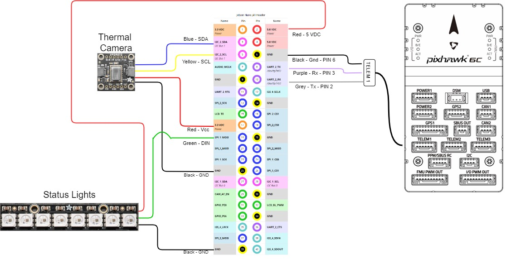

Using tweezers you will remove pins 1, 4, and 5 from the Pixhawk connector. This is done by prying the plastic tab for each pin as shown in the photo below.

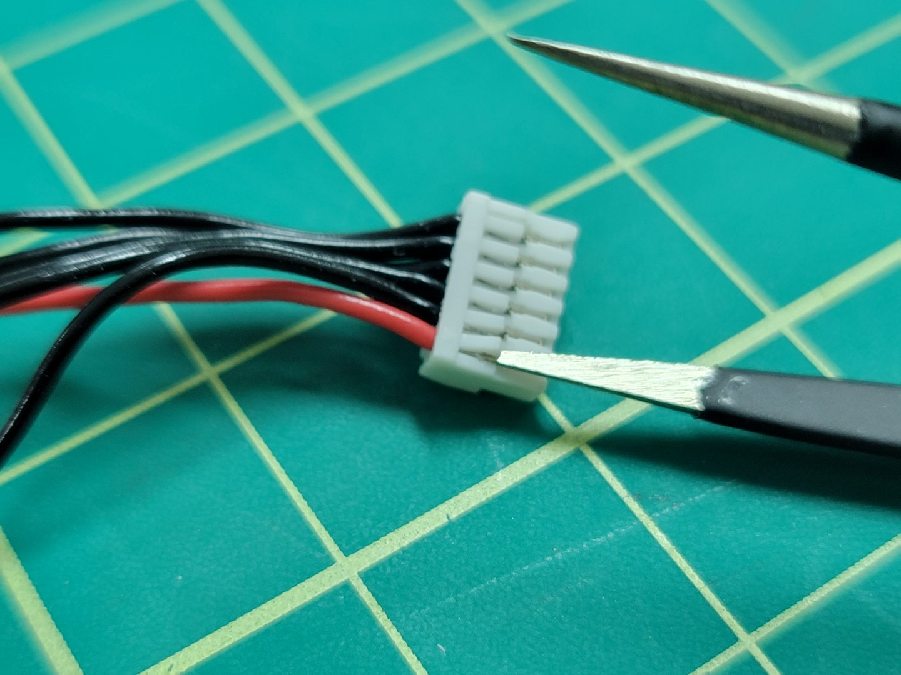

The photo below shows only the necessary pins remaining: pin 2, 3, and 6 from left to right.

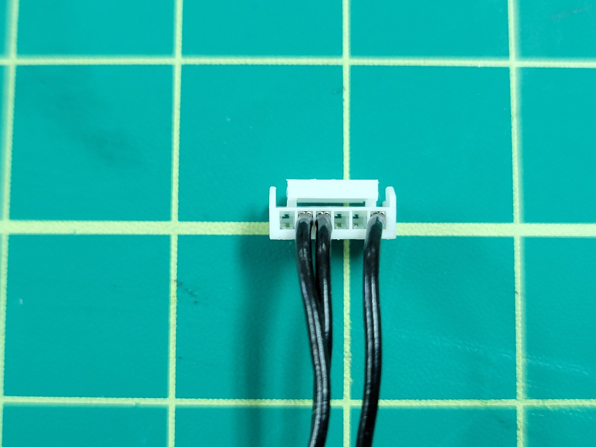

Clip the connector from the other end of the Pixhawk cable. Cut all three of the individual female-female wires to approximately 2-3". Strip 1/2" of shielding away from all wires as shown in the photo below.

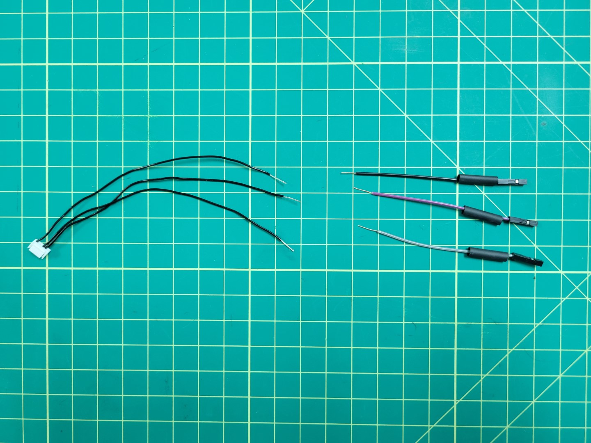

Prior to soldering make sure each colored wire matches the corresponding pin. The photo below shows one final check before soldering.

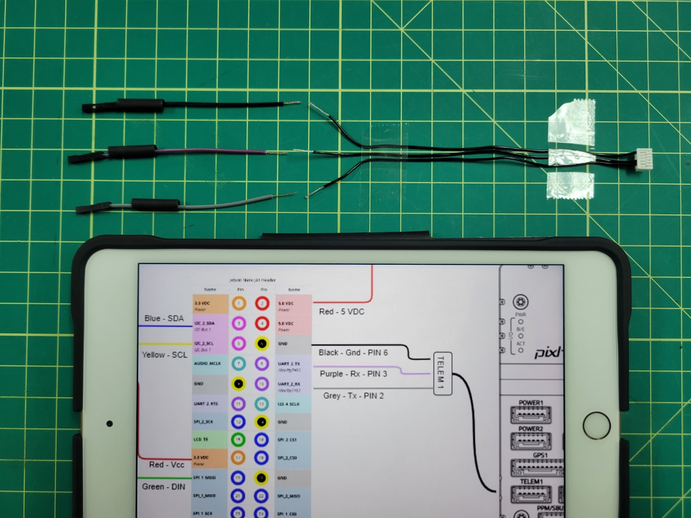

Join the wires using the "Twisted Helix" method we covered in the [ESC wiring]() during basic assembly.

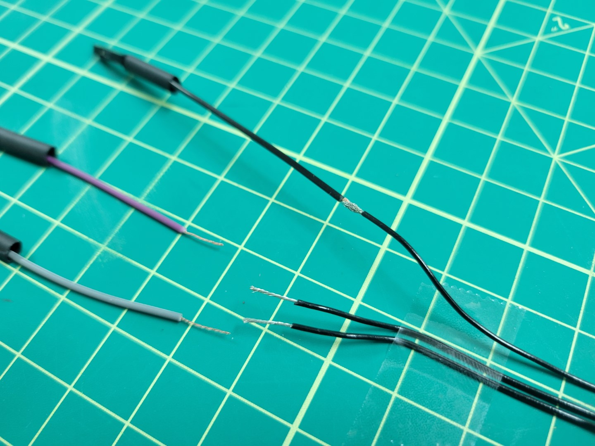

Solder all three wires and apply heat shrink.

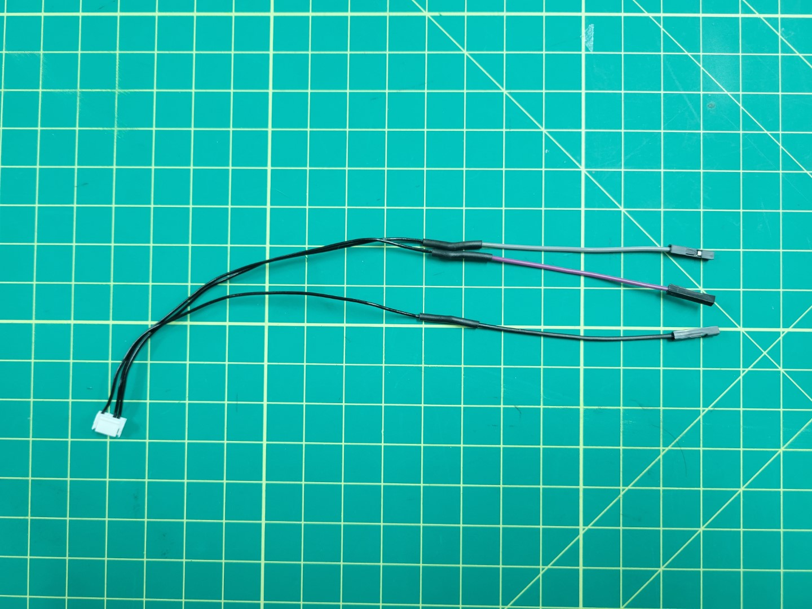

Remove the plastic connectors from the grey, purple, and black wires.

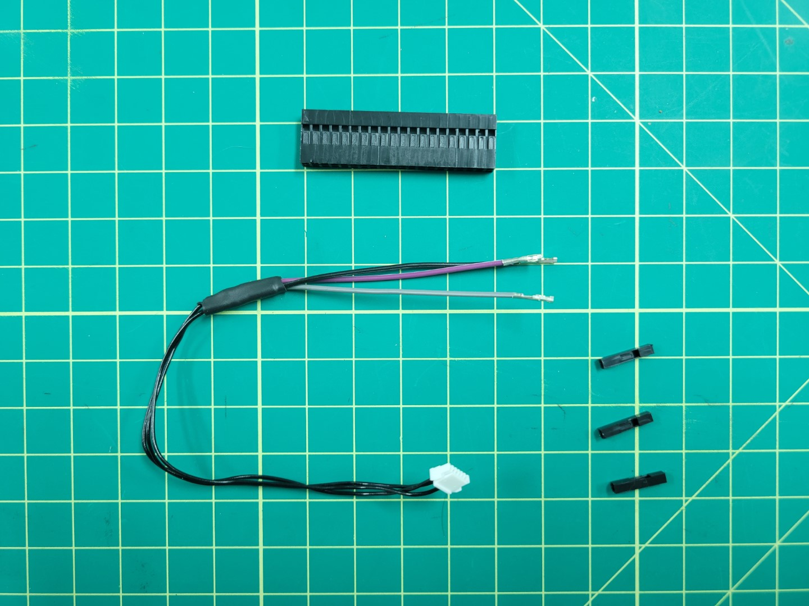

Insert all three wires into the 40 pin connector housing as shown in the following photos. If you're uncertain where to insert the wires refer back to the diagram in the overview section.

Make sure you hear each of the pins click into the connector housing. Inserting them properly into the housing will prevent them from accidentally getting pulled out.

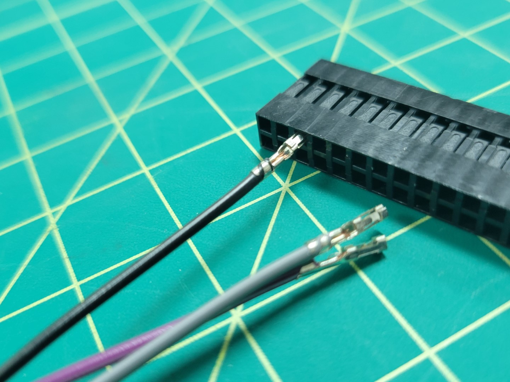

Now that your telemetry cable is complete you can do a test fit. Pay attention to the orientation of the 40 pin connector as seen in the photo below.

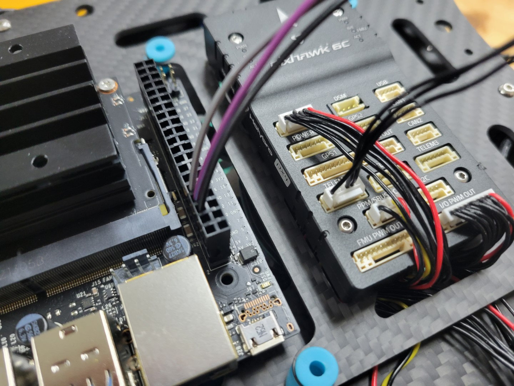
