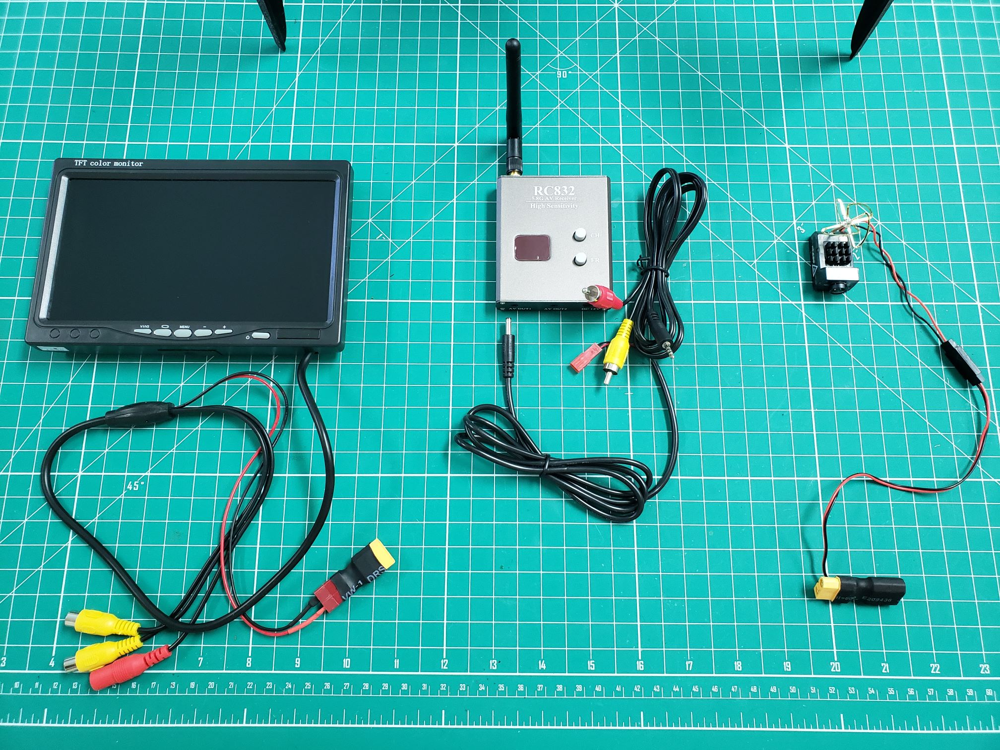
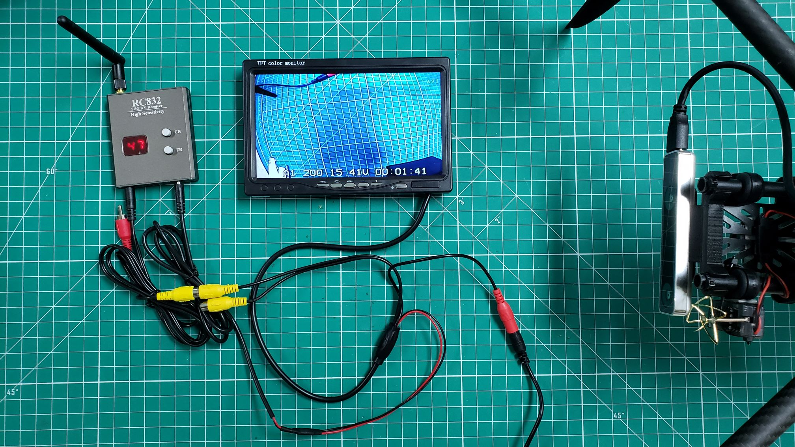

The FPV projection camera will be instrumental in providing a live video feed
to the GCS. This is done using a 5.8 GHz wireless link.
The components for this part of the build can be found in **Box 7** and include:

- FPV camera with built-in transmitter and antenna (mounted to AVR drone)
- FPV receiver (on the ground)
- FPV monitor (on the ground)

These components are shown in the photo below.

## Mounting

To mount the projection camera and built-in transmitter to the AVR
drone you will make use of double-sided tape and zip ties.

Cut a small piece of adhesive, fold it over, and attach it to the side
of your camera as shown below.

Press the camera securely onto the side of the ring mount of the camera plate
as show in the photo below. Fasten two zip ties together to create enough
length to wrap around both the camera and ring mount. This will ensure that
the camera does not come loose while in the air.

{}
Be gentle with the camera as the solder joint for the antenna is fragile.
You do not want to accidentally have the antenna come loose!
{}

Plug the XT-60 connector from the camera into the XT-60 connector of the
FC's power module. This will allow the Venom battery to power the camera
and the AVR drone.

{}
There will be some slack in the power cable between the camera and
the XT-60 connector. Use your best judgment regarding how much slack to
leave available. Given you will be powering the system with the Venom battery
repeatedly, you do not want to put any strain on the camera during this process.
{}

## Receiver Power

With the camera and transmitter mounted to your AVR drone the next step
is to provide power to the receiver and monitor. The monitor and receiver
power cables will be cut and soldered together.

Go ahead and cut off the Deans connector (red with two brass contacts)
from the monitor cable and JST connector (red plug) from the receiver
power cable. Strip the cables and place heat shrink over the monitor
power cable as shown below.

After soldering the cables and applying heat shrink your
connections should look identical to the photo below. The wall power
supply can be located in **Box 7** and plugs into the red
barrel jack of the monitor cable.

## Receiver Connection & Frequency

The next step is to make sure your video connections are set up properly.
This will enable you to receive the video feed from your AVR drone on the
FPV projection monitor. Plug the yellow RCA plug from the receiver cable
into the **V1** input from the monitor as shown below. Plug the other end of the
receiver cable into the port labeled "AV Out 1".

The final step is to make sure your receiver band and channel are set properly.
Go ahead and power up your AVR drone (using the battery) and receiver/monitor
(using wall adapter). Turn on your monitor and there's a good chance you won't
have a video feed yet. Make sure your monitor is set to **AV1**, which can be toggled
using the **V1**/**V2** button on the monitor. In the top right of the
screen you'll see **AV1**.

By default the FPV projection camera will be on frequency band 4.
Click the **FR** button on the receiver until it displays 4 as the first number on
the display. Within this frequency band you will need to find the right channel.
Since everything is powered up you can simply press the **CH** button until you see
the video feed displayed on your projection monitor. Make note of this channel in
case your receiver settings accidentally get reset.

If you have any problems getting your FPV projection system up and running
please don't hesitate to post in the
[Ask an Engineer](https://teams.microsoft.com/l/team/19%3a21c615dc691c4f289fb9fda44c862df3%40thread.tacv2/conversations?groupId=6baa0f71-7580-4c72-905f-2b6ee58685c3&tenantId=771923a0-2465-44c5-8531-b9366e228aad)
channel in Microsoft Teams.
