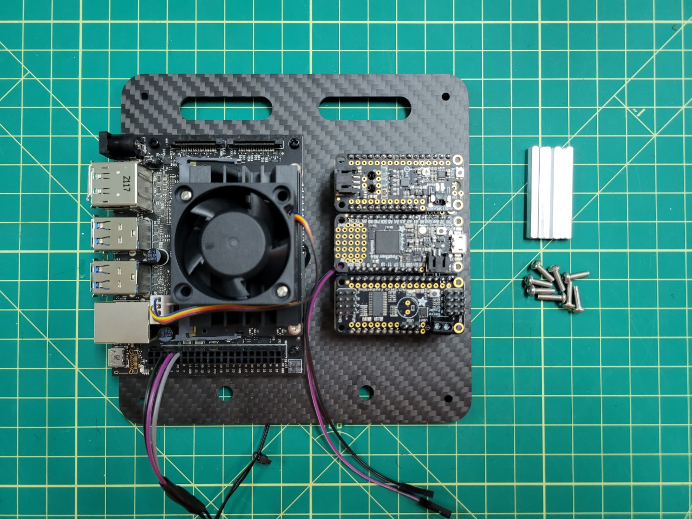

## Overview

In this section we will cover mounting the VMC and PCC to the top accessory plate followed by attaching the plate over the FC. Locate the ziploc bag of 2.5mm nylon hardware. We will be using the 6mm nylon standoffs, bolts, and nuts. Make note of the four holes around the larger cutout on the left. This is where we will mount the VMC. In addition, make note of the four holes around the smaller cutout on the right. This is where we will mount the PCC.

Start by placing the 6mm standoffs facing down through the mounting holes in the top plate. Use a 2.5mm nut to secure each of the standoffs.

The photo below shows the completed standoff installation.

## VMC Mounting

We will now mount the VMC to the top accessory plate. The VMC is the "brains" behind your AVR drone build and will be responsible for running the Bell software stack during testing and on competition day.

With the standoffs secured into the top accessory plate the next step is to attach the VMC. These standoffs will provide enough clearance for the VMC so that the solder joints beneath do not make contact with the carbon fiber plate. Carbon fiber is conductive, which means that it can cause your board to short out if two leads touch the plate.

Align all four of the VMC mounting holes over the 6mm standoffs and secure into place with the nylon bolts. The VMC will be mounted on the left of the top accessory plate with the USB ports facing out.

The orientation of your top plate and VMC should look identical to the photo below.

## VMC Cooling Fan

During advanced testing you will be running the AVR software stack on your VMC.
Since we make extensive use of the VMC's CPU and GPU it can heat up significantly.
It's important to keep your VMC cool and in this section you will install a cooling
fan onto the top of the VMC heat sink.

There are two nuts and bolts included in a small ziploc bag with your cooling fan. Place your cooling fan on top of the heat sink and insert two bolts, on opposite corners, through the fan and the heat sink.

{}
The nuts provided with the cooling fan are not self-locking.
It's a good idea to use a small amount of Loctite to keep them secure.
{}

Use needle nose pliers to hold the nut in place and screw the bolt from the top using a Phillips head screwdriver.

Repeat the process for the other nut and bolt. Attach the fan's power cable to the VMC as shown in the photo below.

{}
The cooling fan automatically turns on to 100% when the VMC is powered on.
This functionality was installed as part of the AVR software, and helps
keep the VMC cool.
{}

## PCC Mounting

Let's proceed with mounting the PCC to the top accessory plate. Make note of the photo below and that the micro USB port is facing outward.

We will secure the PCC with four nylon bolts. The easiest way to do this is to remove the top and bottom PCC boards as shown in the photo below.

Replace the boards back into the PCC and mounting is complete!

## Top Accessory Plate Mounting

Before we can place the top accessory plate onto the drone we must screw the antenna connectors into place.
Run the VMC and PCC cables through the bottom of the plate as shown in the photo below.

With the VMC and PCC attached to the top accessory plate and wires routed let's proceed
with mounting the plate over the FC using 40mm standoffs and 10mm M3 screws.

Place blue Loctite on one of the 10mm screws.

There are four access holes in each corner of the bottom mid-plate, close to where you mounted the 3D printed landing gear.
Use a long hex driver to feed the screw up through the bottom accessory plate and through the mid-plate assembly.

Another option is to use a short L-shaped hex key to feed the screw into the hole.

Hand tighten the 40mm standoff onto the screw.

Securely fasten the standoff and repeat the process for the other three standoffs.

Connect the telemetry cable from the VMC to the **TELEM1** port on the FC.

Use four 10mm screws to mount the top accessory plate onto the standoffs. Do not forget to use blue Loctite on each of the screws.

{}
Make sure the top accessory plate is mounted with the VMC on the left and PCC on the right as you're standing behind the AVR frame.
{}

## Wiring

Connect the barrel plug from the VMC buck converter to the VMC power input.

{}
Make note of the jumper in the photo below.
The jumper must be in place for the VMC to be powered using the barrel jack.
If you need to revert to power over the micro USB port you can move the jumper so that it's only connected to a single pin.
{}

Finally, cut the positive and negative wires from the PCC buck converter to length.
Trim 1/8" of shielding from the wires and connect them to the PCC power terminals as shown in the photo below.

