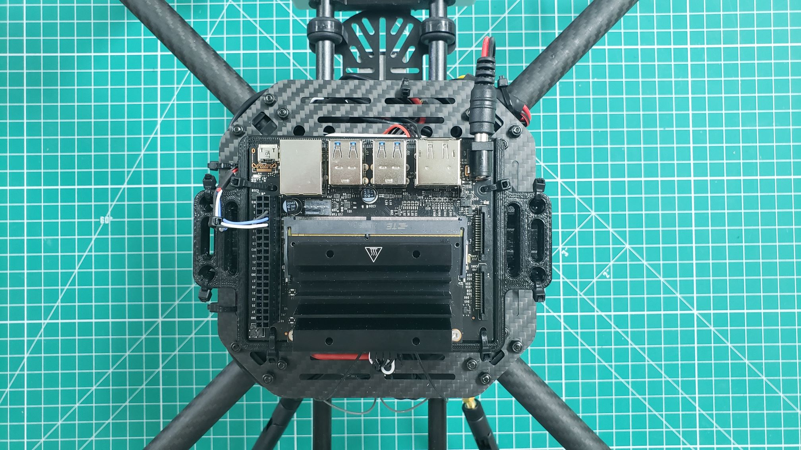

## VMC Mounting

We will now mount the VMC using to the top assembly plate.
The VMC is the "brains" behind your AVR drone build and will be responsible
for running the Bell software stack during testing and on competition day.

Screw your stand offs into the top assembly plate.

With the stand offs fasted into the top accessory plate the next step is to attach the
VMC to the Standoffs.
These standoffs will provide enough clearance for the VMC to top plate and not have the
solder joint at the bottom rest on the carbon fiber plate.
Carbon fiber is conductive, which means that it can cause your board to short out if
two leads touch the plate.
Be sure you have your VMC ports facing outboard from the drone so you are able to easily
plug things in.

Once the VMC is placed, use the M2.5 nuts to secure your VMC in place.

After attaching your VMC, your top assembly plate should look like the following photo.

### Cooling Fan

During advanced testing you will be running the AVR software stack on your VMC.
Since we make extensive use of the VMC's CPU and GPU it can heat up significantly.
It's important to keep your VMC cool and in this section you will install a cooling
fan onto the top of the VMC heat sink.

# TODO: 2 nuts/bolts

We are only using 2 nuts and bolts this year because due to supply chain issues... some of the images might have to be slightly reworked.

Place your cooling fan on top of the heat sink and insert two bolts, on opposite corners,
through the fan and the heat sink. Using needle nose pliers you can hold
the nut into place and screw the bolt tight with a Phillips head screwdriver.

{}
The nuts provided with the cooling fan are not self-locking.
It's a good idea to check them from time to time or use a small amount
of thread locker to keep them secure.
{}

After mounting the cooling fan plug the connector into your VMC as shown below.

{}
The cooling fan automatically turns on to 100% when the VMC is powered on.
This functionality was installed as part of the AVR software, and helps
keep the VMC cool.
{}

## PCC Mounting

## Top Accessory Plate Mounting

## Wiring

Ensure you FCC->VMC wiring is complete from the 
[previous section]({{relref "../ }})

At this point you can go ahead and connect the 2x20 crimp housing
and barrel plug into the VMC as shown in the photo below.

