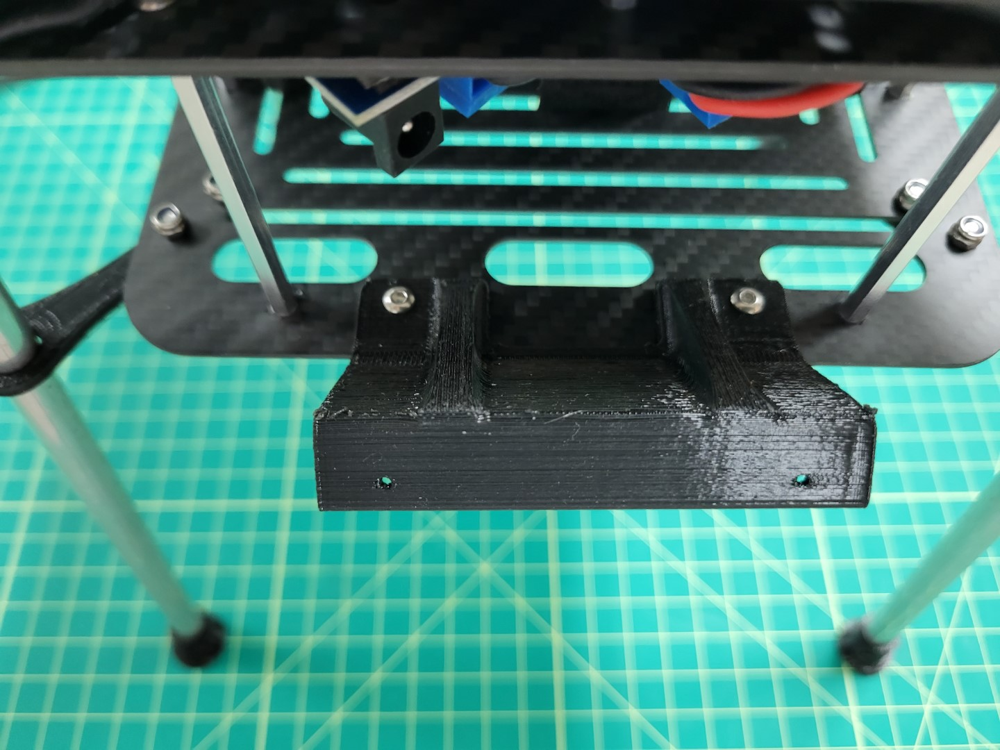
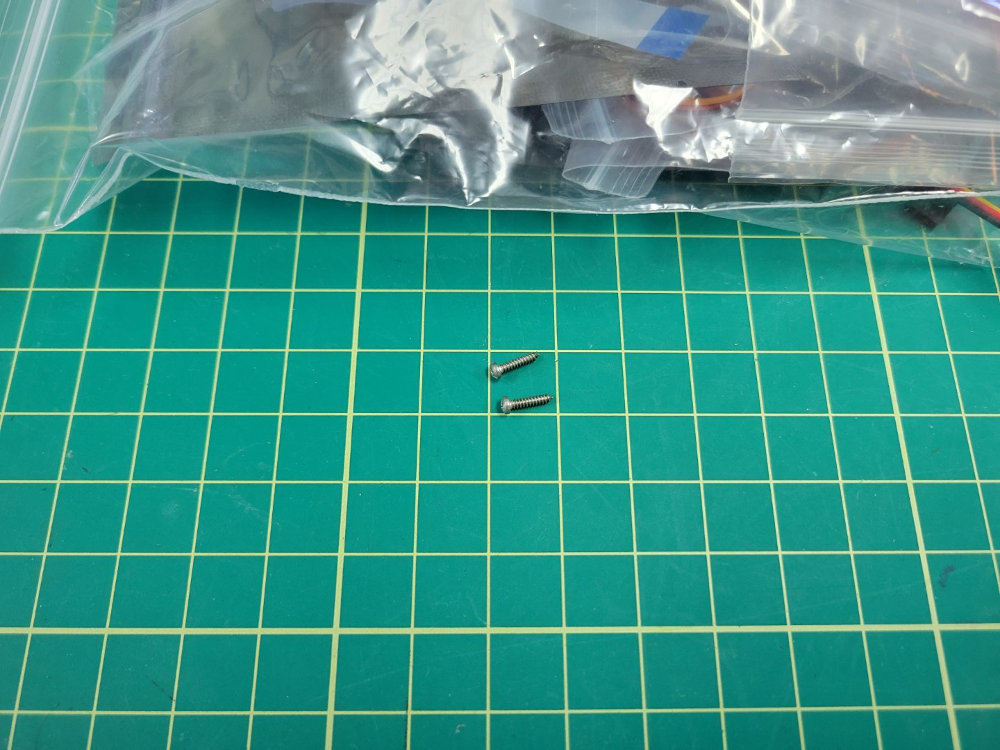
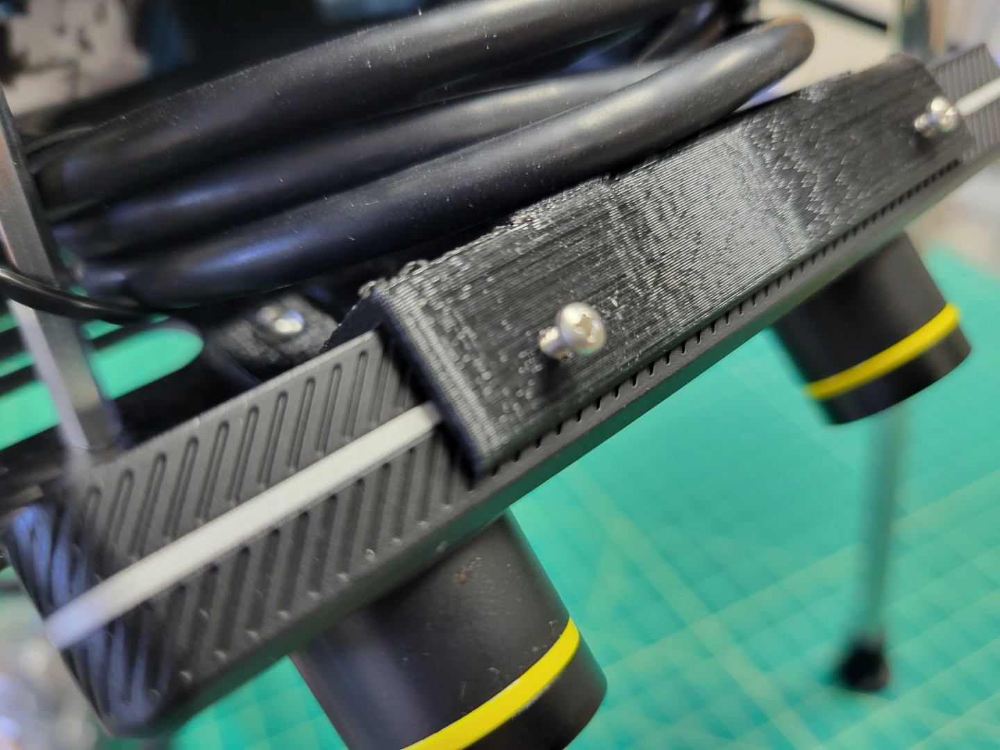
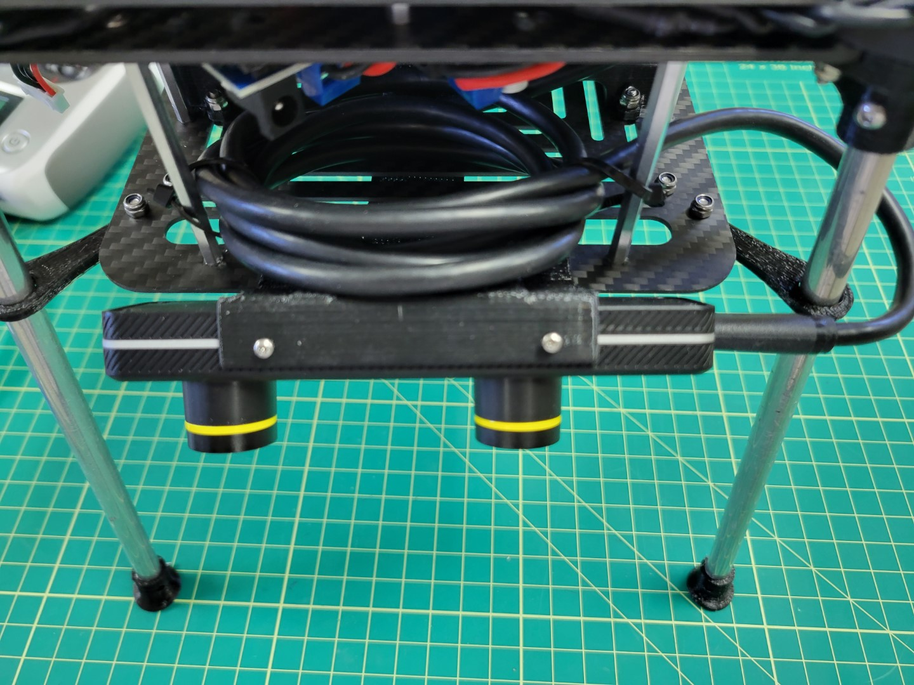

The ZED Mini will be mounted to the front of your AVR drone and connected with a USB-C
cable. This camera is instrumental in mapping out
the environment in real-time and providing location updates to the VMC.
This enables your AVR to "see" and maintain it's current position without GPS!

You should have printed the
[Zed Mini mount from the 3D Printing section]()
of this documentation. The ZED Mini should clip into your 3D printed mount securely.

Secure the camera mount to the bottom accessory plate with two M3 8mm screws and lock nuts.

You will notice that the mount points 45 degrees downward. This aids in tracking both in front and beneath the AVR drone.

Snap the ZED Mini into the mount. Make sure that the ridges in the mount snap into the recessed areas on the top and bottom of the camera. You should not be able to slide the camera left and right when properly secured.

{}
You will notice there is a bit of play when you wiggle the camera back and forth. This can cause problems for ZED Mini's internal sensors. We will further secure the camera with set screws from the servo hardware.
{}

Locate the large ziploc bag inside the **AVR Drone Peripherals** box. Inside this bag there are several screws floating around. You will need two of them that look like the ones in the photo below.

Use a Phillips head screwdriver to thread both screws into the 3D printed mount.

{}
The set screws will not go all the way in. Screw them until you make contact with the threaded hole in the ZED Mini. At this point you will feel a bit of resistance and can stop.
{}

Wiggle the camera left and right to see if there is any play. If so, turn the set screws half a rotation. Repeat the process until the camera is fully secured.

Finally, you can plug the USB cable into the side of the Zed Mini
and into one of the ports on the VMC.

The Zed Mini has a unique USB-C cable so unfortunately it is going to be a little longer
than you need. We suggest rolling the cable up and tucking it between the bottom and
bottom-mid plate for cleanliness.

{}
As you're going through the build process make note of any cables that may
obstruct the drone's propellers. The photos provided throughout this documentation
show how we've mounted things and provide a sufficient amount of clearance.
{}
