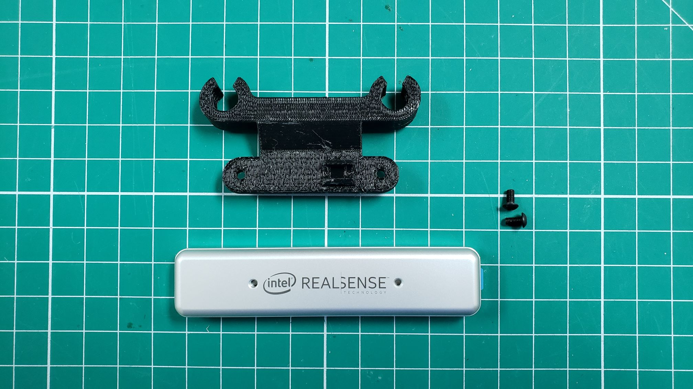

The Zed Mini will be mounted to the front of your AVR drone and connected with a USB-C
cable. This camera is instrumental in mapping out
the environment in real-time and providing location updates to the VMC.
This enables your AVR to "see" and maintain it's current position without GPS!

You should have printed the
[Zed Mini mount from the 3D Printing section]()
of this documentation. The Zed Mini should clip into your 3D printed mount securely.

# TODO: Need to replace

First, you will need to attach your 3d printed mount to the front of the bottom plate of
your drone.

# TODO: Need to replace

needs image of zed mount on drone

Next, you can clip your zed mini into the 3D printed mount.

# TODO: Need to replace

needs image of zed in mount.

{}
If you feel that the Zed Mini is not secure in the 3D printed mount we recommend
adding a zip tie around the center. This will keep the Zed Mini from coming free.
{}

# TODO: Need to replace

needs image of zed in mount.

Finally, you can plug the USB cable into the side of the Zed Mini
and into one of the ports on the VMC.

The Zed Mini has a unique USB-C cable so unfortunately it is going to be a little longer
than you need. We suggest rolling the cable up and tucking it between the bottom and
bottom-mid plate for cleanliness.

{}
As you're going through the build process make note of any cables that may
obstruct the drone's propellers. The photos provided throughout this documentation
show how we've mounted things and provide an sufficient amount of clearance.
{}
