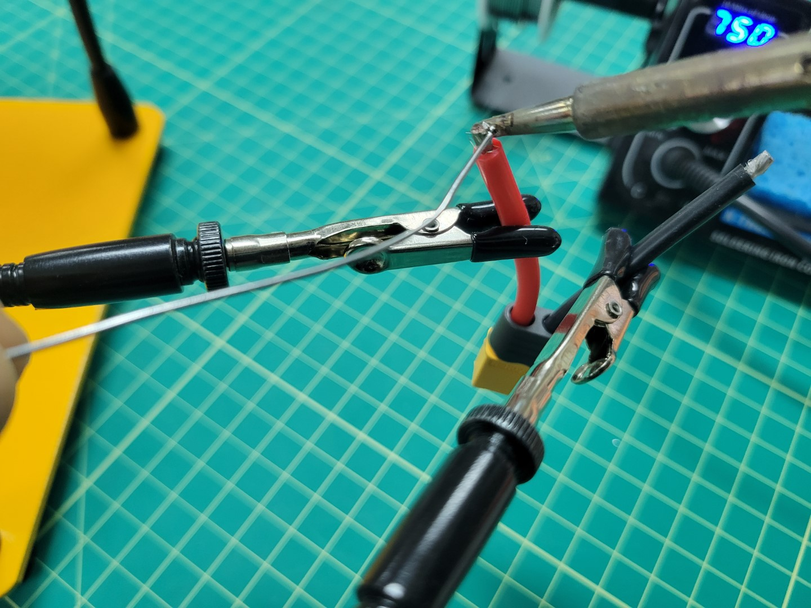
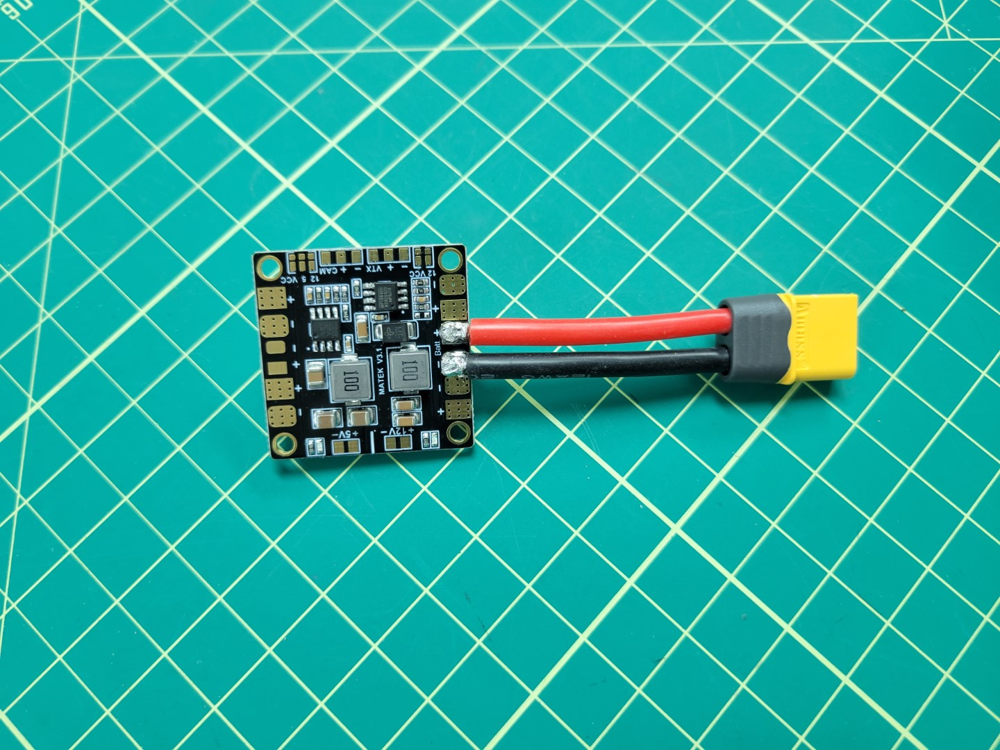

## Overview

Two main components of your advanced build are the **Vehicle Management Computer** (VMC), which runs the AVR software stack and the **Peripheral Control Computer** (PCC), which will allow teams to manually and programmatically control the LED ring, actuate up to four servos, and control the laser.

This section will walk through the necessary steps for providing adequate power to both the VMC and PCC.
This will be done with two separate buck converters.
The main battery of your AVR drone is 16.8V fully charged.
The required input voltage for the VMC and PCC are 5V, therefore the buck converters will step the voltage down to a usable 5V.

This section will work its way from the battery out to the VMC & PCC.

## Y-Cable

The Y-cable is the cable that splits the battery power into two directions: one for the ESC, and one for the PDB.

To create the wire cables use 3 of the 4 pre-soldered XT60 cables from the kit, 2 females and one male.

Firstly, cut each cable to approximately 1.5 inches and solder the ends so that they are ready to combine. The end result should look similar to the following.

Next, place heat shrink large enough to slide over the 3 cable solder joint on the side with 1 male connector. Then, solder the 3 ground (black) cables together.
Pull the heat shrink down over the end of the connection and apply heat.
If you have access to a heat gun or a lighter this will work well.
Alternatively, you can use the side of your soldering iron to apply heat and let the tubing shrink over your connectors.

Repeat for the voltage (red) cables.

Your finished cable should look like the photo below.

## Power Distribution Board (PDB)

Before installing the buck converters, the Power Distribution Board (PDB) will need to be soldered correctly. The PDB will allow us to split off power from the battery to each of the buck converters.

The first step is to solder on the battery leads to the PDB.
To do this cut 1 male XT60 cable to about 2 inches and tin the ends as we did with the y-cable above.

{}
Soldering the larger pads on the PDB requires skill and patience. If possible, we recommend using a flat tip on your iron instead of the normal pointed tip. This will allow for much better heat transfer.
{}

We recommend watching <a href="https://www.youtube.com/watch?v=GoPT69y98pY" target="_blank">this video that goes into great detail on soldering</a>. It's a lengthy video so at the very least you should scrub through it before attempting to solder the XT60 to the PDB.

You do not want the PDB to slide around while soldering. One of our favorite tricks is to use <a href="https://www.amazon.com/Blu-Tack-S050Q-Reusable-Adhesive-75g/dp/B001FGLX72" target="_blank">Blu Tack</a> to hold components in place.

Start the process by tinning the Batt +/- pads as shown in the photos below.

Place the positive wire onto the positive pad. Set the wire down on the pad and place the iron on top. Do not apply too much pressure as you do not want the wire to spread out. The iron should heat both the wire and the pad to form a single solder joint.

Repeat this process for the negative wire. Your completed PDB will look similar to the one below.

## Buck Converters

In the photo below you will notice two identical buck converters, one for powering the VMC and the other for the PCC. This section will work through the necessary wiring to supply power to the buck converters.

Cut the wires to make 4 \_**_8 or 6 or 4 inch_** wires; 2 black and 2 red. These will be used to connect the PDU to the ESC

Next, pre-tin the battery pads on the PDB

# TODO: Add image

Images of soldering on battery leads?
Possibly link to video?
This Guy is very thorough and i watched him when i was building mine...
I think he does say "fricken" at one point though, idk if that matters?
or if there is time for you to make a video that would be awesome,
but i know that is asking a lot.
https://youtu.be/GoPT69y98pY

Apply the soldering iron to the heat pad and start feeding the solder on to the ESC pad (do not the soldering iron itself, if the soldering pad is not heating up you can end up with cold soldering joints.)

Once the pads are pre-tinned it should like the following.

Next, apply solder to the wires to pre-tin them.

After pre-tinning everything, place the battery leads on the battery pad and push the soldering iron down on the top of the leads until it heats up the solder enough to start melting.
When doing this be sure to leave the iron on long enough so that the solder on the pad starts to heat up.

Repeat for the both wires.

After successfully soldering everything to the PDB, use a voltmeter to test and make ensure that there are no shorts between the positive and negative connections.

Repeat for the second set of wires.

You should now be at a place where you have all the parts as shown in the following image.

Place the PDU on top of the ESC standoffs and secure using M2.5 nuts from your AVR kit.

Next route the wires through the middle plate and back out to the front of the drone.
This will keep wires tidy, out of the way of the battery once assembled, and ready for attachment to the buck converters.
