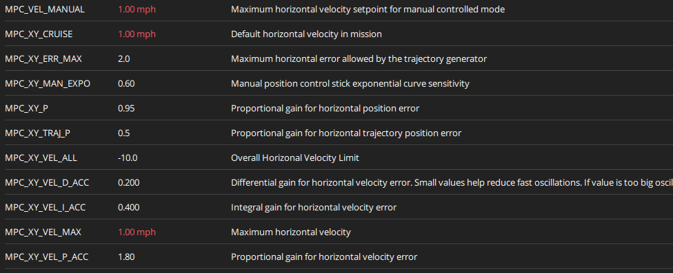

Teams are encouraged to learn and practice programming with their drone. While it is
**not mandatory**, programming the drone to perform tasks autonomously will give you an
edge in the competition.

To gain an understanding of how autonomy works with the AVR drone please watch the video below.

{}
Please make sure you know how to take manual control of your drone and update the home
location prior to launching your autonomous code.
{}

# 

Once you gain an understanding of how autonomy works through simulation you are ready to run your code on the real AVR drone. Make sure you pay attention to the following parameter:

```
MPC_XY_VEL_MAX
```

The default autonomous flight speed in PX4 is too fast for the AVR game court. You will need to slow it down. Our recommendation is something around 0.25 to 0.5 m/s, which is roughly 0.5 to 1 mph.

The example below demonstrates how we've set this param to 1 mph.



{}
Failure to lower the autonomy speed of your drone can lead to a crash and the need to rebuild your drone. Start slow and increase the MPC_XY_VEL_MAX param incrementally.
{}

The following sections will help you with:

- Installing and using VS Code to manage your project
- Installing and using Python
- Installing and working with git
- Using the Bell AVR sandbox environment
- Building and running your code with Docker
