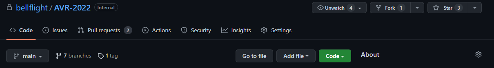

The AVR codebase is currently hosted on GitHub. Not to be confused with Git, GitHub is a cloud-based hosting service that lets you manage Git repositories. In order to customize the software on your drone, we ask you to create your own account, join an organization for your team, and host a version of that project in github

## GitHub Account

To get started, follow this [link](https://github.com/join) and create an account. If you already have a GitHub account, you are free to use that.

## Organizations

You'll want to create a group where you can set access permission for your code to the rest of your team. In your profile settings, [add an organization.](https://docs.github.com/en/organizations/collaborating-with-groups-in-organizations/creating-a-new-organization-from-scratch) If an organization has already been made, ask your team leader for access.

## Forking a Repo

Bell engineers have created the base AVR repository [here.](https://github.com/bellflight/AVR-2022) If you'd like to make changes to this codebase in order to modify your drone, you will need to **fork** the repository.

A fork is a copy of a repository. You will be able to make changes to the code without modifying the Bell codebase. To fork the AVR codebase, click on the **fork** button on the top right of the [AVR GitHub Repository.](https://github.com/bellflight/AVR-2022) If someone on your team has already done this, ask them to share access with you.



## Configure Jetson for the New Repo

Take note of the url of the repository you just made.


We will need to change the upstream URL on your Jetson. Run the following commands:

```bash
cd ~/AVR-2022/
```

```bash
git remote set-url origin https://github.com/your-username-here/AVR-2022
```

Your Jetson should now be configured for your forked Repo.
