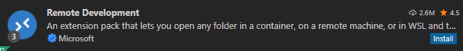
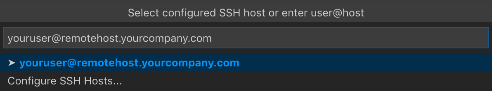
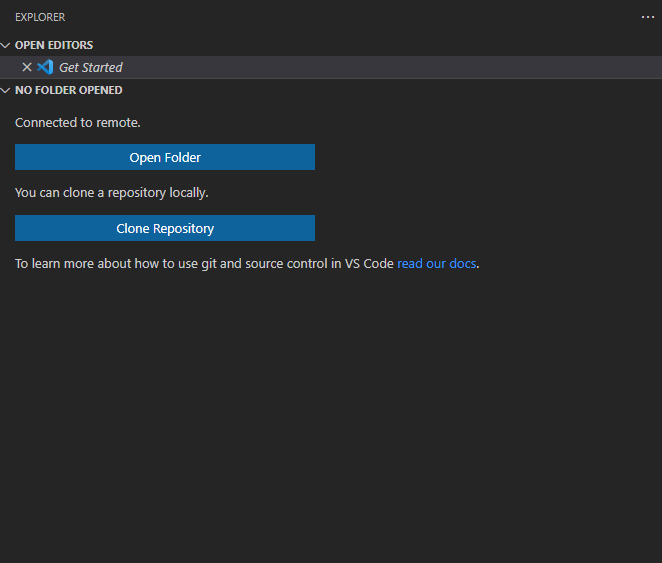
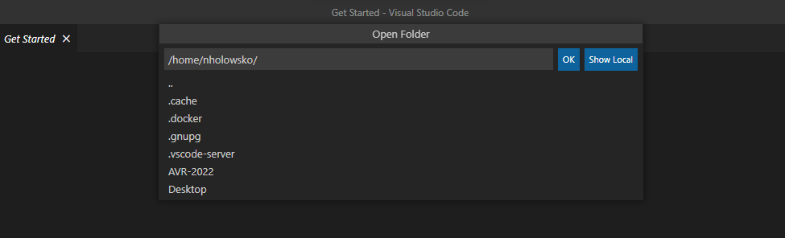

You should now be able to set up VS Code in order to modify code on your Jetson.
If you have not done this yet, familiarize yourself with using SSH to remote into your Jetson.

Take note of the username of your Jetson, and the host IP address.

## Remote Development with VS Code

VS Code has extensions that allow you to develop from a remote machine. From your VS Code window, install the remote development extension, from Microsoft.

Bring up the command pallette in VS Code by pressing _Ctrl+Shift+P_. Search "SSH" and select "SSH: Connect to Host"

Type your username@IPaddress and press enter. Select "Linux" as your operating system. You may be prompted at several times to enter the password to your Jetson.

A seperate VS Code window should open. You now have access to the directories on your Jetson. On the left pane, select "Open Folder".

When prompted, select the AVR-2022 location and press "OK".

You should now be ready for development on your Jetson.
