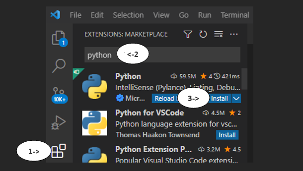
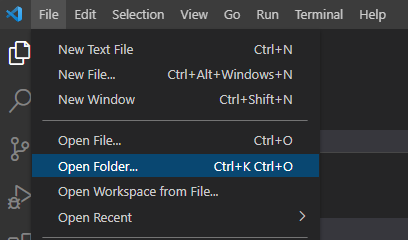
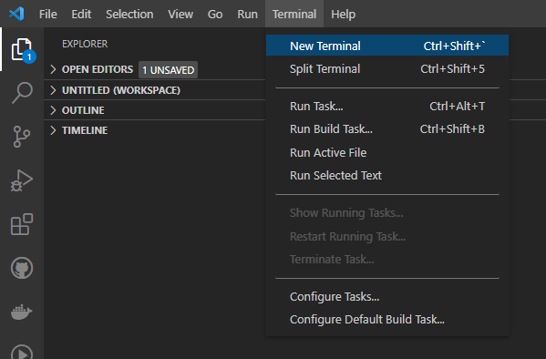

Python is a general purpose programing language. Being one of the most popular programming languages in the world, Python is known for readability and accessability. This section will walk you through installing Python and testing it on your machine.

## VS Code Extension

Before we get started, make sure you have the Visual Studio Code extension for Python. Go to your extensions tab, search "Python", and install.



This extension allows for debugging, auto complete, and python environment managemebnt in VS Code.

## Python Interpreter

An interpreter's job is to take the high-level code written by your team in VS code and to translate it into machine language that is executed by your computer.

The Python interpreter is installed from Python.org - install it from [here](https://www.python.org/downloads/release/python-3912/). Select the installer and run through the installation process.

To confirm your installation, open a command prompt window and execute the following command:

```bash
py -3 --version
```

If your installation was successful, the output window will show the version of Python you have installed.

## Setting Up a Project

Let's set up a central location to store your future projects. Start by creating a "Projects" folder somewhere on your PC. Within this folder, make a "Hello World" folder. This is where we will create your first project.

In a blank VS Code window, open up this folder:



In your new workspace, create a new file called "hello.py". The ".py" file format denotes a script written in python.

In this file, type the following:

```python
print("Hello World")
```

Congrats, you've written your first python script! Before we run it, we will need to set up a python environment.

## Setting Up a Python Environment

An "environment" is the context in which the python program runs. It consists of an interpreter and installed packages. We will be using "virtual environments". These are are environments that are project specific and stored within the project itself. To create one in your "Hello World" project, start up a terminal.



In this terminal, type the following to create the virtual environment folder in your project:

```python
py -3 -m venv .venv
```

To activate the environment:

```python
.venv\scripts\activate
```

The environment should now be activated. You're now set up to run your script. In the terminal, type and execute:

```python
py Hello.py
```

If you were successful, you should see "Hello World" printed in the console.
