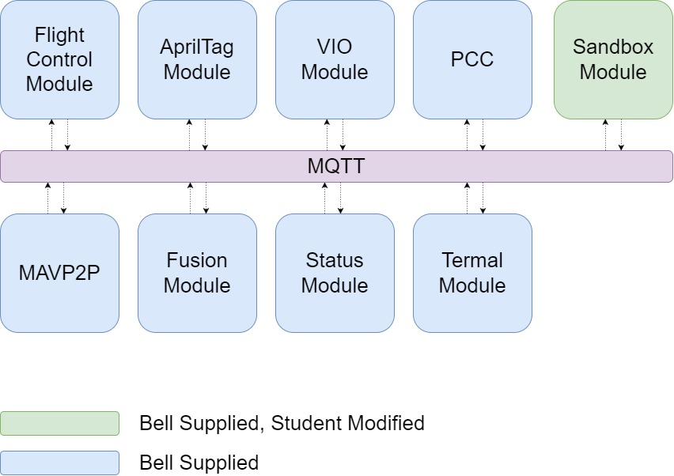
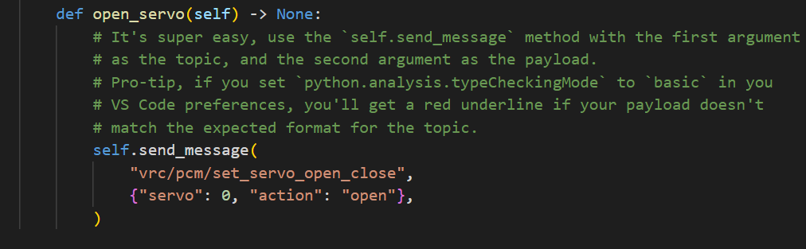

Your team will need to create a sandbox environment to develop from.

In the
[GitHub repository](https://github.com/bellflight/AVR-2022/tree/main/VMC/README.md)
we've provided an area for you to write
Python in order to accomplish your goals. The software stack for AVR is
made up of a series of modules, which are actually independent
[Docker Containers](https://www.docker.com/resources/what-container).

Below is a graphic that shows the individual containers:

All of these modules communicate with each other over a message bus called
[MQTT](http://www.steves-internet-guide.com/mqtt-works/).
You could loosely think of MQTT like a social media feed.
You can **publish** posts and your friends can **subscribe** to your feed to see them.
Similarly, you can subscribe to your friends' feeds and see their posts too.

Below is a non-exhaustive list of the kinds of data some of the modules publish:

- Flight Control Module
  - Drone Position
  - Drone Orientation
  - Drone Velocity
  - Drone Flight Mode
  - Drone Battery Level
- AprilTag Module
  - Visible AprilTag IDs
  - AprilTag relative Positions
- VIO Module
  - Zed Mini Position
  - Zed Mini Velocity
  - Zed Mini Confidence
- PCC Module
  - Laser States
  - Gimbal Control
- Fusion Module
  - Coordinate Transformed Drone Position
- Thermal Module
  - Infrared Camera Readings
- Status Module
  - Module States

You can read more about these modules [here.]()

Your task here will be to subscribe to the
necessary topics above and write your own logic to produce the
desired output.

## Using MQTT

You will be using the sandbox module to read from and interact with the other modules. By publishing messages to MQTT, you can create custom actions for your drone. The sandbox module has some example code to help you get started.

For full documentation of the MQTT topics and payloads available, go to
[https://pypi.org/project/bell-avr-libraries/](https://pypi.org/project/bell-avr-libraries/)
and scroll down to "MQTT Documentation".
