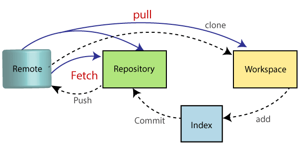
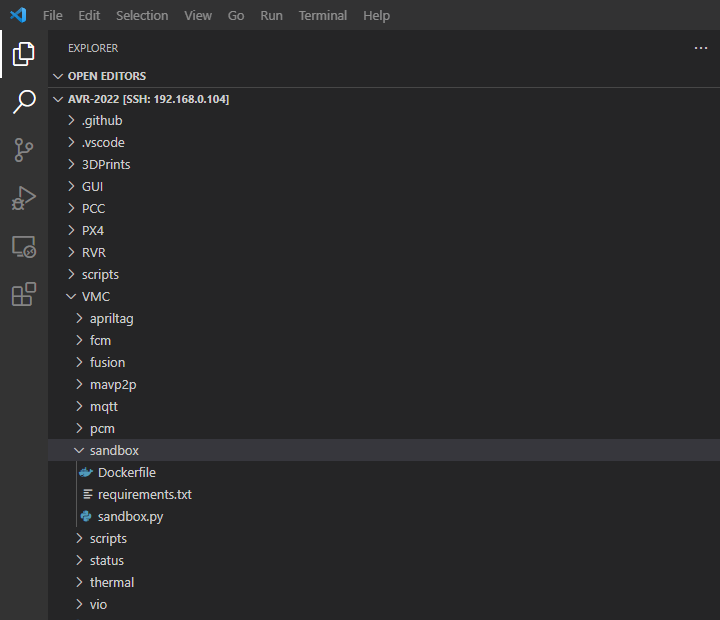
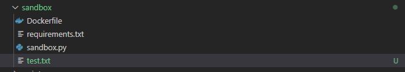
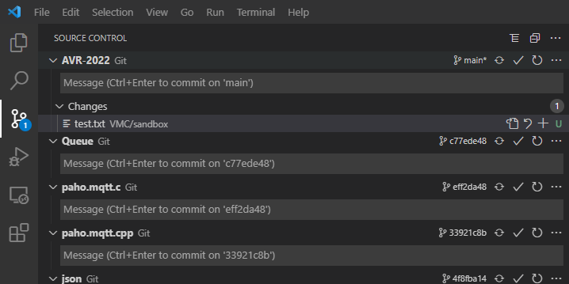
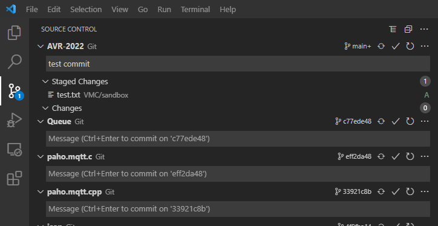
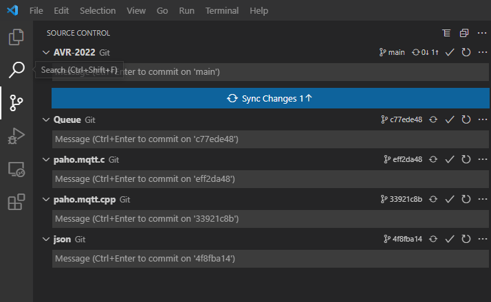

This section will intorduce you to the basics of using git and will walk you through an example using VS Code.

## Basics of Git

Git has a handful of basic commands that are useful to know. These can be executed from the command line, but we encourage you to use VS Code's GUI as you get started.

We will primarily focus on _commit_, _push_, and _pull_.

- A _commit_ is used to capture the state of the project at a point in time. It saves any additions or changes to the local repository from your workspace.

- A _push_ adds all commited files to the remote repository. In this case, your remote repository is hosted in GitHub.

- A _pull_ gets files from the remote repository and puts them directly in your local directory. You will need to manually manage issues between conflicting files.

## VS Code Example

This will walk you through a Git command example using VS Code and the local repository on your Jetson. To start, make sure you have a VS Code window open with remote SSH access. Refer to previous steps for instructions on how to do this.

You should have an editor window on the left that looks like this:

Since you will be developing in the "sandbox" folder, we will experiment with that. Go ahead and add a new file. To do this, right click "sandbox" and "add new file". Call it "test.txt".

You've now made a change in your workspace, you can now _commit_ it. Select the "Source Control" icon on the left pane of VS Code:

The test file you made should show up in source control. Click the "+" button to commit the change. It will now be "staged". In the upper text box, append a message to this commit describing the contents.:

Click the check mark to commit the change. It is not saved in your local repository. The last step is to store this change in GitHub. The "Sync Changes" button that appears gives theuser the option to automatically _pull_ and _push_ to the remote repository. Select this to complete the process.

In the future, when working with others on your team, it may be necessary to manually manage conflicts when syncing changes.
