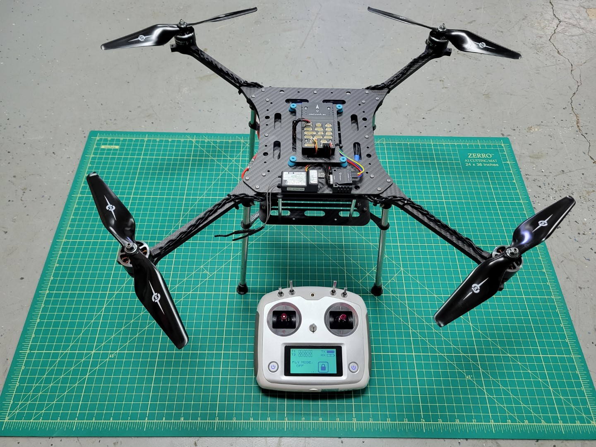
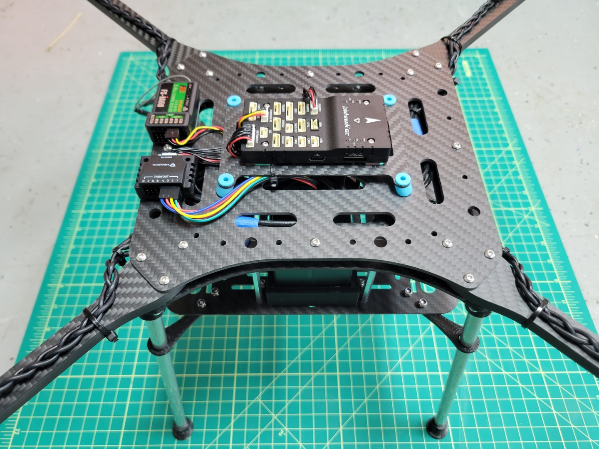

This section is a complete guide on how to build the Bell AVR drone.
It is recommended to read this guide **thoroughly** and **in order**.
At the bottom of each page, there are navigation buttons that will allow you to
proceed to the next section or visit the previous one.

Our goal in this section is to get you to **Checkpoint #1: Flight Test**,
which consists of the ability to manually pilot the drone indoors in a
stabilized flight mode.

Below are photos of what your assembled kit will look like before your
first flight test.

A simple block diagram can be used to represent the components of the basic drone.
As you move throughout this documentation keep these details in mind.
It will help you gain a high-level understanding of what we're trying to accomplish.

Let's get started with assembly!
