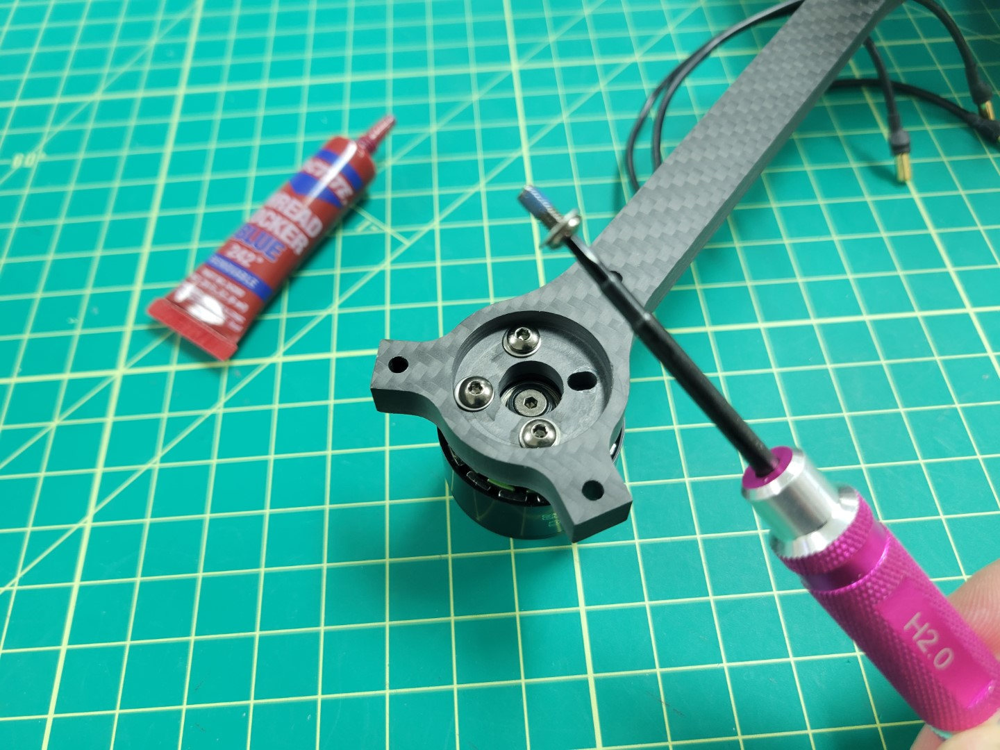

## Attaching Motors to Arms

Inside each motor box there is a small ziploc bag of 4 x 8mm screws and other components. You will only be using the screws from this bag. In your AVR kit you will also find a ziploc bag of M3 washers.

{}
Please be sure to use the screws provided in the small ziploc bag inside the motor box. **Using longer screws from the kit can end up damaging the motor windings and ultimately prevent the motor from operating.**
{}

The photo below shows the necessary parts for mounting the motor to the frame arm. You will follow this procedure for each of the four motor/arm assemblies.

A 2mm hex driver is necessary to secure each of the 8mm screws into the motor.

{}
Don't forget to use one M3 washer with each screw. This will help reduce stress on the carbon fiber arm.
{}

Make note of the blue loctite already applied to each of the screws in the photo below. Loctite is useful in helping secure your screws and prevents them from coming loose.

Repeat this process for all four of the motors.

## Attaching Arms to Midplate

{}
To proceed with this step you must 3D print four landing gear mounts. **Make sure to print with 100% infill as these mounts will experience a lot of stress from the weight of the drone and hard landings.**
{}

Locate the M3 22mm screws and lock nuts in your AVR kit. These will be necessary for mounting the motor arms to the midplate and securing the 3D printed landing gear mount.

Each arm will require three 22mm screws and lock nuts. You will insert each of the screws through the top plate, arm, bottom plate, and landing gear mount. The lock nut will be secured from the bottom as shown in the photo below. A 5.5mm box driver is necessary for tightening the nut. Be sure to tighten each nut securely.

Repeat this process for each motor arm.

Flip your AVR drone over and connect each of the motor leads to the corresponding ESC leads.

Be sure to make a good connection between the male leads of the motor to the female leads of the ESC. **You should not see any brass between each of the connections.** This is important so that nothing comes loose or causes a potential short.

Feed any excess cable slack between the top and bottom plates. You can use zip ties to clean up your cabling as shown in the photo below.

Motor position and rotation is an important part of any drone build. The photo below is a gentle reminder. It won't be long before you have this photo memorized!

