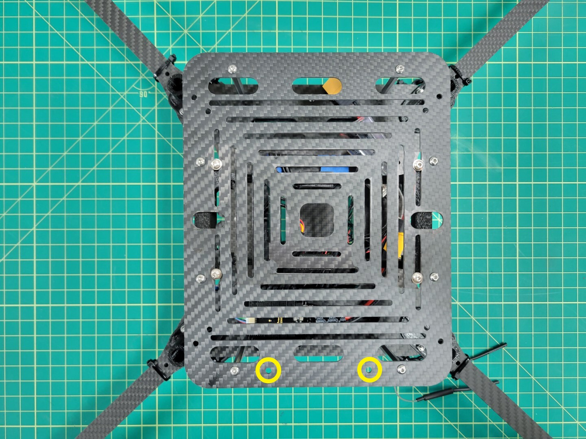

## Battery Tray Assembly

{}
To proceed with this step you must 3D print the battery tray. An infill of 15% should be sufficient.
{}

The parts necessary to mount the battery tray to the accessory plate are 10mm M3 screws, lock nuts, and washers.

Insert the screws and washers from beneath the plate coming up through the battery tray. Secure each corner with a lock nut as shown in the photo below.

## Attaching Accessory Plate

Let's attach the bottom accessory plate to the mid plate assembly of the AVR frame. You will need the 60mm standoffs and 10mm M3 screws that come with your kit.

From the top of the midplate assembly locate the eight larger access holes. Place a 10mm screw through each access hole into the mid bottom plate. A pair of needle nose pliers are very helpful for this step.

Place a small drop of Loctite into the standoff and screw into place using a 2.0mm hex driver.

Repeat this process for all eight standoffs. Flip your AVR frame over so that the standoffs are facing up. Place a drop of loctite into each of them.

Place the bottom accessory plate onto the standoffs and secure with 10mm screws.

{}
Make sure that the two holes denoted by the yellow circles below face the front of the drone. These holes will be essential when mounting the ZED Mini camera during advanced drone assembly.
{}

