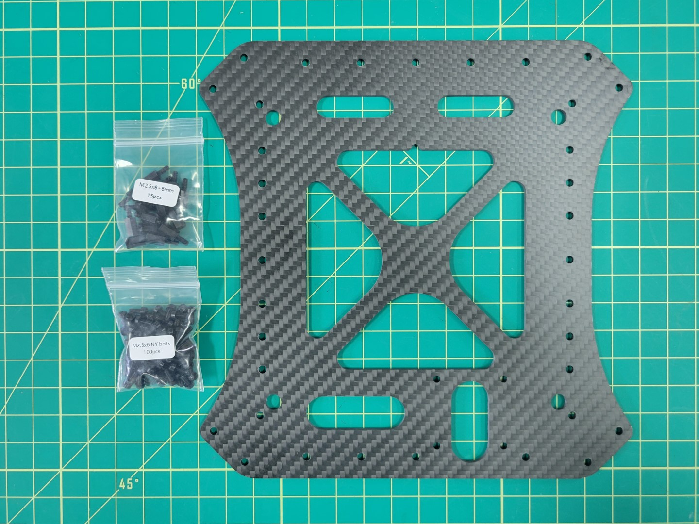
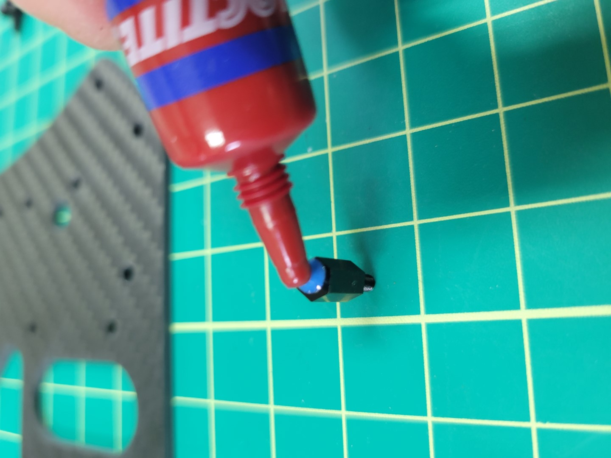
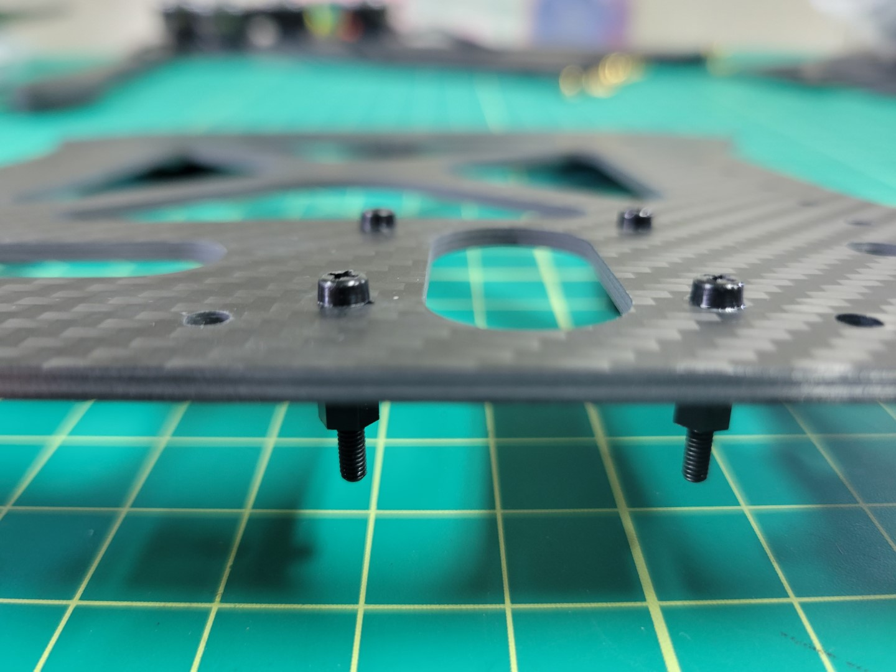
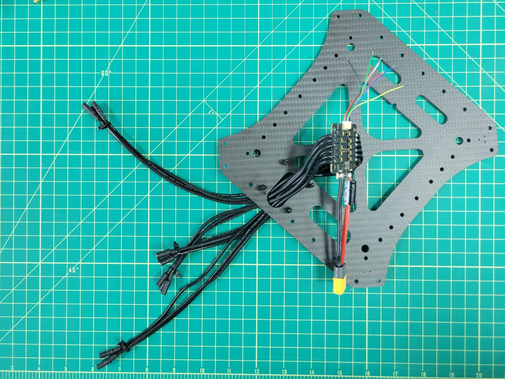
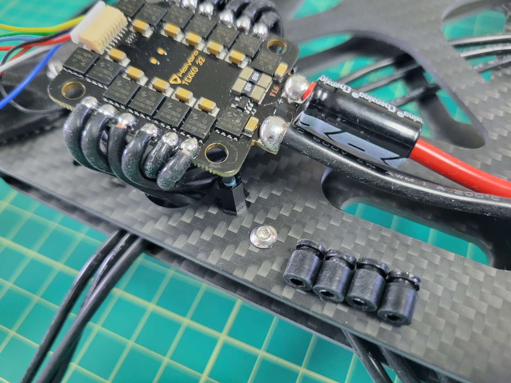
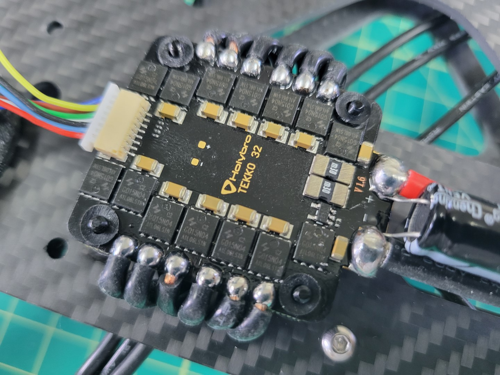
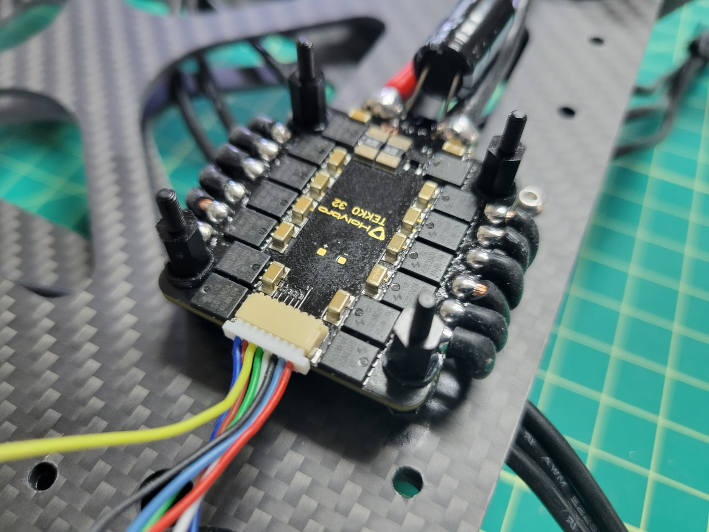
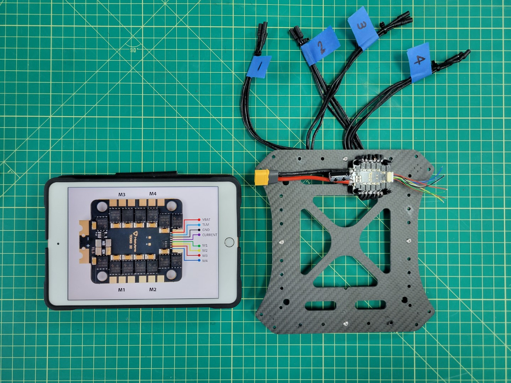

{}
The Bell AVR team has become aware of a firmware issue with the ESC’s that were shipped
in the initial kits. A new ESC with the correct firmware will be included in your
Wave 2 Kit, along with a prepaid shipping label to return the original one.
Please be aware that if you mount your ESC now,
there will be additional rework to replace your ESC prior to flight testing.
{}

## Mounting

{}
As you work through each section of the AVR build process we highly encourage you to read to the bottom. Then come back to the top and begin building!
{}

The Tekko32 4-in-1 ESC will be mounted underneath the bottom plate of the middle section. Locate the bottom plate as shown in the photo below. You will notice a small notch that indicates the front of the plate.

Look for the 6mm threaded nylon standoffs and bolts that will be used to mount the ESC. It's important that the electronics from the ESC do not make contact with the carbon fiber plate. **This could lead to a potential electrical short.**

Your AVR kit comes with a small tube of blue Loctite. You'll want to place a small drop of this inside each of the threaded standoffs. Don't overdo it. Loctite can get messy and a little will go a long way.

Mount the standoffs in the right rear corner of the plate facing downward as shown in the photo below.

{}
Be careful not to overtighten. Nylon hardware is easy to strip. Gently tighten and let Loctite do its job. Loctite will set in about 10 minutes and fully cure after 24 hours.
{}

Flip the plate over so that the threaded standoffs are facing up. Run all of the ESC leads through the provided cutout.

{}
Use care when feeding the ESC leads through the cutout. Edges of carbon fiber can be sharp and you do not want to accidentally strip any of the shielded cables.
{}

Before placing the ESC on the standoffs you will need to install the rubber dampeners. You can find these inside a small ziploc bag in the ESC packaging.

The purpose of these rubber dampeners is to keep the ESC secure when placed onto the nylon standoffs.

Working with rubber dampeners can sometimes be a bit challenging. We recommend using a tool with a flat tip such as a 2.0mm hex driver that you will be using throughout the AVR build process. Do not use a sharp or pointy tool such as a Phillips head screwdriver. You do not want to accidentally pierce the rubber dampeners.

Pinch the dampener and feed it into the hole with your fingers. Use the hex driver to push the rim of the dampener into place as shown in the photo below. Repeat the process for all four corners of the ESC.

Once all the dampeners have been installed proceed to place the ESC on the standoffs. You will need to use a bit of force to push the ESC into place.

Make sure the yellow XT60 connector is facing the towards the inside of the plate and not hanging off the edge.

Now that the ESC is in place use four more 6mm threaded standoffs to secure it. In the next phase of the build process you will "stack" a Power Distribution Unit (PDU) on top of the 4-in-1 ESC. **Don't forget to use a dab of Loctite on the standoffs.**

ESC mounting is complete! Before proceeding we recommend following the tip below.

{}
Labeling your ESC leads will save you time and frustration throughout the build! The diagram below shows how each group of three ESC leads match up with motors M1-M4. In the next section we will install the middle top plate, which will make it challenging to see which lead goes to a given motor. Do this step now and you will be glad you did!
{}

