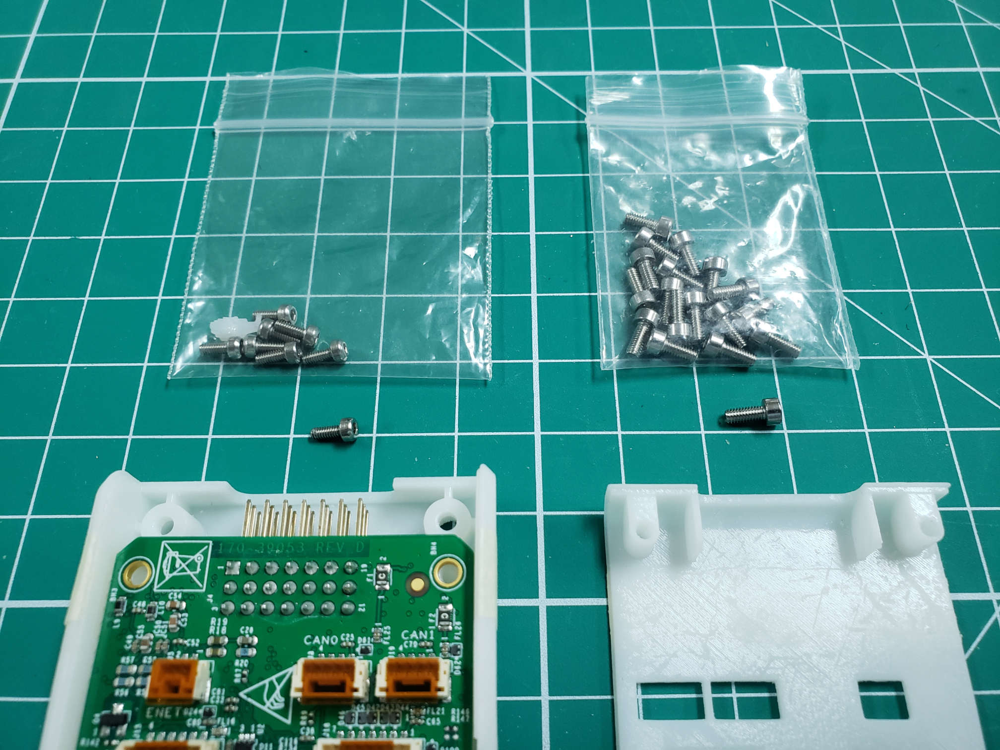

The FC comes with a 3D-printed enclosure, which still has to be assembled.
It consists of a top part, a bottom part, a tiny reset button, and several screws.
First, make sure the reset button is installed inside the enclosure.
It should fit in a hole in the side, next to the hole for the micro USB connector.

{}
The FC will ship with small pieces of tape on top of its connectors.
You should take them off using an exacto knife or small tool.
Be sure not to damage any of the connectors.
{}

Now, the FC can be installed into the bottom part of the enclosure with
four short hex screws (7 mm). The screws will thread into the bottom half of the
3D printed case. Be careful not to overtighten so you don't strip or crack the plastic.

{}
You may find that the screws included with the reset switch are too narrow and
don't grab into the 3D-printed enclosure. If this is the case,
you can find larger screws that will thread into the plastic in the
frame box (Box 1). These screws are shown in the photo below on the right.
{}

The photo below shows the FC mounted into the bottom part of the enclosure.

After the FC is installed into the bottom case,
you can put the top case on and turn the whole enclosure upside down.
Use four screws to mount the top case to the bottom. Once again,
be careful when tightening.

{}
Now is a good time to insert the 16GB micro SD card into the FC as
shown in the photo below. The SD card will come in handy throughout
AVR and will allow for data logging.
{}

The final step in this section is to place the FC label on the top plate.
This gives a visual representation of ports and will come in handy when we begin
to wire everything together. Not to mention it looks really cool!

