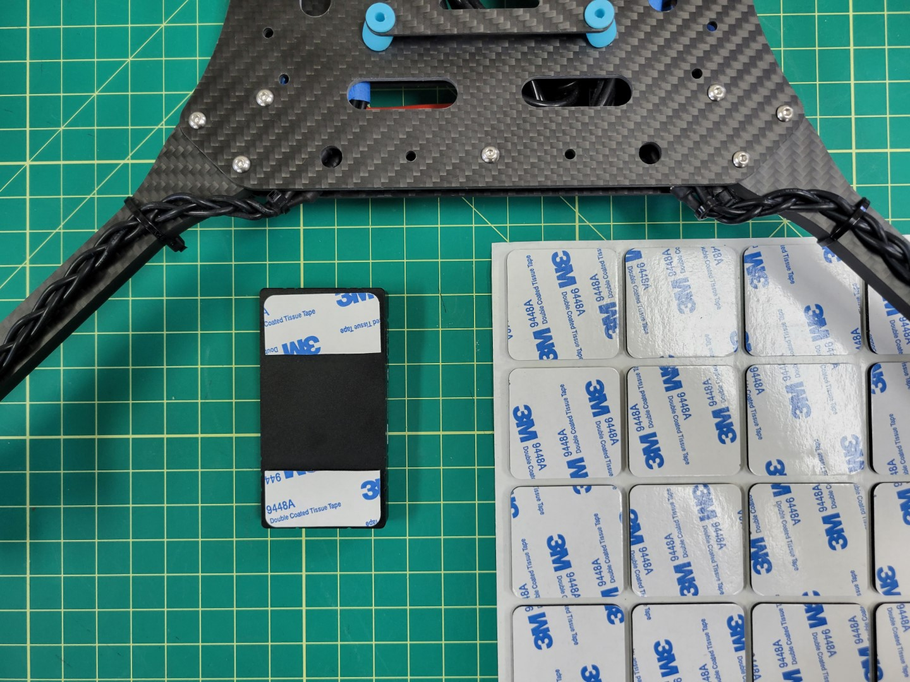
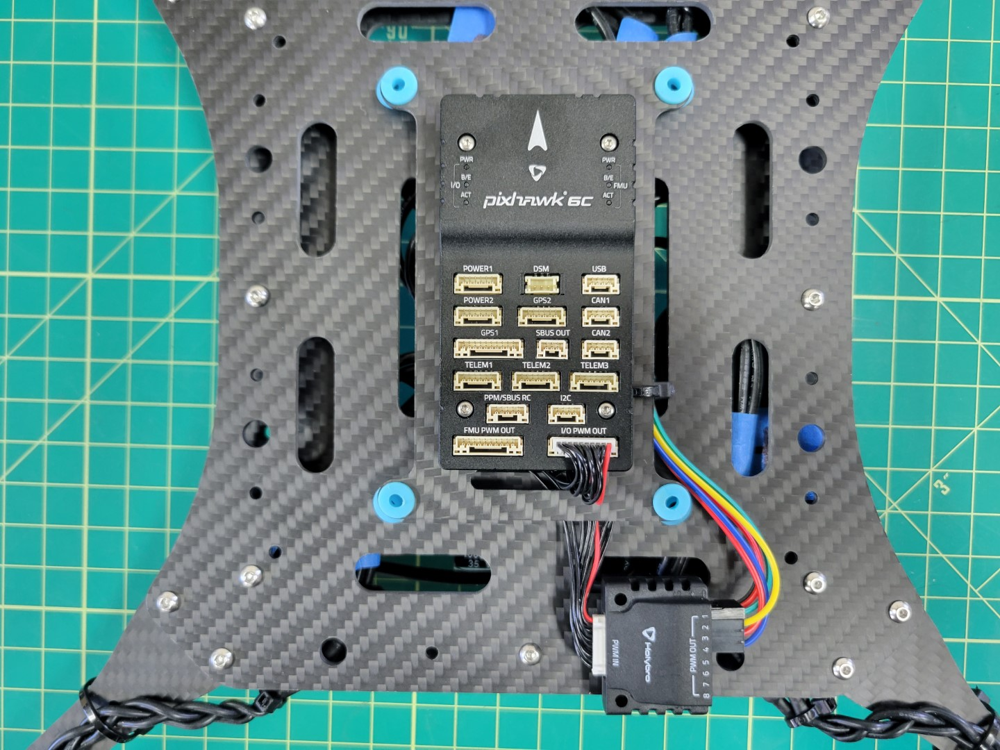
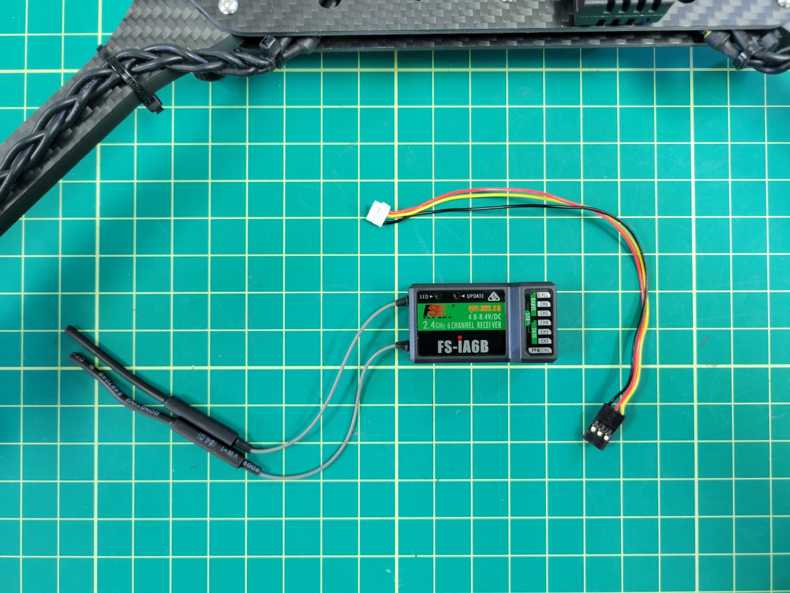

## FC Mounting

Locate the sheet of 3M double-sided adhesive pads and cut one out. Then cut it in half.

Place each half at the front and back of the Pixhawk FC.

Center the FC over the top tray and press it firmly into place.

{}
Double check that the arrow on your FC is pointed forward towards motors M1 and M3.
{}

## PWM Module Mounting

Let's connect the cable we previously created to the ESC beneath the frame. You can see in the photo below that we've zip tied it to the mid bottom plate to keep it in place. Feed the other end of the cable to the top of the frame.

Cut out a small piece of 3M tape and secure your PWM module to the frame as shown in the photo below. Wire up your connections.

## RX Mounting

The radio receiver (RX) will be mounted next. You can find the RX in the FlySky FS-i6S box. The cable to connect the RX will be in the bag of cables inside the Pixhawk box.

Mount the RX using 3M tape as shown below. Attach the cable to the **PPM/SBUS RC** port of the Pixhawk and the other end of the cable to the **I-BUS SERVO** port of the RX.

## Power Module

The Pixhawk Power Module steps down the battery voltage for use by the FC. It also provides voltage and current monitoring. This monitoring will be critical for the AVR competition and will help teams understand the power profile of their drone. Both the power module and cable can be found in the Pixhawk box.

Plug the female XT60 connector of the power module into the male XT60 of the ESC. Then plug the FC cable into the port of the power module as shown in the photo below.

Feed the power cable from the module to the top of the frame and plug it into the **POWER1** port of the Pixhawk.

