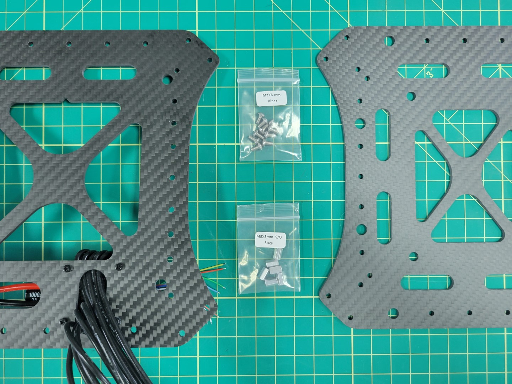
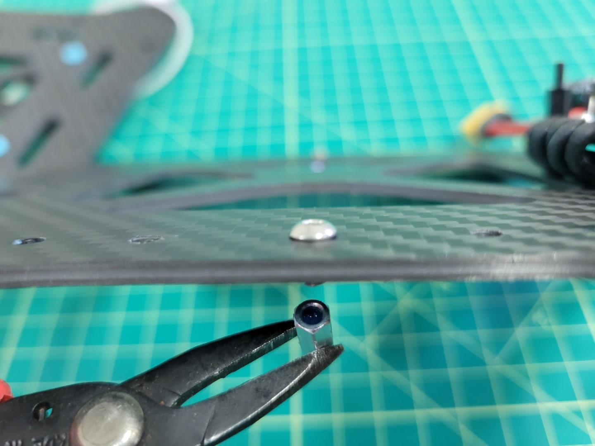
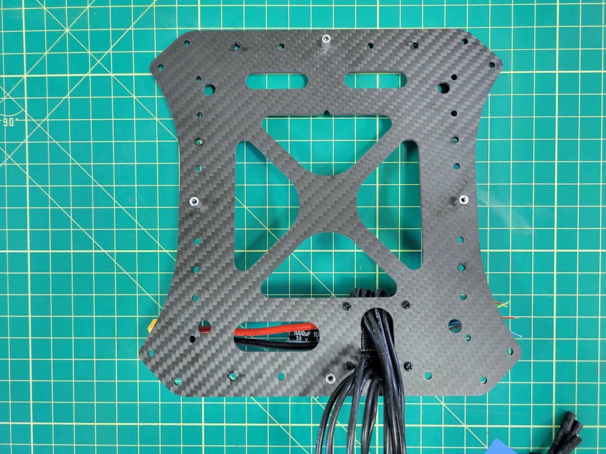
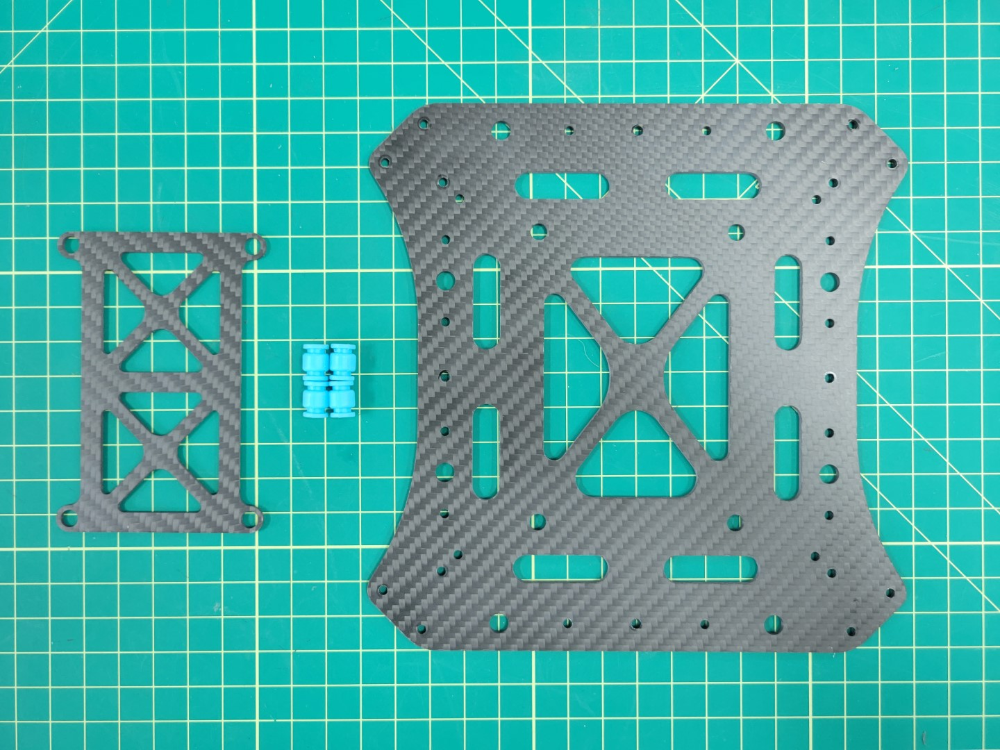
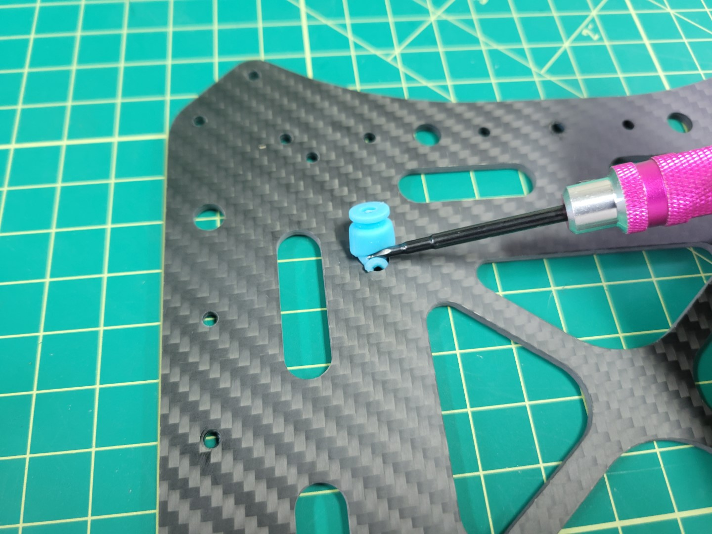
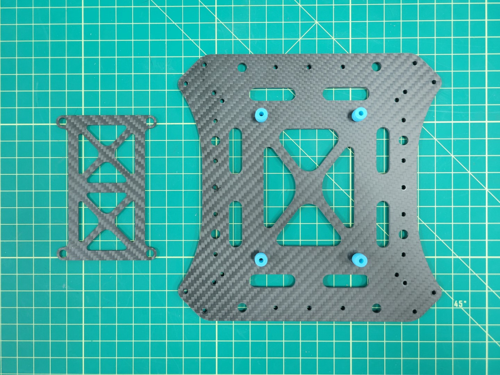
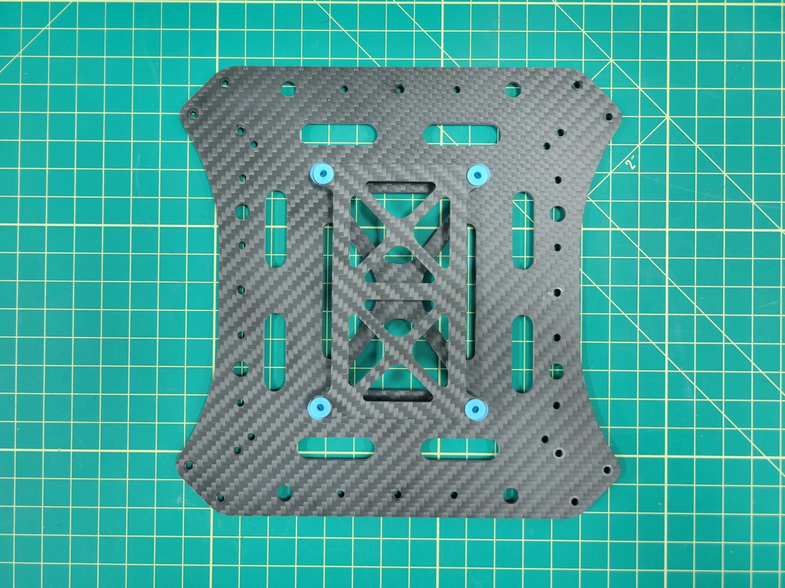
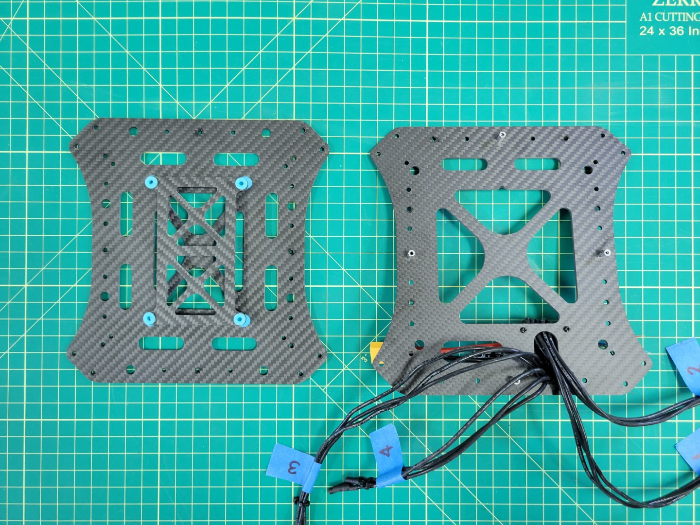
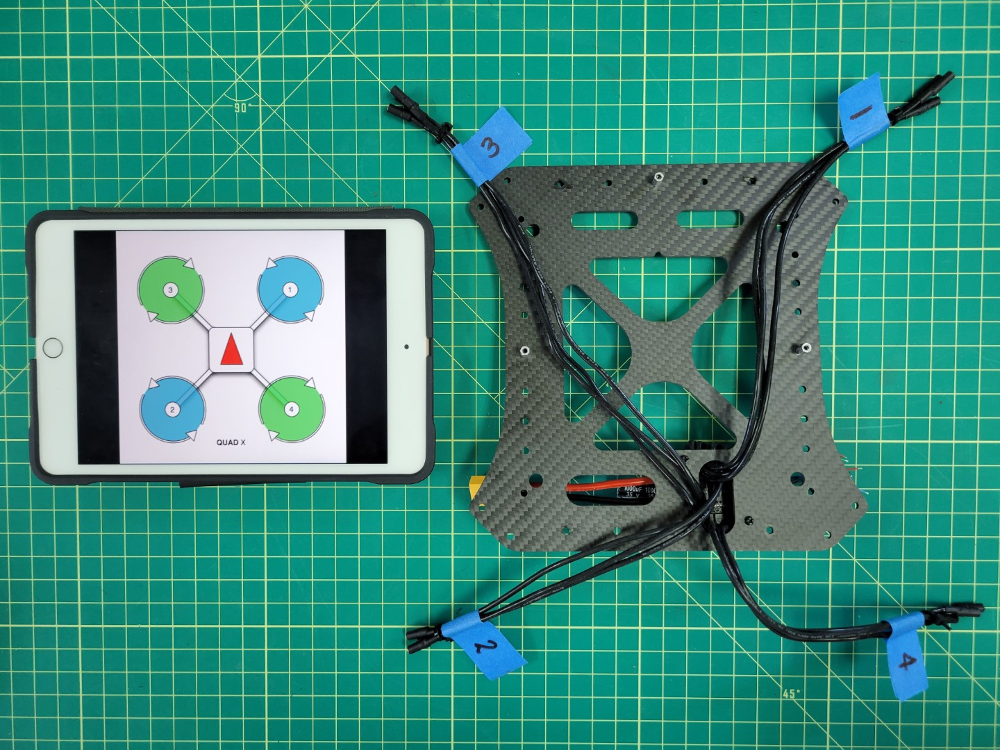
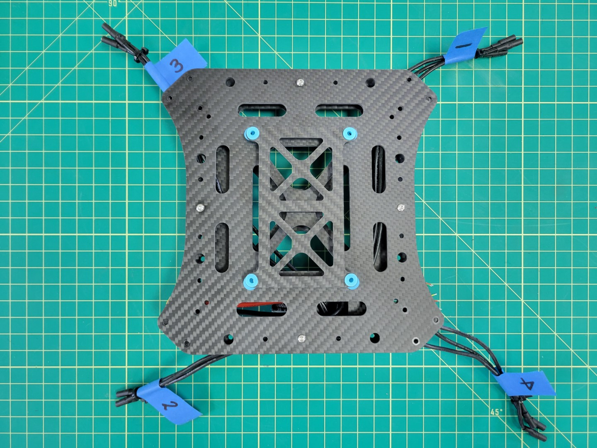

## Standoff Mounting

We will be mounting the mid top plate to the bottom plate using M3x8mm standoffs and M3x6mm screws. Make sure your parts match up with the photo below.

The mid bottom plate has several mounting holes around the outside edge. Locate the center hole on each edge of the plate. Place a screw in each hole.

{}
Make sure you are placing the screws through the plate on the same side as the ESC. Take a close look at the photo below for more guidance.
{}

A small dab of Loctite in each of the standoffs will help keep the plates secure. Screw each of the standoffs into place with a 2.0mm hex driver.

## Pixhawk FC Tray Mounting

Before securing the mid top plate we will mount the Pixhawk Flight Controller (FC) tray with four rubber dampeners. This is necessary to help isolate the FC from vibrations that are generated from the propellers.

The following steps show installing the dampeners in the top plate first, but some prefer installing them in the tray and then attaching the tray to the top plate. Choose whatever method makes the most sense to you.

Use the same procedure as mounting the ESC dampeners. Pinch the dampener, push it into the hole, and use your 2mm hex driver to feed it through the plate. Do this for all four dampeners.

The photo below shows all four dampeners installed into the mid top plate. Proceed with installing the FC tray onto the dampeners.

You will have limited wiggle room when installing the FC tray onto the dampeners. Be patient. In a matter of no time you will become a dampener installation pro!

## Assembling Top and Bottom Plates

Place your mid top and bottom plates side by side as shown in the photo below.

As we discussed in the previous section, motor order is incredibly important for you to have a successful flight test. Look at the motor position diagram below. Lay out each of your ESC leads in this same order.

Place Loctite in each of the standoffs and secure the mid top plate with four 6mm screws. Your mid plate assembly is now complete!

