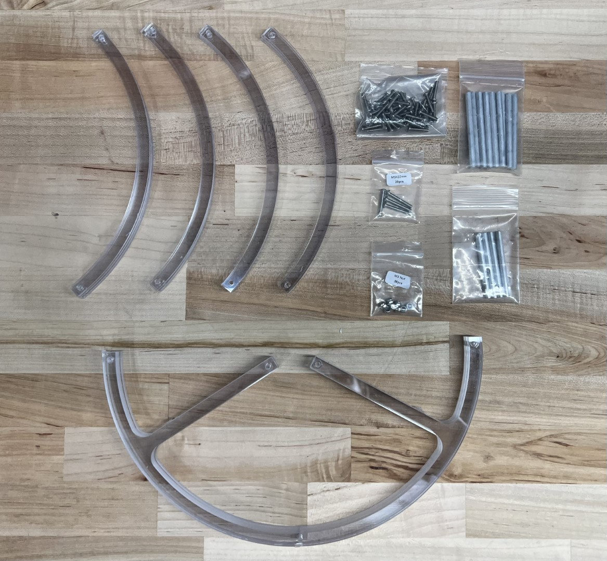
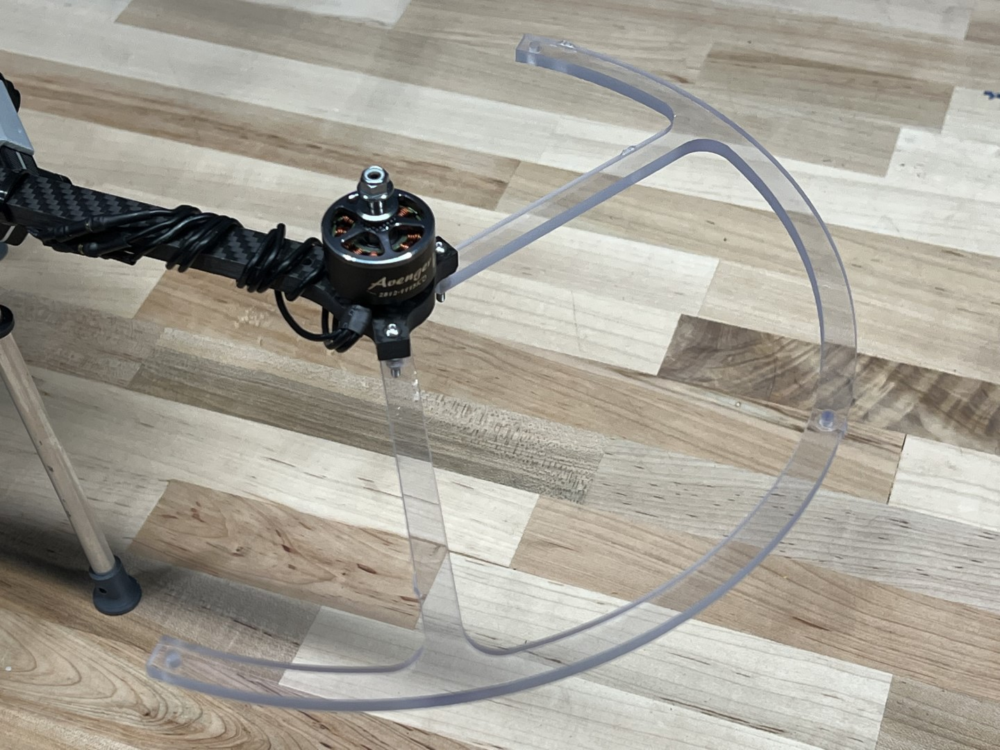
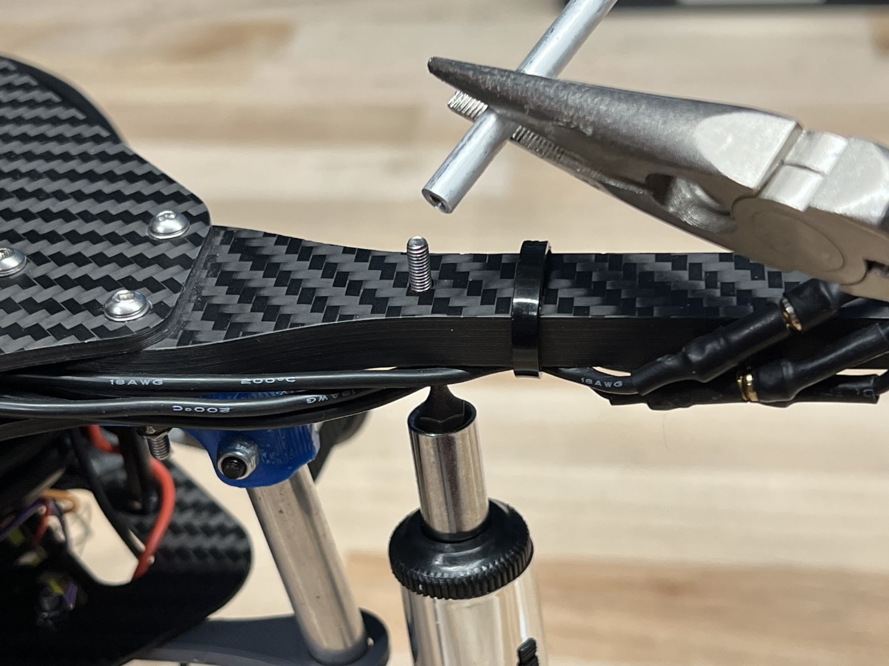
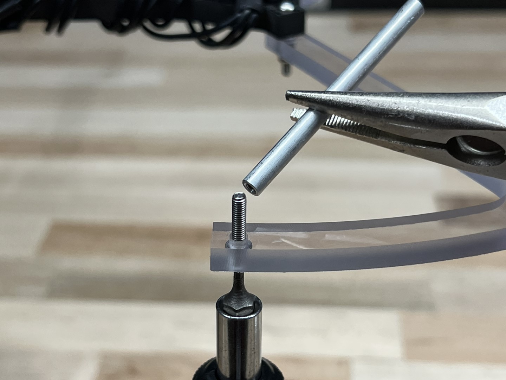
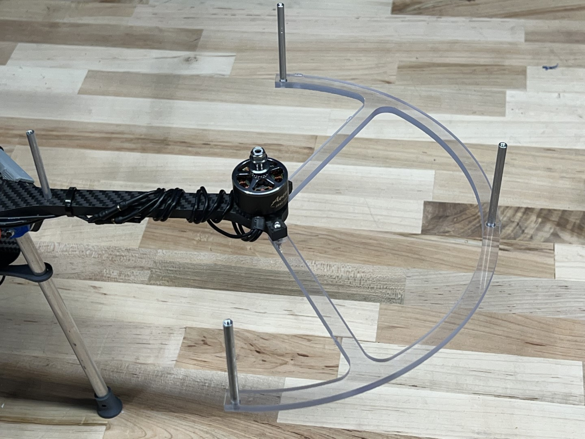
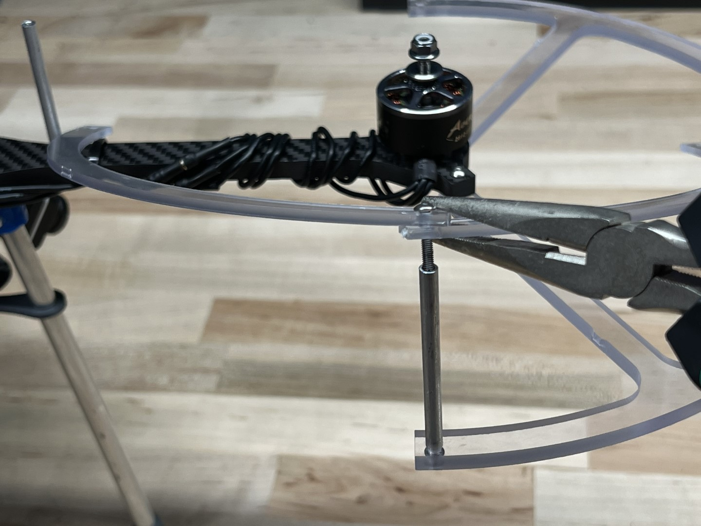
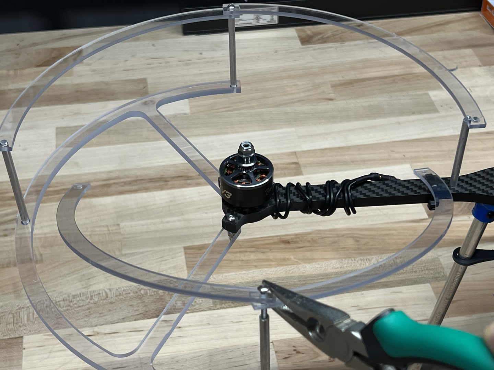
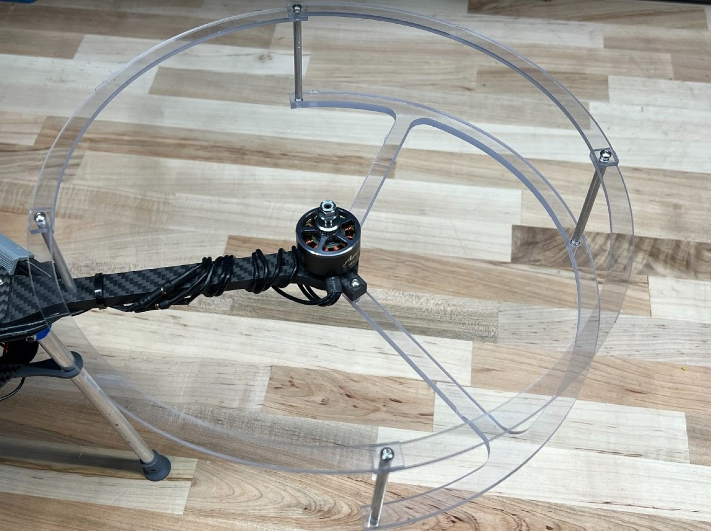
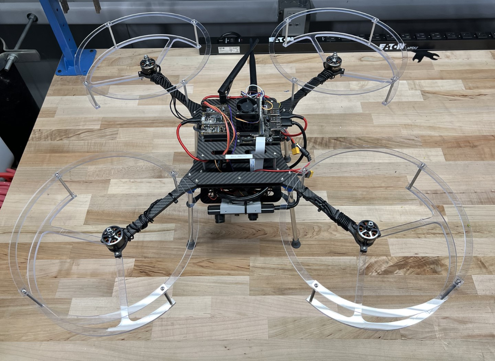

{}
There are not enough M3 x 22mm bolts included in your kit to assemble the prop guards.
Please refer to notice a bottom of page for solution options.
These instructions use the recommended solution option.
{}

## Prop Guard Mounting

This section will guide you through the assembly of the propeller guards.

{}
Do not attempt to drill or machine carbon fiber motor arms.
Machining will create carbon dust which can cause irritation to skin, eyes, or lungs from fine resin dust particles.
Proper ventilation and respiratory equipment are required to machine carbon fiber components.
{}

Locate the following items below in both your first and second kit shipments.

The M3 x 22mm bolts and M3 Nuts can be found in the first shipment.
The clear polycarbonate prop guard pieces, short stand-offs (the pack of 4), long stand-offs (the multipack), and M3 x 15mm bolts (unlabeled bag) can be found in the wave 2 kit.

Fasten lower prop guard bracket to motor arm using agreed upon method.

{}
Do not allow wet Loctite to come in contact with the polycarbonate prop guards.
Loctite is caustic to polycarbonate and can cause the prop guards to crack and ultimately fail.
{}

Fasten a **short** stand-off to the motor arm hole closest to the drone body arm using the M3 x 15mm bolt.

Fasten the **long** stand-offs to the 3 mounting locations on the lower prop guard bracket using the M3 x 15mm bolts.

The assembly should match the following photo with the bottom prop guard and all stand-offs mounted.

Stack two upper prop guard brackets on top of one another, place a M3 x 15mm bolt through the two holes, and fasten to one of the 4 stand-offs as shown in picture below.

Stack the remaining 2 upper brackets such that the upper bracket sits on the lower bracket of the previous step; likewise, the current lower bracket should sit below the upper bracket from the previous step.
Secure the brackets to the stand-off using a M3 x 15mm.

Check that the top brackets are stacked in the correct order and secure to the remaining 2 stand-offs with 2 M3 x 15mm bolts.

Repeat on the remaining three motor arms.

Congrats, you have now properly assembled the prop guards to your AVR drone!

{}
There are not enough [M3 x 22mm bolts](https://www.mcmaster.com/92095A473/) included in your kit to assemble the prop guards.
Teams may choose from the list of solutions below, but are also encouraged to think of alternative solutions that are not listed.
{}

- Purchase the remaining M3 x 22mm bolts **(Recommended solution)**
  - Pros: Quick fix, doesn’t require any modifications to drone parts
  - Cons: Spend money and coordinate travel to store or [buy online](https://www.amazon.com/m3-assortment/s?k=m3+assortment)
- Repurpose the M3 x 22mm bolts currently used on the upper landing gear mounts for mounting the prop guards.
  The M3 x 20mm Nylon bolts included in your kit will act as a substitute for the Aluminum bolts on the upper landing gear mount.
  - Pros: Does not require purchase of additional supplies
  - Cons: Nylon hardware prone to breaking in substitute of Aluminum on landing gear mounting brackets
- Use Nylon M3 x 20mm bolts and nuts included in your kit to fasten prop guards to motor arms
  - Pros: Does not require purchase of additional supplies
  - Cons: Nylon hardware prone to loosening in a high vibration environment next to the motor.
    Loosening can be prevented by using a non-loctite thread locker applied to Nylon nuts and bolts. (See previous note about loctite being caustic to poly carbonate.)
- Counterbore prop guard motor arm mounting holes to accommodate shorter length Aluminum fasteners included in your kit.
  - Pros: Does not require purchase of any additional supplies.
  - Cons: Run the risk of ruining prop guard components if done improperly, it is aesy. If this approach is attempted, a drill press and appropriately sized end mill are suggested to perform this operation.
