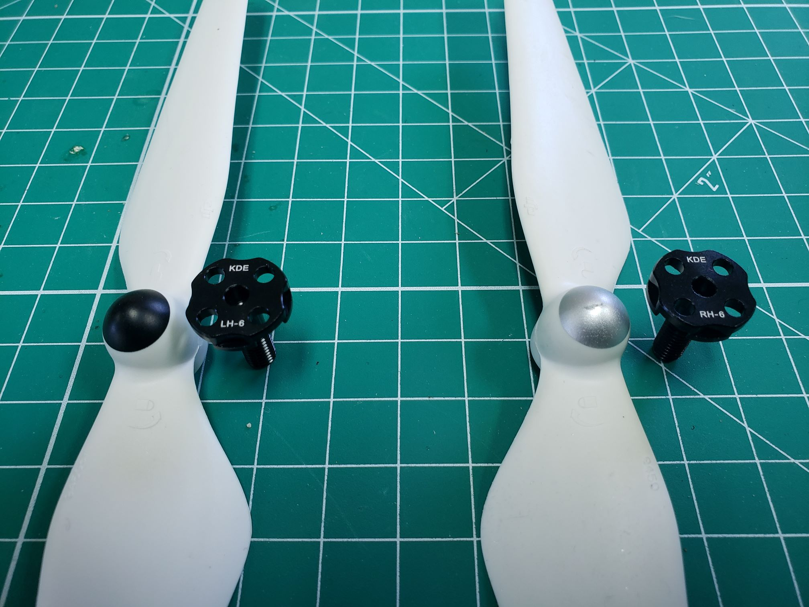

The propeller adapters are what we will use to attach the propellers to the motors.
In each motor box there are two adapters provided and it's important for us to
determine which adapter to install on each motor.

As covered earlier in the previous section, motor rotation is of the
utmost importance. Motors can spin in one of two directions:

- Clockwise (CW)
- Counterclockwise (CCW)

Previously we connected the ESCs to the servo rail in the necessary order.
The image below shows the proper rotation of each motor/propeller.
**Motors 1 and 2** (blue) rotate in a CCW direction while
**Motors 3 and 4** (green) rotate in a CW direction.

The prop adapters are right-hand and left-hand threaded and marked underneath
with **RH-6** and **LH-6**. The number 6 represents the
diameter of the shaft in millimeters.

For **motors 1 & 2** we will mount the **RH-6** adapter, which interfaces with
CCW rotating propellers (silver cap). **Motors 3 & 4** will use the LH-6 adapter,
which interfaces with CW rotating propellers (black cap).

{}
Make sure the front of your AVR drone is oriented correctly before mounting!
Double-check that it is consistent with the rotation diagram above as
you look down on your drone.
{}

Each prop adapter requires four screws for mounting.
Each motor box contains several screws. Use the shorter
screws with the button head as shown in the photo below.

{}
Do not overtighten as you do not want to risk stripping the head of the screw.
Removing stripped screws is not fun and may even require the replacement of the motor.
{}

Mount all four prop adapters and then add one of the provided aluminum washers
on each of the four shafts. The washers come in a separate bag and are necessary
to make sure the propeller is nicely seated on the adapter.

{}
It is good practice to check the prop adapter screws before each flight.
Simple pre-flight checks can prevent catastrophic failures while in the air.
{}

The photo below shows the propeller nicely seated onto the prop adapter and aluminum washer.

Let's wrap up this section by mounting all four propellers and make sure we
have them in the proper orientation.

The **CCW** rotating propellers have silver caps and are attached to **motors 1 & 2**.
The **CW** rotating propellers have black caps and are attached to **motors 3 & 4**.
After verifying the correct orientation you should remove all propellers before
moving onto the next section. While the drone assembly is complete,
we still have some configuration to do before our initial flight test.

{}
We want to reinforce the importance of keeping propellers off your AVR
done while on the bench or performing maintenance. Only attach propellers
when the area is clear and you are ready to fly.
{}
