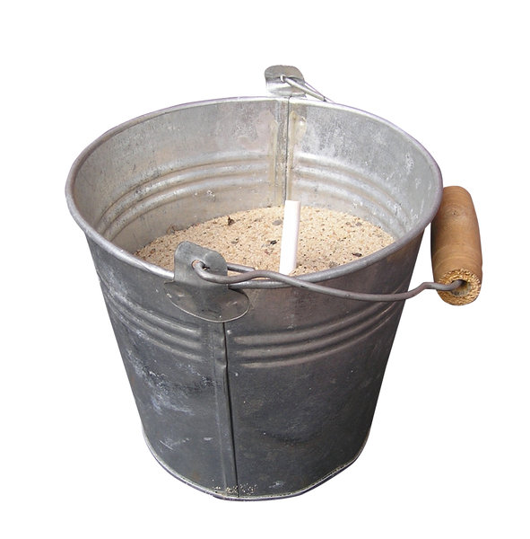
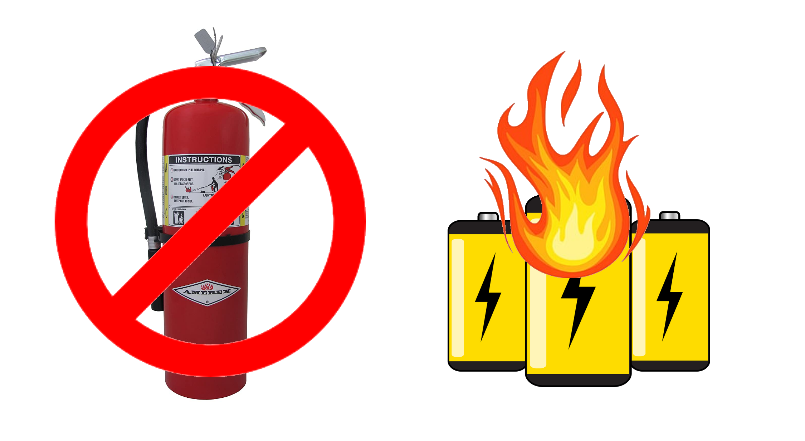

## Safety Overview

**Please ensure all team members have read the LiPO guidelines were
included with the SMC battery as well as the manual for the Hitec charger.**

You can learn more about these products at the links below:

- [SMC True Spec DV Extreme 14.8V 5200mAh 135C Battery](https://www.smc-racing.com/index.php?route=product/product&path=67_171&product_id=642)
- [Hitect RDX1 Pro charger](https://hitecrcd.com/products/chargers/acdc-chargers/rdx1-pro-/product)

### Key Safety Points

- Always charge batteries using the proper settings.
  Improper charge settings may result in a catastrophic failure of the battery.
- Never charge batteries unattended. If, during a charge, you need to leave for
  any reason, stop the charge and disconnect the battery from the charger.
  You can restart charging when you return.
- If a battery ever becomes warm/hot during charge, or starts to swell, it
  should be removed from the charger and taken outside where it cannot cause
  damage if it fails. If a battery fails as a result of damage or misuse it
  may result in fire.
- Never leave a battery connected to your device or charger when not in active use.
  This may cause a parasitic draw on the battery which may lead it
  to become over-discharged.

### LiPO Battery Voltage Range

- 4.20V per cell represents a fully charged cell.
- 3.00V per cell is the very lowest the battery can go without sustaining damage.
- 3.70V per cell is the "Nominal Voltage" which is the "named" voltage of the cell.
  This voltage is used as a standard to identify the cell/battery type.
- 3.5-3.7V per cell is the voltage we would recommend landing at.

The battery you will be using is a SMC 14.8V 5200mAh 135C Battery.

### Definitions

- **Battery**: A battery is a device consisting of one or more electrochemical
  cells with external connections for powering electrical devices.
- **mAh**: is an abbreviation for milliamp hour and is a unit that measures
  (electric) power over time. It is commonly used to measure the energy capacity
  of a battery. In general, the more mAh and the longer the battery capacity or
  battery "run time."
- **C-Rating**: is a shorthand representation of how many amps the cells can
  supply on a continuous basis without failing.
- **Cell Count:** How many cells are in series to make the overall voltage of
  the pack. In this case, 4 cells are in series to make 14.8V nominal, or 16.8V
  when fully charged. Sometimes referred to as a 4S battery, the "S" refers to
  "series" to tell us how many cells are comprising the battery pack.

### The Charger: Hitec RDX1 Pro

The RDX1 Pro is one of Hitec's most popular single-channel
multi-chemistry battery chargers. It features a 100W Power supply
as well as an integrated 6-cell balancer. The RDX1 Pro is capable of
charging 1S-6S batteries.

### Battery Storage Bag

Your kit includes a battery storage bag that can be used for storage, transport, and charging.

We recommend you use this bag as a charging mat,
this will give you an added layer of protection between the battery and
the charging surface. Always remember to charge batteries on a
non-combustible surface.

## What to Do in Case of Fire

If you follow the safety guidelines provided, you
should be perfectly safe. However, in the event that something has gone wrong,
and there is a battery (LiPo) fire, take the appropriate steps:

{}
_Please_ read this section, battery fires are serious.
Just look up videos of LiPo fires to see for yourself.
{}

1. **First, get yourself and those around you to safety**.
   Drones, computers, etc. are replaceable, while you (and your lungs) are not.
   Battery fires produce very toxic smoke, and you do NOT want to breathe it in.
2. **Get help**. This depends on your specific situation, but this may be to pull a nearby
   fire alarm (contrary to popular belief, pulling the alarm does not set off
   sprinklers), call 911, or call your security department.

After doing the above two steps, and _only if you're comfortable with it_ and does
not pose any danger to you, you can attempt to fight the fire. Your most effective
tool is a class D fire extinguisher. These are special fire extinguishers that are
meant to put out combustible metals (such as Lithium) and stand out as
being bright yellow.

However, class D fire extinguishers tend to be uncommon.
If a class D fire extinguisher **is** available, pull the safety pin, aim the nozzle,
and squeeze the handle. These tend to be quite heavy, so you may need an additional
person to assist.

If a class D fire extinguisher **is not** available, your next best bet is to throw
a fire blanket over the fire to smother it as much as possible. This won't put it out
but it will supress the flames. Most labs have a fire blanket.

Finally, as a last resort, pour sand or dirt on the fire.
This is generally what we have on hand at competition events for safety and acts
similarly to a fire blanket.

**_A normal, red, class ABC fire extinguisher does very little to put out a battery fire._**
Don't waste your time unless you have absolutely nothing else to smother the flames with.

