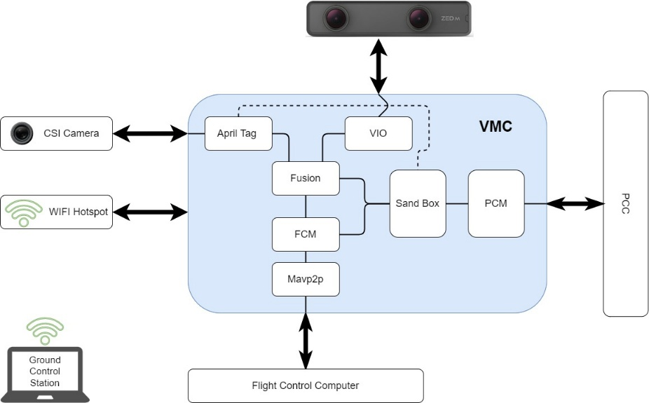

## General

The software for AVR is designed around a pub/sub messaging system in order to exchange
data throughout the system. This allows software modules to operate independently
of each other, and to communicate with each other over a network.

A pub/sub messaging system is a system which allows clients to publish
data to "topics" and clients can subscribe to incoming messages on defined topics.
Think of how email works for example. You sending an email to someone is like
publishing data to a topic (their email address), and you subscribe to all messages
on a topic (your email address). However, a pub/sub system allows multiple clients
to subscribe to the same topic.

With that in mind, the core principles of AVR software architecture are as follows:

1. Data exchange must happen through the MQTT broker.
2. All MQTT data must be JSON encoded.
3. All modules are run as containers.

Because of all of the hardware components of AVR (PCC, FCC, thermal camera, etc.),
what this generally means is that each module acts as a hardware to MQTT adapter.
For example, the FCM module publishes telemetry data over MQTT, and feeds
fake GPS data from MQTT to the FCC.

This modular, open system makes it simple to add new modules or functionality
to AVR. The GUI for example,
is 100% based on consuming MQTT data.

## Modules

Here is a description of the modules in AVR and what they all do.

### AprilTag

[Source Code](https://github.com/bellflight/AVR-2022/tree/main/VMC/apriltag)

The AprilTag module is responsible for using the images pulled from the CSI
camera to scan for visible [AprilTags](https://april.eecs.umich.edu/software/apriltag).

A low-level C++ program captures the images and hands them off to the Jetson's GPU
for processing and publishes the raw detections to the "avr/apriltags/raw" topic.

From here, a second Python program inside the module subscribes to this topic,
and upon new detections, uses linear algebra to perform a coordinate
transformation in order to get several pieces of data.
These detections include the tags ID, as well as the drone's absolute location
in the court (pos_world), and the drones relative location to the tag itself (pos_rel).

This data is then broadcast out over MQTT for other modules, such as the
Fusion and Sandbox modules to consume.

This is the only module with C++ code, for performance reasons.

### Flight Control

[Source Code](https://github.com/bellflight/AVR-2022/tree/main/VMC/fcm)

The Flight Control module (FCM) is responsible for communicating with the
FCC over MAVLink. This module takes telemetry data from the FCC and publishes
it over MQTT. Additionally, it takes fake GPS data from the Fusion module
and feeds it to the FCC.

There also exists functionality to send commands to the FCC, such as arming the drone,
or sending it missions, but this is disabled due to the drone's current lack of
knowledge of where it is in global coordinates.

### Fusion

[Source Code](https://github.com/bellflight/AVR-2022/tree/main/VMC/fusion)

The Fusion module is responsible for fusing multiple data sources
to produce the final fake GPS data that is fed to the FCC. Currently, this only takes
data from the VIO module, but experimental functionality exists to also take data from
the AprilTag module to position itself more accurately in global coordinates.

This is the only module which is pure Python and has no hardware component.

### Mavp2p

[Source Code](https://github.com/bellflight/AVR-2022/tree/main/VMC/mavp2p)

The Mavp2p module is responsible for bridging multiple MAVLink connections
together. This is just a Docker container for the amazing open-source project
[mavp2p](https://github.com/aler9/mavp2p/).

### MQTT

[Source Code](https://github.com/bellflight/AVR-2022/tree/main/VMC/mqtt)

The MQTT module is responsible for running the MQTT broker. This is
a thin wrapper around the
[docker.io/library/eclipse-mosquitto](https://hub.docker.com/_/eclipse-mosquitto)
container with a configuration baked in.

The port 18330 is used instead of the normal 1883 port because it puts it
outside of the normal operating system privileged port range.

### Peripheral Control

[Source Code](https://github.com/bellflight/AVR-2022/tree/main/VMC/pcm)

The Peripheral Control module is responsible for communicating with the
PCC over serial. This is a thin MQTT to serial bridge.

### Status

[Source Code](https://github.com/bellflight/AVR-2022/tree/main/VMC/status)

The Status module is responsible for consuming status information from the various
other modules and updating the status LEDs connected to the VMC. This also
communicates some with the host Jetson as well to check if it's being power-limited.

### Thermal

[Source Code](https://github.com/bellflight/AVR-2022/tree/main/VMC/thermal)

The Thermal module is responsible for capturing thermal images from the thermal camera
and publishing them over MQTT.

### Visual Inertial Orientation

[Source Code](https://github.com/bellflight/AVR-2022/tree/main/VMC/vio)

The Visual Inertial Orientation (VIO) module is responsible for
capturing data from the stereoscopic tracking camera, and converting it into
global-ish coordinates.

This module considers wherever it is started as "0,0,0" and thus the drone's movements
are relative to that. Because PX4 only thinks in global coordinates, this module
then uses a hardcoded latitude and longitude to convert the data into
global coordinates. They're not true global coordinates, however,
as they're still relative to where it was started.

This module is the core of the AVR "secret sauce" to enable GPS-denied stabilized
flight.
