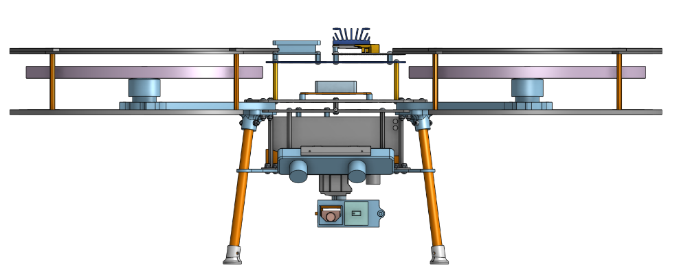
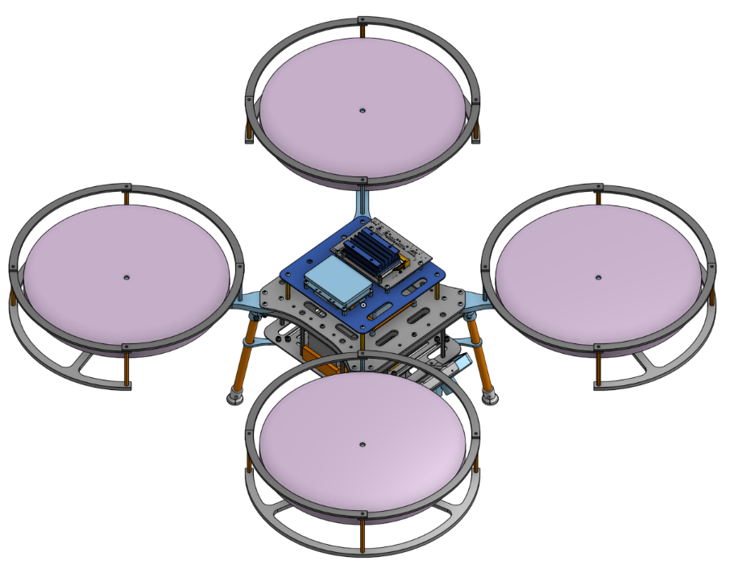
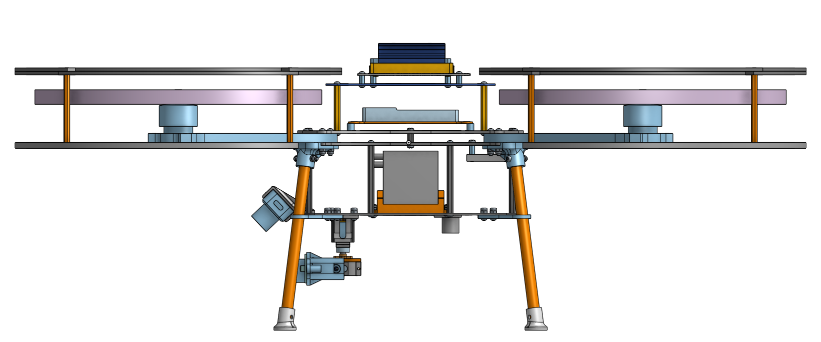

Teams can find a representative model of the drone by following this
[link to Onshape](https://cad.onshape.com/documents/f08e1611fc586d47d95fab88/w/54e486abf65e2342d219df17/e/a7584f81718cb567b0135253)

