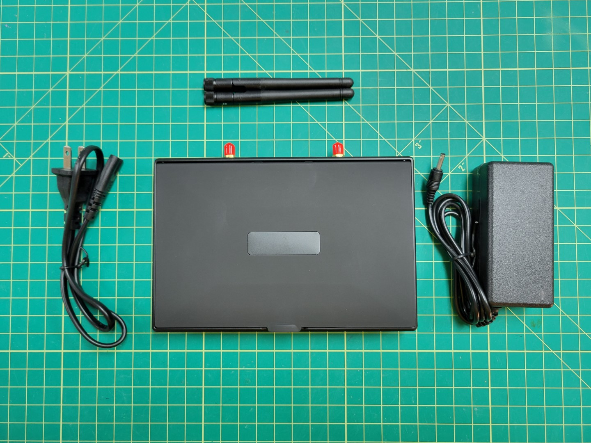

## Overview

Your FPV camera has a built-in transmitter that will broadcast a video signal to the monitor, which has a built-in receiver. Open your FPV monitor box and pull out the components shown in the photo below.

{}
Be sure to attach the both antennas to the FPV monitor before powering it. Otherwise you run the risk of burning out the receiver.
{}

The video below will walk you through setting the band and channel of the transmitter and receiver.

{}
The FPV transmitter gets VERY HOT. Be careful when setting the transmitter's band and channel.
{}


