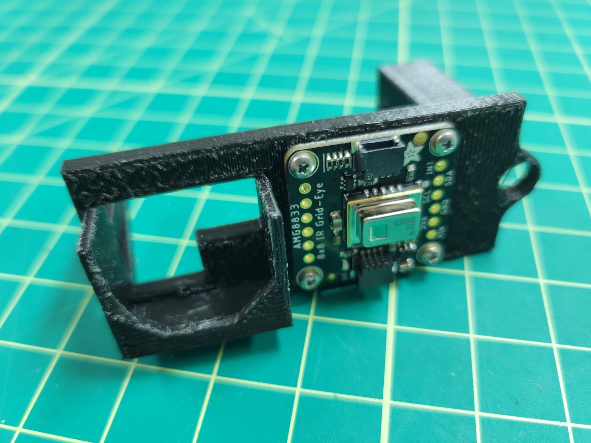
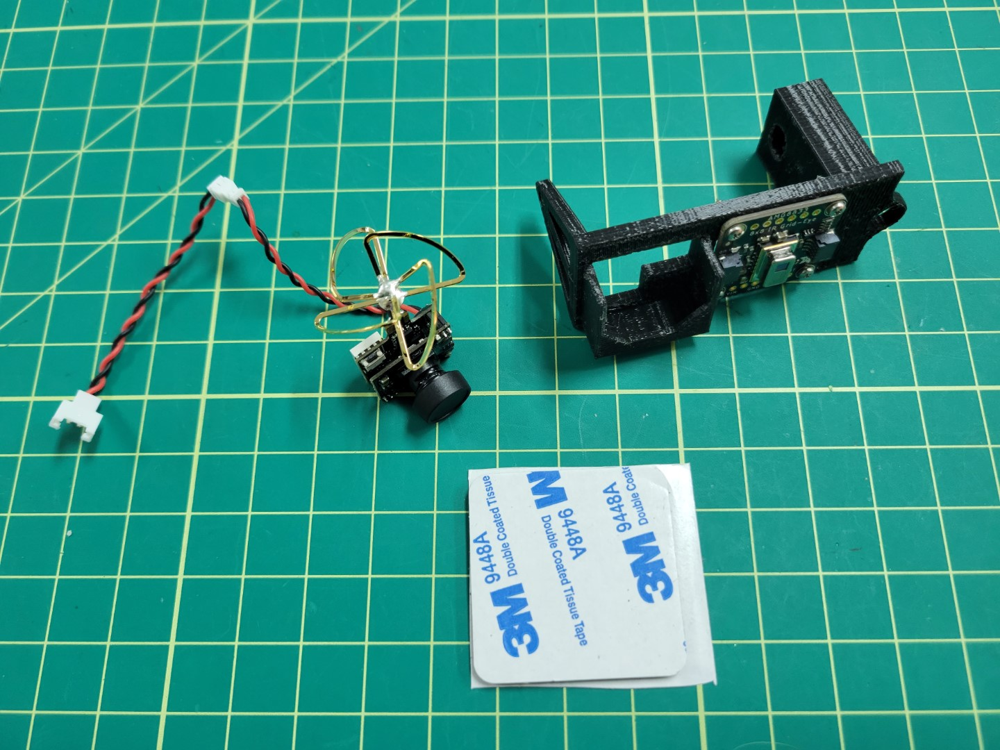
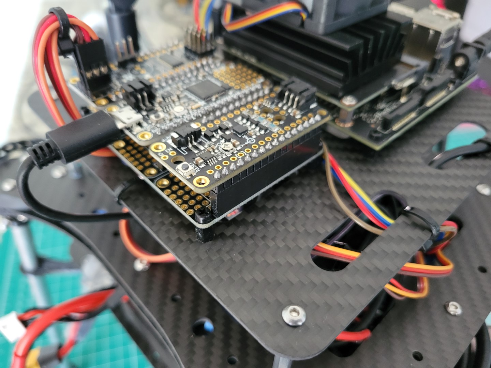
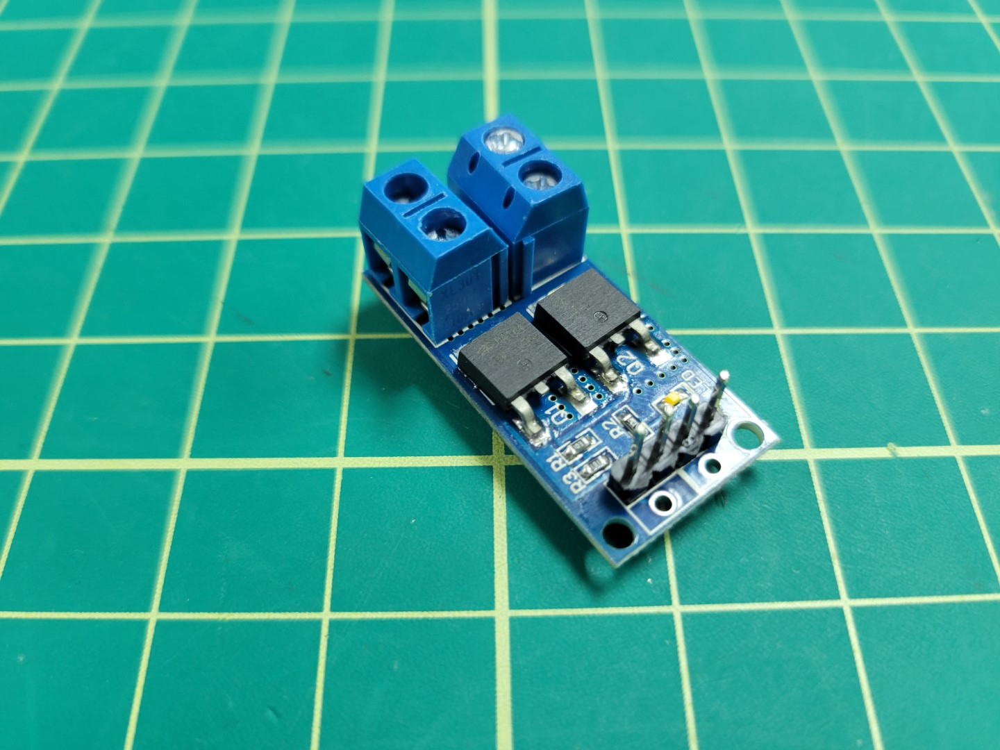
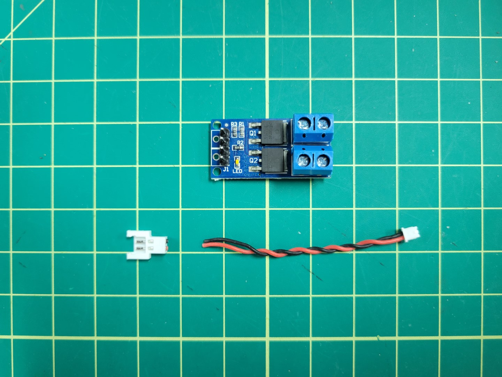
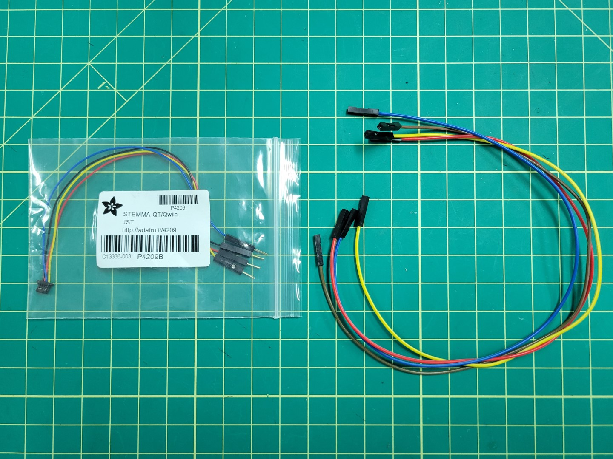

## Overview

This section details how to assemble your gimbal.
The gimbal allows the ground station operator to aim the FPV camera, thermal camera, and
laser pointer at targets on the field independently of the drones position/orientation.
The gimbal assembly will be used to detect hot spots on the field, put out fires using
your water cannon, and perform reconnaissance with your FPV camera .

The gimbal uses 2 servos (very similar to servos used in previous years)
to control the pan and tilt of the drone.

Pan is the rotation about the z-axis meaning this controls the left or right camera angle.
Pan gets its name because it keeps an object in the picture or secures a panoramic effect.

Tilt is the rotation abut the y-axis meaning it controls the up and down camera angle.

Obtain the
[gimbal parts]()
from the 3D printing section, 2 servos and associated hardware, a mosfet,
the thermal camera, laser module, FPV camera, and long F-F dupont jumper wires.

{}
Be sure you have the latest 3D printed parts as there have been changes to the pan part
to accommodate your specific servo horn.
{}


## Gimbal Base

Start with the gimbal base.
Pass your servo wire through the slot on the slide and slide servo into place.


Secure the servo into the gimbal base using the servo hardware screws as shown below.


## Gimbal Pan

Next you will attach the servo horn with 2 arms to the
bottom of the gimbal pan part using the servo hardware.


Be sure the geared part of the servo horn is facing away from the connecting face.
Align the center hole and the 2 holes (one hole away from the end of the servo arm) with
the holes on the pan part. Screw through the part to attach your servo horn to the pan part.

If done successfully your screws heads should sit flush with the bottom of the gimbal pan.


Place a second servo in the gimbal pan part, this servo will be used to control the tilt of the gimbal. The gimbal gear and the tilt attachment arm should be on the same axis. Align the servo gear with the tilt attachment arm of the opposite side of the 3D printed part. Screw the tilt servo into the two holes on the side pan assembly; the final product of which should look like the following photo.


## Gimbal Tilt

Next we will be assembling the tilt mechanism.
This is where all of our sensors will be mounted.

### Thermal Camera Mounting

The thermal camera will be mounted in the center of our gimbal tilt part.
Use 4 screws from the peripheral bag to attach the thermal camera to the drone.


After screwing in, it should look like the photo below.

{}
Make note of the thermal camera's orientation. This will be important for properly viewing the thermal image in the AVR GUI.
{}



We will wire and test this in following sections.

### FPV mounting

The FPV camera is mounted on the left side of the part (as shown in the picture).



Cut a 3M double sided tape to the size of the base of the protruding area of the tilt part and place.


Slide the camera into the slot and ensure that the camera is secured.
You should be able turn the part upside down without the camera falling out.


We will wire and test this in following sections.

### Mount Servo Horn

Next place your servo horn into the the recess on the tilt part.
We find that using a small amount of super glue is helpful in holding the servo in place before we attach it.


The only remaining part of the gimbal assembly components is the laser,
but we will come back to that after fully assembling the gimbal on the drone.

## Gimbal Assembly

Now that all of the assembly 3D parts have been assembled we can start mounting the gimbal to the drone.

{}
Before performing this section, ensure you have connected to your drone with
[the GUI]()
as we will need to use it in order to calibrate the Gimbal.
{}

First, mount the Gimbal base to the drone using 10mm 3M screws included in your kit.
Use the 1st and 3rd slotted holes from the front of the drone to mount the gimbal base.


### Pan and Tilt Calibration

Please watch the video below to understand calibrating your gimbal's pan and tilt range of motion.



{}
If you do not have the "invert joystick" option in your GUI be sure you have the
[latest stable release](https://github.com/bellflight/AVR-2022/releases/tag/stable)
of the GUI.
{}

Command used in video for starting the services

```bash
cd AVR-2022/VMC
./start.py run mqtt pcm
```

### Pan and Tilt Servo Wiring

You can clean up your servo wiring by using 12" servo extenders. You will run them up through the bottom, mid, and top plates and finally connect them to your PCC as shown in the photo below.



There is no right or wrong way to manage your servo wiring. The only important thing is that you have your pan and tilt servos plugged into the correct ports as covered in the calibration video.

## Laser Pointer Mounting


Cut a small piece of your 3M double sided tape and place it on the end of your laser pointer being sure not to obstruct the view of the laser barrel.


## Powering Laser and the FPV

Next we will be focusing on the FPV and the Laser wiring as shown in the following wiring diagram.


Solder extra header pins from the PCC section onto mosfet pins J1.



Cut wires (black and red) approximately 6" in length.

Screw wires into the PCC Buck converter output terminal. There will be two wires coming out of the positive and negative terminals as shown in the photo below.


Cut the extender provided with the FPV camera at the connector as shown in the following photo.



Place both the power and FPV wire ends into the mosfet input terminals and screw down to terminal to secure.


Stack 2 layers of 3M double sided tape on the mosfet as shown in the following photo.


Next mount your mosfet and plug in your FPV camera.


Wire mosfet from the PCC. Wire A4 will run to the PWM. The Ground pin will run to GND.


Cut and strip one side of a black and red Female-Female dupont jumper wire to approximately 8" in length.
Screw wires in to their respective terminal blocks.
Place the black and red wire on the ground and signal pins of the laser pointer respectively as shown in the following photo.


## Thermal Camera

Locate the thermal camera JST SH 4-pin connecting cable and four 12" jumper wires with corresponding colors from your kit.



Connect long female-female jumper wires of corresponding colors.
It may be beneficial to add a little bit of electrical tape to ensure they do not come undone.


Remove your plastic end pieces.


Attach the JST connector to the thermal camera and route the cables through the top accessory plate.


Place your top cables into the 20x2 connector housing on your Jetson per the following wiring diagram.


The final product should look like the following.


