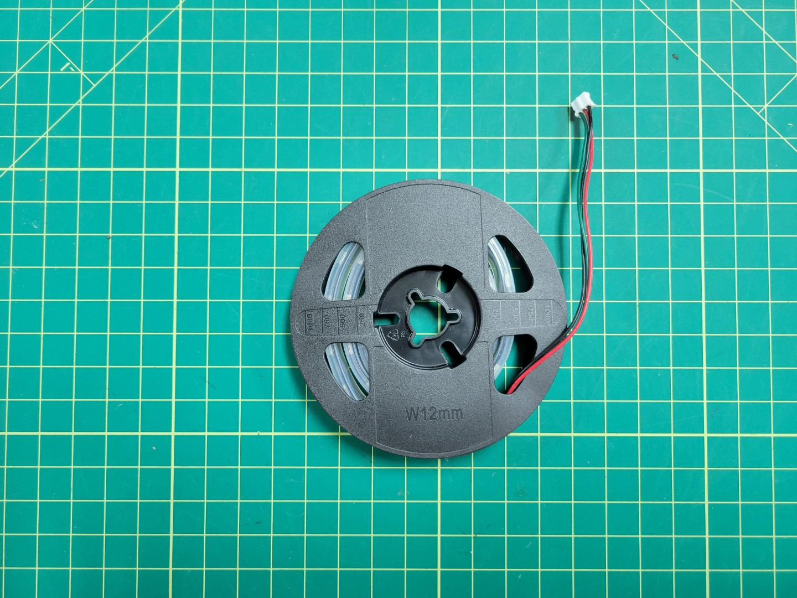
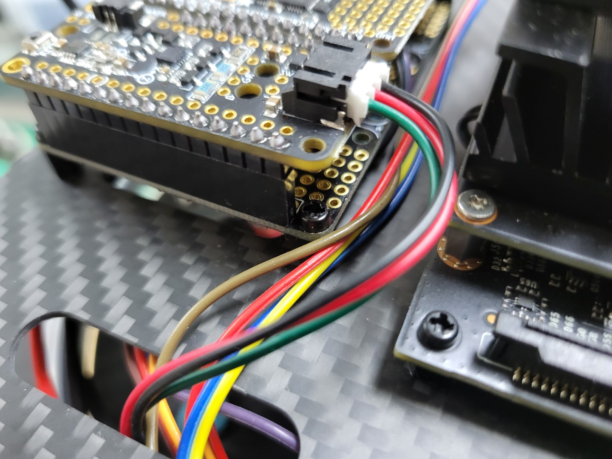
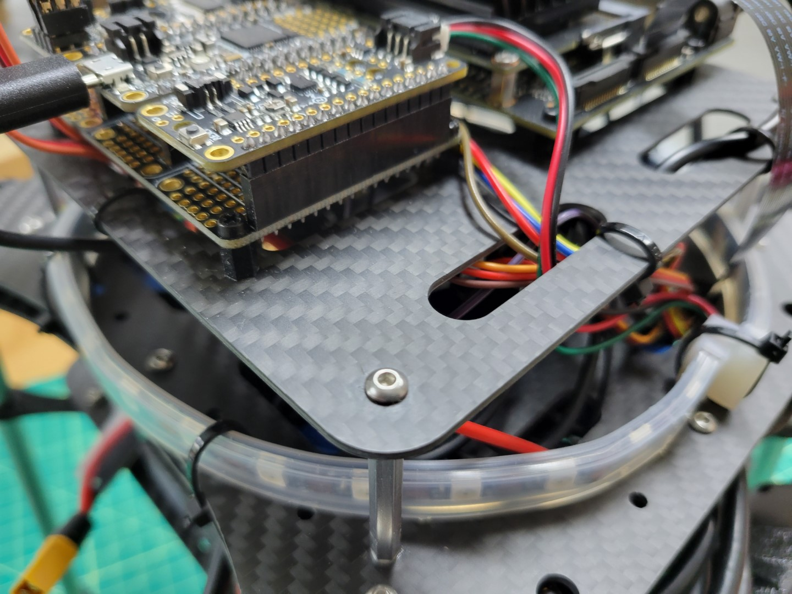

In this section we cover how to install your LED light ring which will be used to communicate from the field back to teams.

Route your wire lead through the side slot on the top accessory plate and plug into the PCC as shown below.

Position the LED light ring under the top accessory plate around the inside of the standoffs and secure using zip ties.

{}
Feel free to find alternative means of attaching your LED rings, just ensure they are visible.
{}

## Testing


