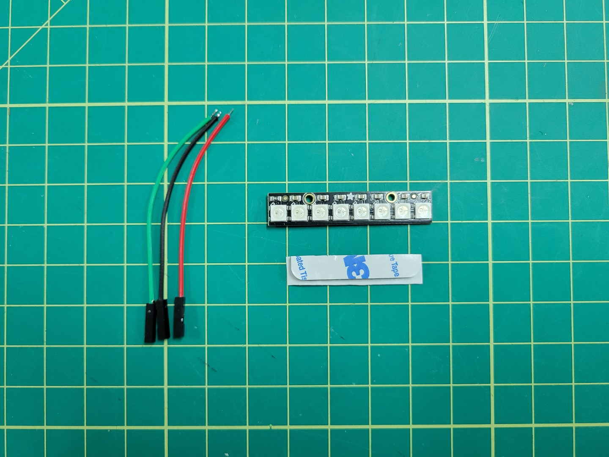
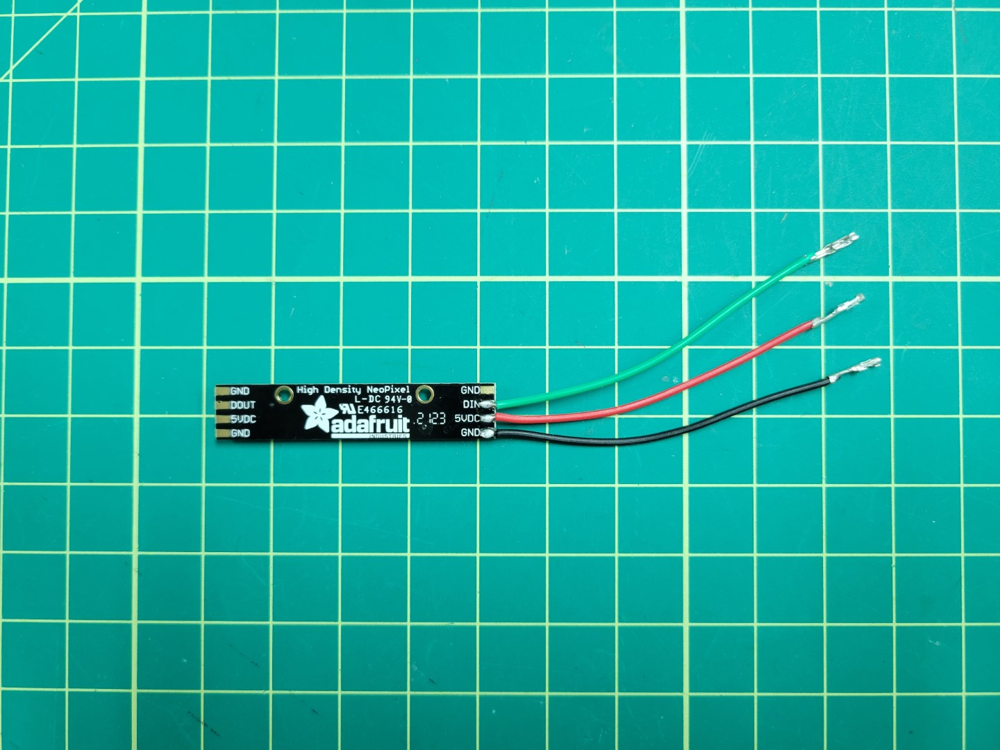
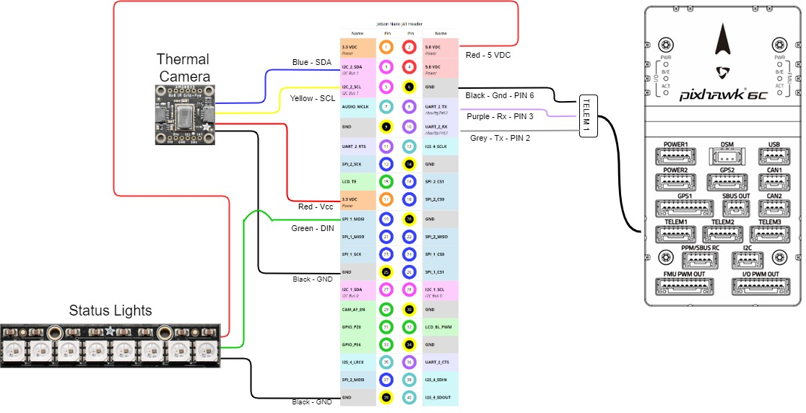
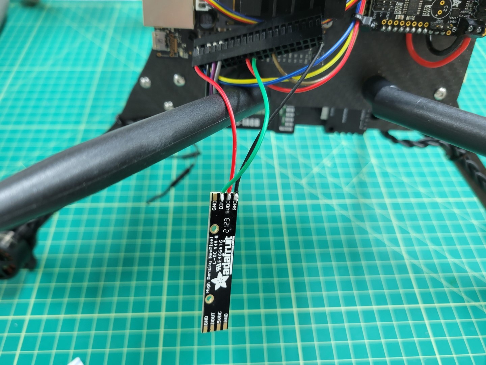
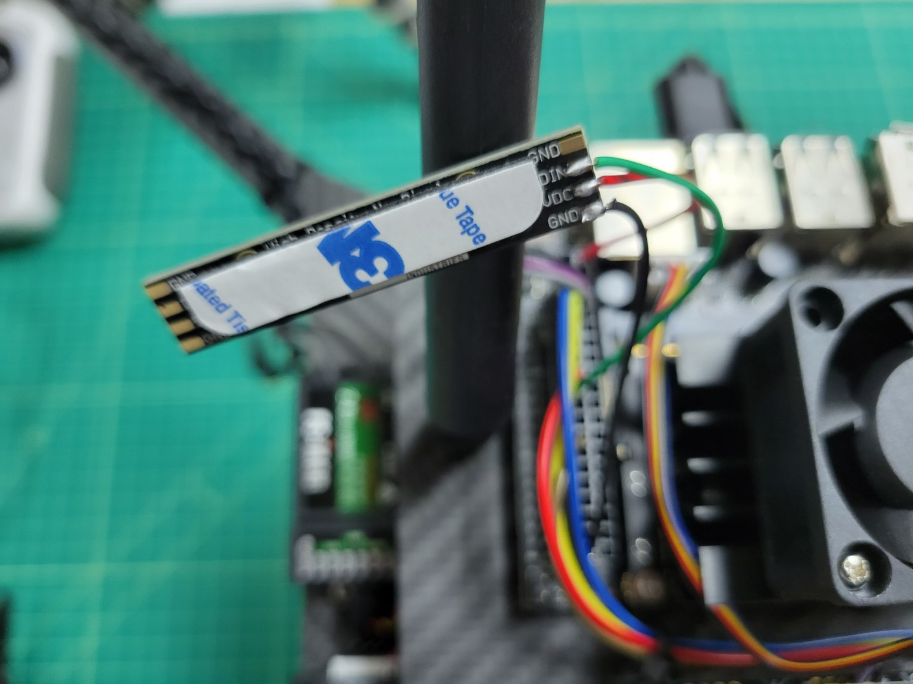
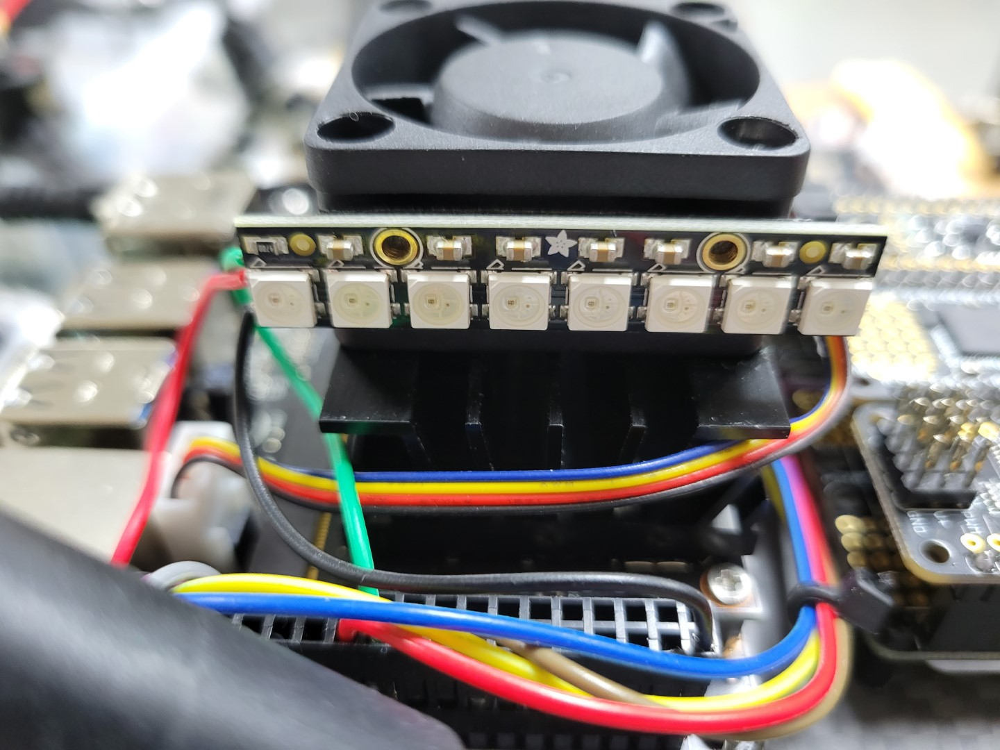

The status lights are designed to provide an extra layer of quick and easy debugging to show the status of your drone at a glance.

To complete the status light installation you will need the following.



## Wiring

Wire the green wire to DIN, red wire to 5VDC, and black wire to Ground. Remove the plastic housing from other end of the wires.



Insert wires into VMC housing per the following wiring diagram.



This should result in the following.



## Mounting

Use 3M double-sided foam tape to mount to the fan of the Jetson facing towards the rear of the drone.





## Testing



Commands run in video:

```bash
cd AVR-2022/VMC/
./start.py run -n
```

Feel free to explore and try different combinations for what you think is the most useful information.
For instance if you are doing just a flight test with no peripherals you may want to try the following.

```bash
cd AVR-2022/VMC/
./start.py run status -m
```

## Light Definition

| Module:   | Message:        | LED: | Color: |
| --------- | --------------- | ---- | ------ |
| VIO:      | "avr/vio"       | 1    | PURPLE |
| PCM:      | "avr/pcm"       | 2    | AQUA   |
| Thermal:  | "avr/thermal"   | 3    | BLUE   |
| FCC:      | "avr/fcm"       | 4    | ORANGE |
| AprilTag: | "avr/apriltags" | 5    | YELLOW |
