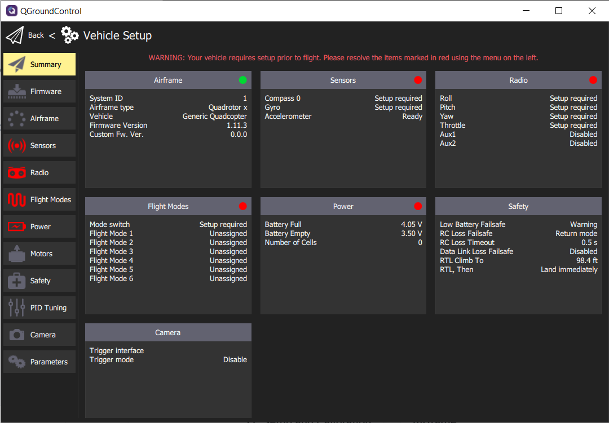

## Uploading PX4 firmware using QGC

[PX4](https://px4.io/) is firmware that we will be running
on the AVR drone. It is an open-source flight stack containing all the
software necessary to get your drone into the air.

To facilitate some of the extra functionality required for our drone
to fly in stabilized flight mode without a GPS, you will need a custom version of PX4
Bell engineers have developed. Go to the latest
[AVR software release](https://github.com/bellflight/AVR-2022/releases/tag/stable)
and download the `px4_fmu-v6c_default.<px4 version>.<hash>.px4` file.

{}
Be sure you grab the correct **6c** firmware, there will also be a 6x build,
`px4_fmu-v6x_default`, but that is for a different flight controller
and is **NOT** to be used.
{}

In the Firmware screen in QGroundControl you can upload a new version of PX4.
To access the firmware screen make sure to click on the Q logo in the
top left of the screen and then click on **Vehicle Setup > Firmware**.
You will see the following screen.

{}
Make your FC is **NOT** plugged in when accessing the firmware setup screen.
First access the firmware screen and **THEN** plug in your FC.
It will recognize the connection and initiate the process.
{}

QGC will ask you to plug in your FC using a USB cable.
A popup will appear that asks you which firmware you want to use.
select "Advanced Settings", then "Custom firmware file..."

Then click "Ok" and select the firmware file you downloaded.
Now, you will see a progress bar. This process should take no more than 2-3 minutes.

After the PX4 firmware is successfully loaded you will be presented with
the default **Vehicle Setup** screen. It is necessary to go through the
following steps to ensure a reliable and stable first flight.

