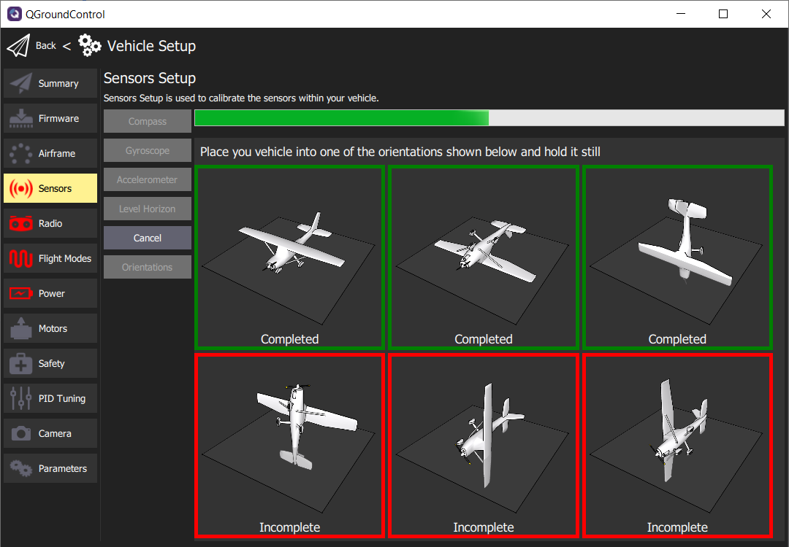

The **Sensors** screen lists most of the sensors that are available to
the FC (internal or external). It allows you to start the calibration process
for the listed sensors. This step is very important for stable flights.
It is required to do the calibration at least once and should be repeated whenever
adding new components to the AVR drone or if flight becomes less stable.

{}
Given advanced assembly of your drone will require additional autonomy components
and peripherals, it is a good practice to understand the calibration process in detail.
{}

Click on **Sensors** in the navigation menu and let's walk
through the calibration process for each sensor.

## Compass

The compass is important for your AVR drone to maintain proper orientation.
Click on the **Compass** button and you will be asked to begin the calibration process.
This process requires you to position the AVR drone in a number of set orientations
and rotate the vehicle about the specified axis.

Click **Ok** to proceed with the compass calibration.
QGC will automatically recognize the orientation of the AVR drone and
provide a yellow highlight as shown in the image below.

{}
Don't be thrown off by the images of an airplane in the QGC
compass calibration process. This still applies to the AVR drone.
{}

{}
You may find it difficult to rotate the AVR drone with USB connected.
It is helpful to have someone keep the cable out of the way while another
rotates the drone around its designated axis.
{}

Once the orientation is highlighted you can begin rotating the drone until the
box is highlighted green. This generally requires one 360 degree rotation
around the axis. The image below shows three of the six orientations completed.

After completing the calibration of all axes click **Ok** to return to the sensor setup.
It is important to reboot your FC prior to flight,
but for now we will move on to calibrating the **Gyroscope**.

## Gyroscope

The gyroscope is an important sensor that will be used to keep your
AVR drone level when hovering. Now that the compass calibration is complete
you will click on Gyroscope to being the process. This will be much easier
than compass calibration! Make sure your AVR drone is on a level surface
and click Ok.

After a few seconds, the gyroscope calibration will be complete.

## Accelerometer

The accelerometer works in conjunction with the gyroscope to keep your
AVR drone level along each axis. Click on **Accelerometer** and then
**Ok** to begin the calibration process.

This process is fairly similar to compass calibration but does
not require you to rotate the drone around each axis. You simply
need to hold the drone level in each orientation. QGC will detect
the orientation, which is denoted by the yellow border.

Hold your AVR drone steady in each orientation for approximately 5-10 seconds.
As you complete each axis the border will turn green in QGC.

## Level Horizon

Level horizon is a simple calibration to make sure your FC understands the
default level position when powered on. Click on the **Level Horizon** button and
then **Ok**. This process will take more than a couple of seconds to complete.

## Orientations

Given we have mounted the FC in its default orientation
(facing up and forward) this calibration is unnecessary.

Nice work! You have calibrated the necessary sensors for your AVR drone
to be able to know its orientation and keep level during flight.
The following Summary screen shows the successful steps completed in green.
Now we will move onto setting up the **Radio** (aka Transmitter).

