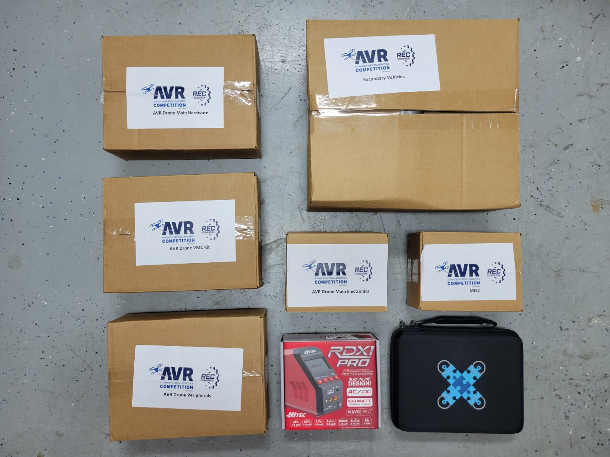
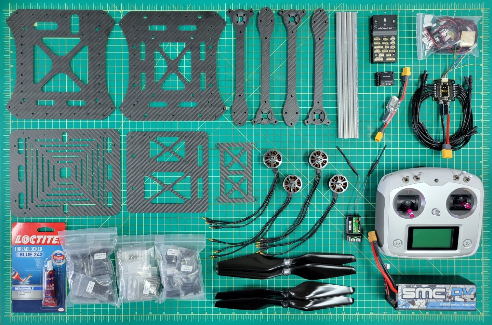
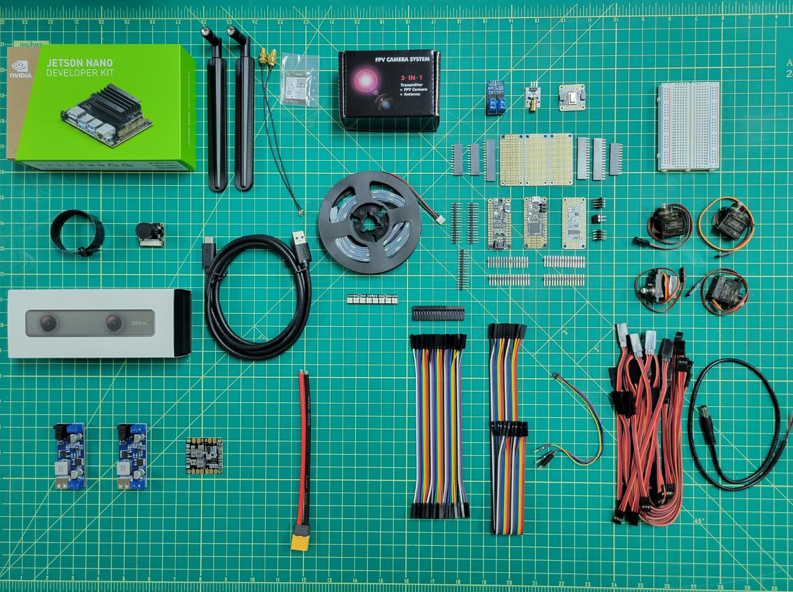

As you read through this page please be sure to refer to the
[glossary](),
which contains definitions of many of the components on this page.
The Bell AVR drone kit includes all of the components required to build your
own autonomous quadcopter. The kit provides a frame, motors, electronic speed
controllers, flight controller, and several additional peripherals.
This section will cover a majority of the components included for basic
assembly of the drone.

---

## Boxes in AVR Kit

The first shipment of your AVR kit will contain the following boxes. Be sure to read the label on each box to gain a high level understanding of the components inside.

## Components for Basic Drone Assembly

The photo below shows the main components necessary for the first phase of the build, which consists of assembling the drone hardware, configuring the flight controller, and becoming familiar with manual, stabilized flight.

## Components for Advanced Drone Assembly

In the second phase of the build you will be adding several peripherals to your AVR drone, installing software, and configuring parameters for better performance. These modifications will allow you to fly in a mode known as "Position Hold" where the drone will maintain position and altitude. This will lead to a much better experience when it comes to competition day.

