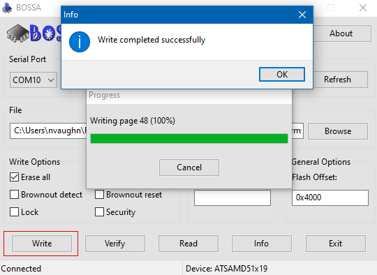

## Setup

To flash your PCC, you need to download and install a tool called BOSSA first.

### Windows/MacOS

Go to [this page](https://github.com/shumatech/BOSSA/releases/latest) and download and install
the `bossa-x64-<version>.msi` file for Windows, or the `bossa-<version>.dmg` file
for MacOS.
Make sure to install the device drivers that it prompts you to install as well.


### Linux

For Linux, you'll need to compile and run BOSSA from source.

```bash
git clone https://github.com/shumatech/BOSSA
sudo apt install build-essential libwxgtk3.0-gtk3-dev libreadline-dev
# if libwxgtk3.0-gtk3-dev cannot be found, run `sudo apt-cache search libwxgt*`
# and install the next closest match
cd BOSSA
make -j
./bin/bossa
```

## Flashing

After getting BOSSA installed, you need to also download the PCC firmware that you'll
be loading. Go to the
[AVR release page](https://github.com/bellflight/AVR-2022/releases/tag/stable)
and download the `pcc_firmware.<version>.bin` file.


Now you're ready to flash your PCC! Follow the next steps _exactly_ to not
run into any issues.

First, plug your PCC into your computer with the provided MicroUSB cable.

{}
Open Device Manager in Windows, and you should see at least one entry under
"Ports (COM & LPT)" (if this doesn't happen, that's okay, it means the firmware isn't
loaded or corrupted, but we're about to overwrite it anyways).


{}

Quickly double-tap the little reset button right next to the MicroUSB connector.
The LED next to the button should briefly flash red before turning solid green.

{}
Additionally, the PCC should also now show up as a USB device in Windows
titled "FEATHERBOOT", and the COM port you saw before should now be gone and
replaced with one with a different number.


{}

This puts the PCC into bootloader mode so we can flash new firmware.

Open BOSSA and select the COM port that has now shown up from the previous step,
or the serial device `ttyACM0`. Also select the firmware file you downloaded.

{}
Forgetting this next step will cause lots of confusing results!
{}

In BOSSA, **make sure to put in a flash offset of `0x4000`** and select "Erase all".


Now, you can hit the "Write" button!



You can also optionally click the "Verify" button as well just to make sure
everything flashed correctly.


Finally, to get the PCC out of bootloader mode, and make sure the firmware is working
correctly, unplug the PCC and plug it back in, or press the reset button once.
The bright green LED should remain off and the original COM port should show
back up in device manager.

{}
You're now ready to test it out!
{}
