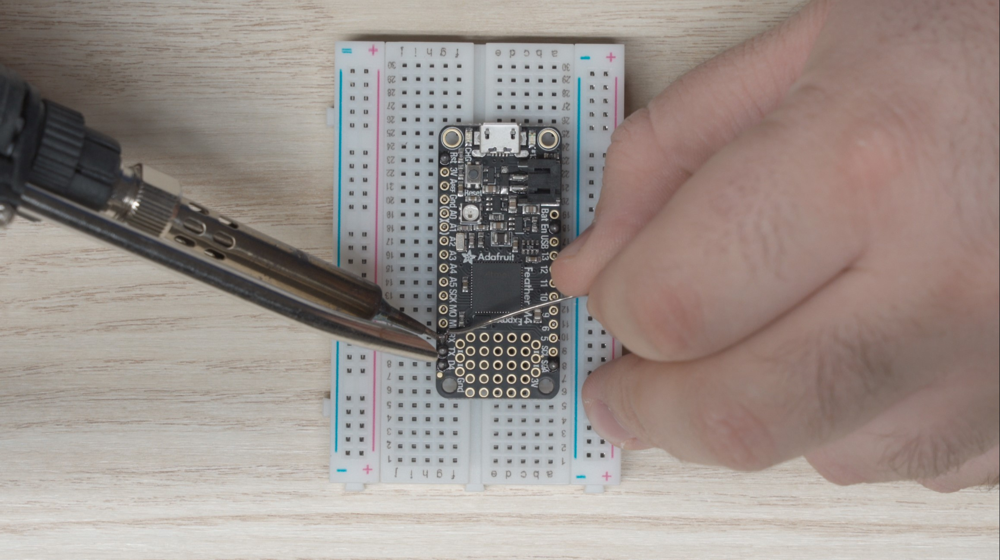
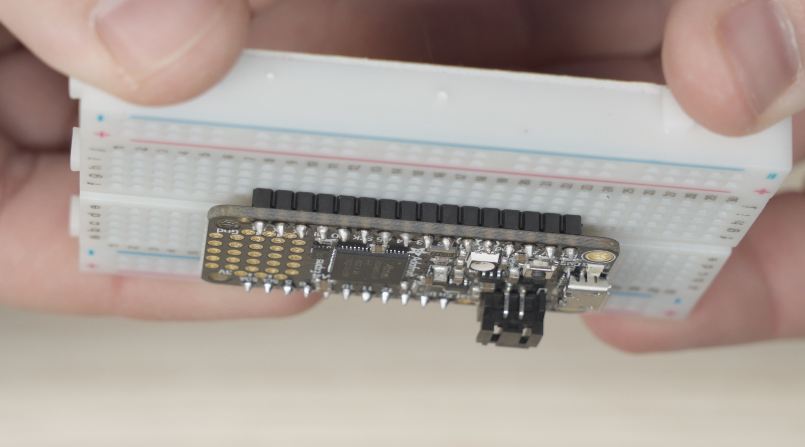
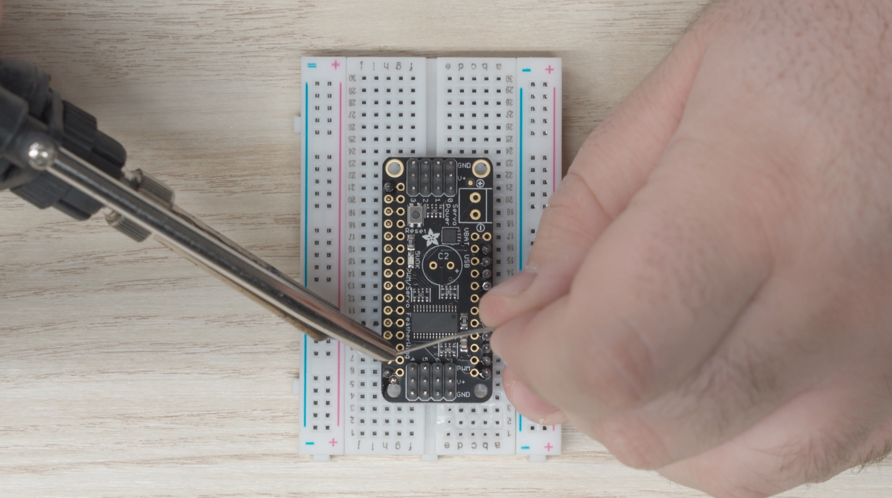
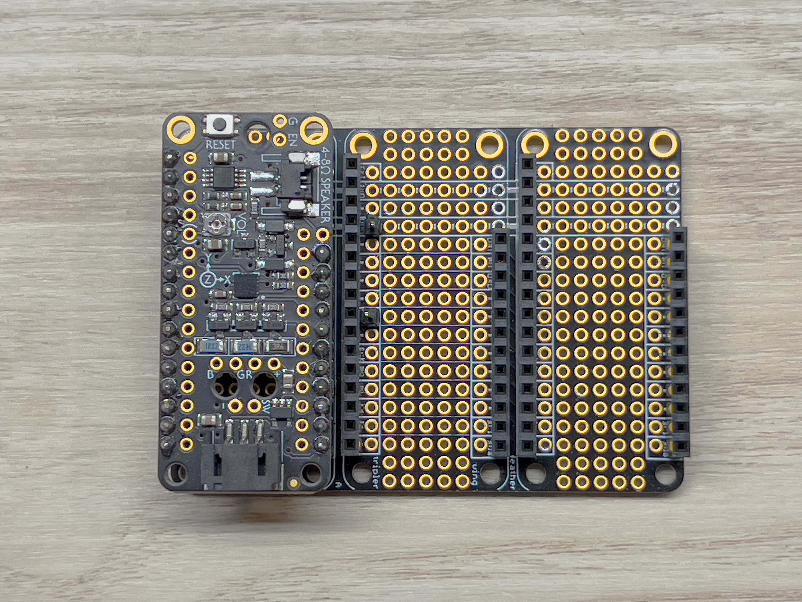
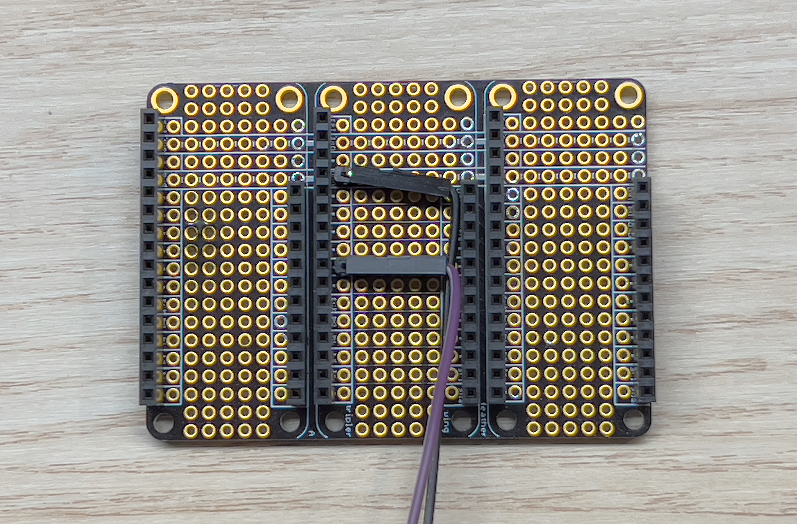
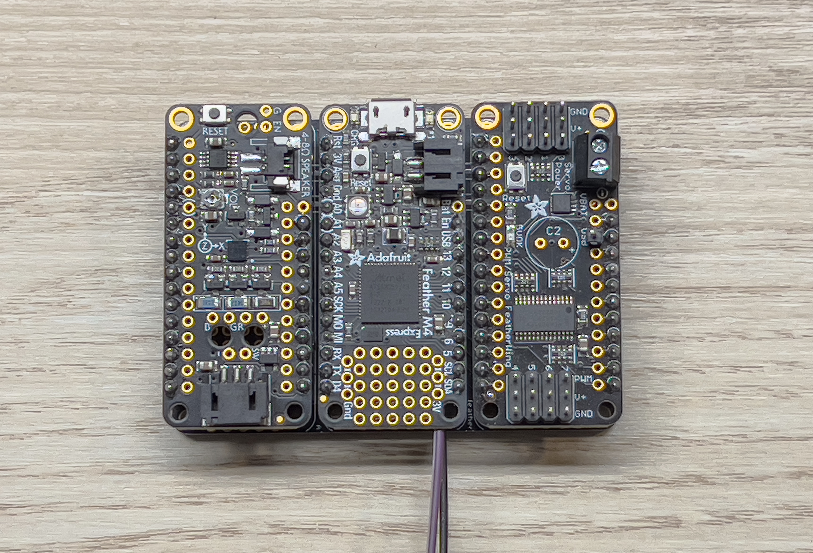

Assembling the Peripheral Control Computer is fairly easy,
and just requires a bit of soldering.

## Tools Needed

- Soldering Iron (I used an iron at 450C, but the recommended solder melts around 200C)
- Soldering Iron Tip Cleaner
- Solder (Recommend 60/40 Tin/Lead)
- Wire Strippers
- Breadboard

## PCC Parts - Box 5

Before we get started, let's make sure we have all the necessary parts for the PCC.

The PCC ships in 4 plastic bags consisting of the following:

- 1 x Adafruit Feather M4 Express (Pictured upper left)
  - 2 x 16x1 Male Pin Headers
- 1 x Adafruit Prop Maker Featherwing (Pictured upper middle)
  - 2 x 16x1 Male Pin Headers
- 1 x Adafruit Servo/PWM Featherwing (Pictured upper right)
  - 2 x 16x1 Male Pin Headers
  - 2 x 4x3 Male Pin Headers
  - 1 x 2 screw-terminal thru-hole adapter
- 1 x Adafruit Featherwing Tripler (Pictured Bottom)
  - 3 x 12x1 Female Pin Headers
  - 3 x 16x1 Female Pin Headers

{}
The picture only has a 9 pin header for the Prop Maker, because mine broke
off in shipping. Don't worry this isn't an issue, just place them
together when it's time to solder.
{}

## Solder the Feather M4 Express

Before we dive in, let's go over a couple of warnings and tips.

{}
Soldering irons get hot... like **really** **_really_** hot.
Pay attention to finger placement, and don't burn yourself.
{}

{}
The key to an enjoyable soldering experience is patience, a clean tip, and a hot iron.
{}

### Step 1: Assemble Feather M4 Express

The Feather M4 is the brains of the PCC. It receives commands from the VMC and
executes them in order to change the color of the LEDs or move a servo.

You'll see that the M4 Express has 16 pins along its left side
(assuming the micro USB port is the top), and 12 pins along the right side.
Because the M4 Express ships with 2 x 16x1 headers, we need to cut one side down.
You should be able to use scissors to trim one of the headers to **11 pins**. Why 11?
The PCC doesn't make use of the "Bat" pin and in our testing including this pin
caused issues. For this reason, we chose to omit this pin.
You can see it is missing if you expand the picture below:

{}
Place the headers in the breadboard, long side down to act
as a fixture for soldering. It will be much easier this way.
{}

With the headers cut to length, grab your breadboard and place the headers in
the "a" and "g" column as in the picture above, with the long side of the headers
going into the breadboard. Make sure it's lined up correctly and set the M4 Express
onto the pins. The feather should not move around anymore and you can begin soldering.

For the smoothest outcome, start by soldering the pins in the four corners so the pins
don't move around on you when soldering the rest. I like to use a hot
iron (around **450°C**) with a fine tip for this.

Use the following steps to complete a solder joint:

1. Place the iron tip on the feather such that it is making contact with the
   protruding pin as well as the donut-shaped pad that the pin protrudes through.
2. If your iron is clean and hot, after about 5 seconds you should be able to move
   your solder in to touch the iron at the junction where the iron and the pin meet.
   The solder should melt almost immediately, and wick around the pin.
3. Don't go overboard with the solder. You want just enough that the solder forms a
   cone shape around the pin. Less really is more here.
4. Pull the solder and iron away from the board and inspect your work.
5. Repeat steps 1 through 4 for each pin on the M4 Express.

Once complete you should have solder joints that look like this:

Once you're happy with your soldering work, grab each end
(the micro-usb and opposite side) and slowly inch the feather out
of the breadboard. It is very easy to bend a pin trying to remove
it so just go slow and be careful.

{}
If you bend a pin removing the soldered part from the breadboard,
use some needle nose pliers to bend it back straight.
Don't work the pin too much though, or you'll break it.
{}

Hopefully that wasn't too bad! Now we need to repeat similar steps for
the prop maker and the servo featherwing.

## Solder the Prop Maker

The steps for the Prop Maker are the same as the M4 Express.

Make sure to cut one set of male headers down to 11 pins and skip the "Bat" pinhole.

Place the headers into the breadboard and solder all the pins.

## Solder the Servo/PWM Featherwing

For the Servo featherwing its easiest if you solder the 4x3 headers first:

1. Place one of the headers into the breadboard first.
2. Place the other set short-end first into the top of the featherwing.
3. Flip the featherwing upside down and onto the headers already inserted
   in the breadboard.
4. Solder these pins

Once the 4x3 headers are soldered in place, remove the featherwing from the
breadboard and solder the 16x1 headers, while remembering to trim the short
side to **11 pins**.

Finally, we need to install the screw terminal:

1. Remove the Featherwing from the breadboard.
2. Place the screw terminal in the top of the circuit board with the
   terminals facing outward
3. Turn the assembly upside down and place it on top of the breadboard.
4. Solder the screw terminal on.

## Installing the USB Power Jumper

In order to run the PCC from a laptop for testing,
we'll have to make a USB power jumper to connect the USB power
from your laptop to the servo power rails. In the future,
once the PCC makes its way onto the drone, the servos will have
a dedicated power supply.‌

First, we need to install a pin for the wire to connect to:‌

- Find a spare male pin from the headers we used in the above steps
- Place the pin into the area labeled "USB" on the servo featherwing
  (highlighted below)

- Solder the pin from the underside

Now we need to make the jumper wire. Take a spare wire from the kit
(there should be a whole bag with the proper connectors already on them)
and cut it down to just about an inch. Then strip about 5mm from the end
like shown below:​

Finally, place the terminated end on the pin we just soldered,
and the bare end into the + side of the terminal block and screw it down.

That's it! The Servo Featherwing is now complete.

## Solder the Featherwing Tripler

The tripler can be the trickiest piece to solder if you don't follow this simple trick:

Hold the tripler circuit board with the silkscreen print facing upwards.

Drop the headers into the board as shown in the picture below:

{}
It's **crucial** that you place the headers in the orientation shown below!
You should drop the headers into the board with the silkscreen facing up.
Failure to catch this before soldering will mean that you'll likely have to
purchase another Tripler, as these parts are hard to desolder.
{}

Then turn the whole thing over on its back (being careful not to drop the headers)
and then solder each pin from here.

{}
It's easiest if you "tack" one pin from each row of headers and then tweak
your alignment before doing the rest.
{}

## Adding the Laser Trigger

For the 2022 season, we are making use of a laser pointer. In order to be able to
trigger the laser from the PCC we need to add some extra pins connected to GND and A4
on the express to the Tripler.

Start by placing the Tripler down, and lining up the M4 Express with the headers on the
Tripler like shown below:

I used a spare male dupont-connector wire to mark the pins of interest by plugging them
into the desired spots on the header.

Next, grab some of the spare header pins and break two single-pins off:

Place them into the holes on the Tripler right next to the point of interest and use
something flat to place over the board to hold the pins in place while you flip it
over. I used an old PCB but you could use paper, cardboard, etc. Now solder the pins in
place.
You should now have something like this:

Now place a female dupont-connector wire on the pins and bend them down to the right.
They should fit perfectly between the header rows like such:

{}
Be sure to use your 12 inch female-to-female jumper wires as these will eventually need
to run from the top mounted PCC to the bottom mounted laser.
{}

Thats it! Move on to the next step!

## Putting It All Together

Now we can just pop the Featherwings into the Tripler as shown below:

Now your PCC is assembled!
