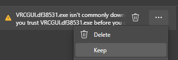
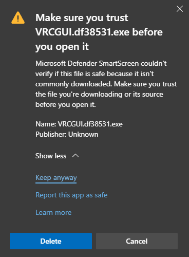

## Physical Setup

On your PCC, we'll need to make use of a USB power jumper to
power the servos from our laptop.


{}
MAKE SURE to **ONLY** use the jumper when testing with your laptop.
**NEVER** use the USB power jumper when the PCC is connected to the Jetson.
This is because the servos may draw enough current in certain scenarios
that would cause the current protection to trip on the power supply and
power off the Jetson regardless of what it's doing.
{}


Plug your servos and LED strip into the designated connections on the PCC:

- The LED strip plugs into the prop-maker featherwing
- The servos plug into channels 0-3, with the yellow signal wire of
  the servo facing the Adafruit logo on the PCB.

## Software Setup

Now it's time to download the AVR GUI program.

### Windows

Go to the latest
[AVR software release](https://github.com/bellflight/AVR-2022/releases/tag/stable)
and download the `AVRGUI.<hash>.exe` file. Like QGroundControl,
you may need to bypass some warnings about being an untrusted file.





### Other Platforms

For Linux and MacOS, we recommend running the AVR GUI from source. You'll need
to have Python 3.9 or Python 3.10 installed.

For Linux users, here's how you can easily install Python 3.10:

```bash
sudo add-apt-repository ppa:deadsnakes/ppa
sudo apt install python3-pip python3.10 python3.10-venv
sudo -H python3.10 -m pip install pip wheel --upgrade
```

For MacOS users, go to the Python releases page for MacOS and download an appropriate
installer: [https://www.python.org/downloads/macos/](https://www.python.org/downloads/macos/)

Now, run the following commands to clone the code repository where desired,
and setup the dependencies.

```bash
# clone the repo
git clone https://github.com/bellflight/AVR-2022
# cd into the repo
cd AVR-2022
# create a Python virtual environment
# You may need to replace `python` here with `python3` or `python3.10`
python -m venv .venv
# activate the virtual environment
source .venv/bin/activate
# install the dependencies
python scripts/install_requirements.py --directory GUI
# run the application
python GUI/app.py
```

In the future to run the application, you'll just need to activate the virtual
environment first:

```bash
cd AVR-2022
source .venv/bin/activate
python GUI/app.py
```

To deactivate the virtual environment, run:

```bash
deactivate
```

## PCC Tester

Before, you launch the application, plug the PCC into your computer with a
MicroUSB cable. The application will not recognize anything plugged in after it starts.
Now, launch the application. You should be presented with a screen like this:


In the Serial section, select the COM Port your PCC enumerates as. Click "Connect"
and the "PCC Tester" should now be enabled (we'll talk about the other tabs in
a later section).


Click around and try the different buttons,
your PCC should light up the LED and move some servos!

If some parts of the PCC work (such as the servos but not LEDs), this is
likely a hardware issue. Double check all of your solder connections
to make sure they are properly electrically connected and not shorting
anything they shouldn't be.

If nothing on the PCC works:

1. Make sure you selected the right serial port in the GUI. Sometimes phantom COM
   ports show up on Windows which you will be able to select, and won't do anything.
2. Make sure your firmware flashed correctly. Follow
   [the steps]()
   again and pay close attention.
3. Finally, as stated above, double check all of your solder connections.
