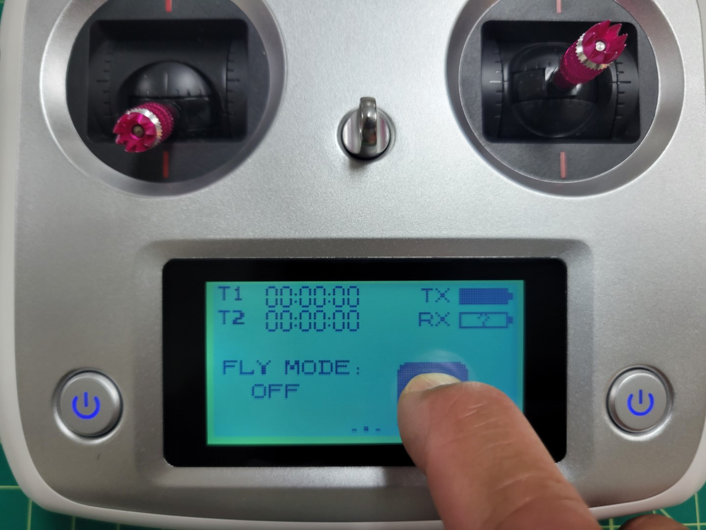
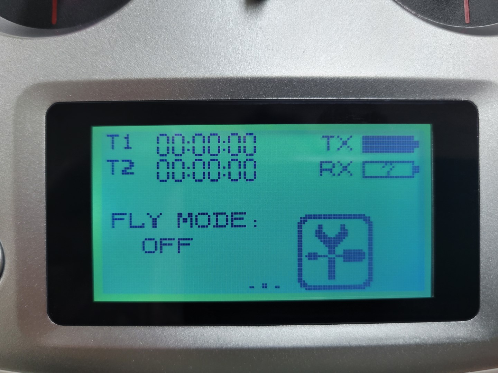
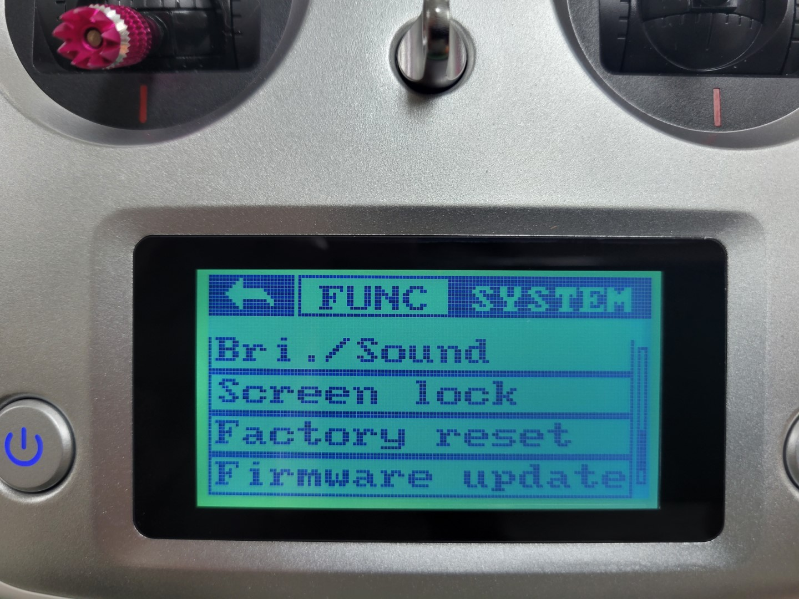
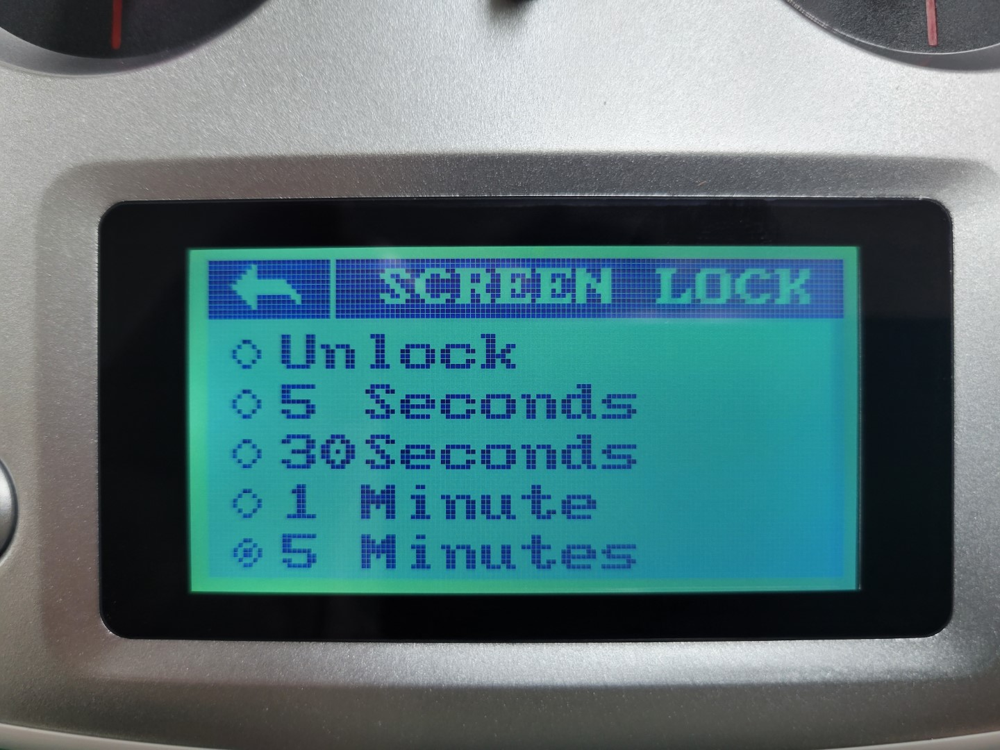

## Overview

To turn on the transmitter, press and hold the two power buttons on the front of
the device until the screen lights up. After you see the logo, you will be presented
with the home screen.

You might see a warning when you turn on the transmitter about switch positions.
Just follow the instructions provided on the screen to continue to the home screen.

The transmitter contains a touch screen used for displaying status info and for setup
purposes. The home screen has three different views. You can switch views by swiping
left and right, where the bottom indicator shows you which screen you are on
(when you start the transmitter, you see the center screen).

The left screen shows you the current value sent over all channels,
while the right screen shows information about sensors connected to the transmitter.

One thing that is helpful to gain an understanding of how your flight sticks
map to various channels is to swipe to the channel view and move your sticks around.
You should see the channel values update as you move the left and right sticks.

## Screen Unlock

By default the transmitter settings will be locked which prevents you from accidentally changing a setting. To unlock the screen press and hold the lock icon for 2 seconds.

After unlocking you will see the settings icon with the wrench and screwdriver.

## Configuration

Configuration is done by pressing the settings icon. The next screen has two different views: the
**function** view and the **system** view. The **function** view provides options that
change how the different sticks, buttons, and dials on the transmitter are
transformed to channel values.

The **system** view provides options for setting up the transmitter itself.
You can change to the **system** view by pressing **SYS**.

## Screen Lock Timeout

You will likely find that the screen lock timeout of 5 seconds is way too short. We recommend changing this to 5 minutes while you're becoming familiar with the transmitter. You can do this by going to the **system** menu and selecting **screen lock**.

You have several screen lock timeout options. Select the one you're most comfortable with.

