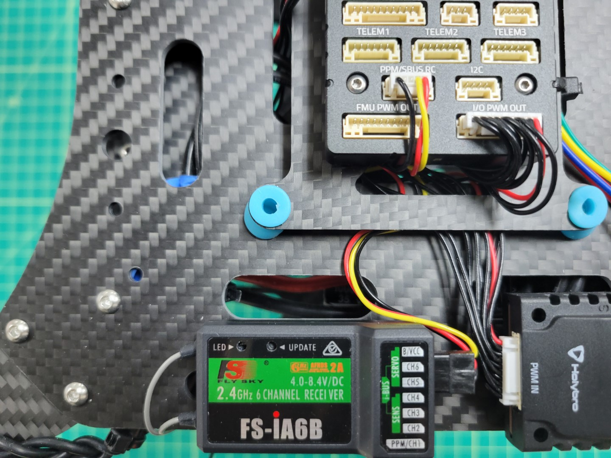

The RC receiver module has already been installed on the drone in a previous step.
Please verify that it is correctly connected on both the receiver (RX) side and on
the FC side as shown in the photo below.

Aside from the physical connection we also need to establish a wireless connection
between the transmitter and the receiver. This wireless connection happens through a
process known as **binding**. Binding is what will allow us to control the AVR drone
with the transmitter and change flight modes, which will become important in
the competition.

**Out of the box, the receiver and transmitter should be automatically bound
to each other.** If this is the case, the RC transmitter display would look
similar to the picture below when both transmitter and receiver are turned on
(receiving power). Please note the RX battery bar.
If this shows a question mark (while the receiver is getting powered),
then you will need to go through the binding process. We will cover that shortly.

The TX battery bar shows the remaining capacity of the batteries in the transmitter.
However, the **RX battery bar does NOT actually show the battery
capacity of the drone.** It reports a reading of the voltage level
(between 4.0 and 8.4 V) that is provided to
the receiver module by the FC, which should always be 5.0 V. In our case, it is only
useful for verifying that the transmitter and receiver module are
communicating with each other.

If your transmitter and receiver are already bound you can skip to the next
section labeled **Setting the Output Mode**. If the transmitter and receiver
are not bound, you can do it yourself. Make sure the FC is not powered by the
battery or USB cable. Insert the bind plug in the rightmost vertical slot
(labeled B/VCC) on the receiver module, see the picture below. You will find
the bind plug in a small plastic bag in the transmitter box. The cable that
connects to the FC should remain as shown below.

Turn on the transmitter and go to the **system** view in the **settings** menu.
Select **RX bind**. It will wait for the receiver to be turned on in bind mode as well.
You should now power the FC, which will also power the RC receiver module.
The easiest way is to power the FC with a micro-USB cable. When power is provided,
the receiver module will go into bind mode because of the jumper wire.
The binding procedure should be finished automatically (you might not even notice).

Power everything down and **you should now remove the bind plug
from the receiver module.** It should not remain in the receiver as it will
trigger the binding procedure again every time the receiver module is powered.
The next time you power up your transmitter and receiver they will be communicating.
