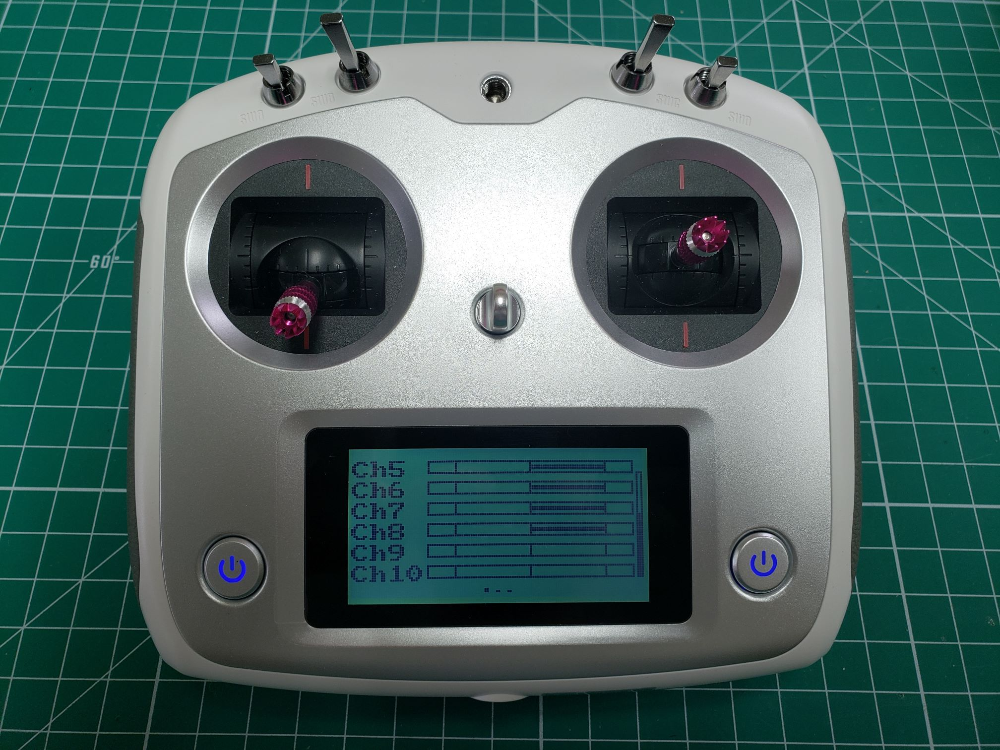

The receiver module supports up to 10 channels when using the S.BUS protocol.
The first 4 channels are used for basic control with the transmitter sticks,
leaving several free channels which can be mapped to auxiliary control switches.
Assigning switches, dials, and buttons on the transmitter to channels can be done
using the **Aux. channels** option under the **Function** tab in the **Settings** menu.

These channels will be useful throughout AVR and will let us do things like toggle a
switch to change the current flight mode of the drone.

You can press the icon to change the kind of input
(STX = stick, SWX = switch, VRX = dial, KEY = button). Pressing the text label
you can specify which exact input should be mapped to the channel.
It is also explained in 

For the AVR drone, we provide a default channel setup which allows for maximum
utility of the available channels, which can be found below. In future references,
we will always use the channel setup as provided here.

| Channel | Switch |
| ------- | ------ |
| 5       | SWA    |
| 6       | SWB    |
| 7       | SWC    |
| 8       | SWD    |

The following steps will walk you through assigning Channel 5 to **SWA**.
First, tap on the big circle with the line through it.

The following screen allows you to assign CH5 to a switch. You will select **SWx**.

After selecting **SWx** you will be presented with a screen that lets you select one
of the following switches: **SWA**, **SWB**, **SWC**, or **SWD** for Channel 5.
In this case, we will select **SWA**.

Repeat these steps for **CH6**, **CH7**, and **CH8** based on the table above.
After completing the steps you can go back to the home screen and swipe
right to see your channel outputs. Swipe down to see **CH5 - CH8** outputs.
With all switches in their default position (up) you should see the output
as shown in the image below.

Now toggle all of your switches to the downward position.
You should notice that the output changes and should be identical to the image below.

