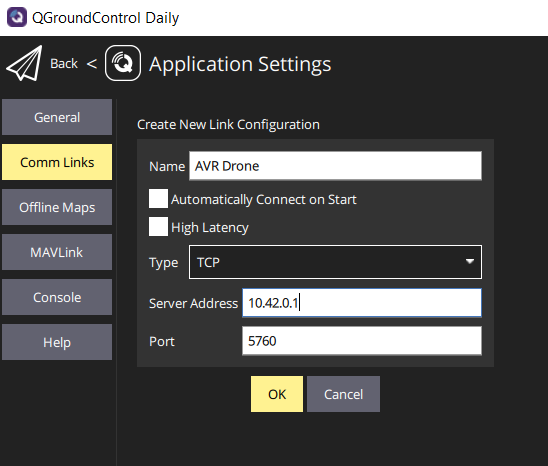
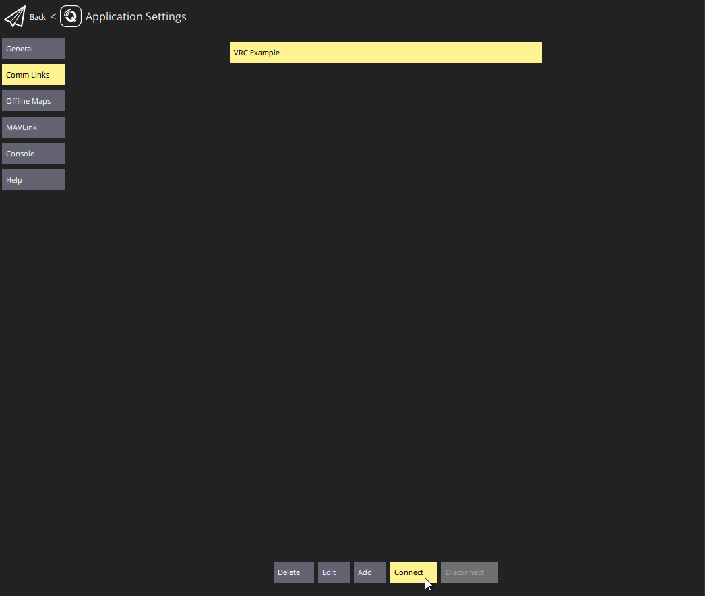

Once you have the VMC software running on your drone,
you'll want to connect QGroundControl to it. While not strictly
required for anything, it helps with keeping an eye on the
battery percentage remaining, and ensuring the correct flight mode is selected.

Open QGroundControl, click on the purple "Q" in the top left,
then go to "Application Settings". Now, go to "Comm Links" and
then click "Add" at the bottom.

Now, enter a name for this connection, select type of "TCP", enter the
IP address of your drone, and leave the port number to the default of 5760.
Click "Ok" to add it.

Now whenever you want to connect QGC to your done, go back to
"Application Settings", "Comm Links", select your connection,
and click "Connect" at the bottom.

Go back to the main QGC screen and you should see your drone at the Bell headquarters
with 13 satellites visible.

