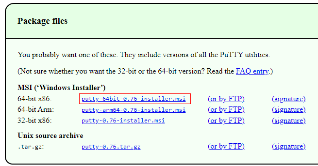
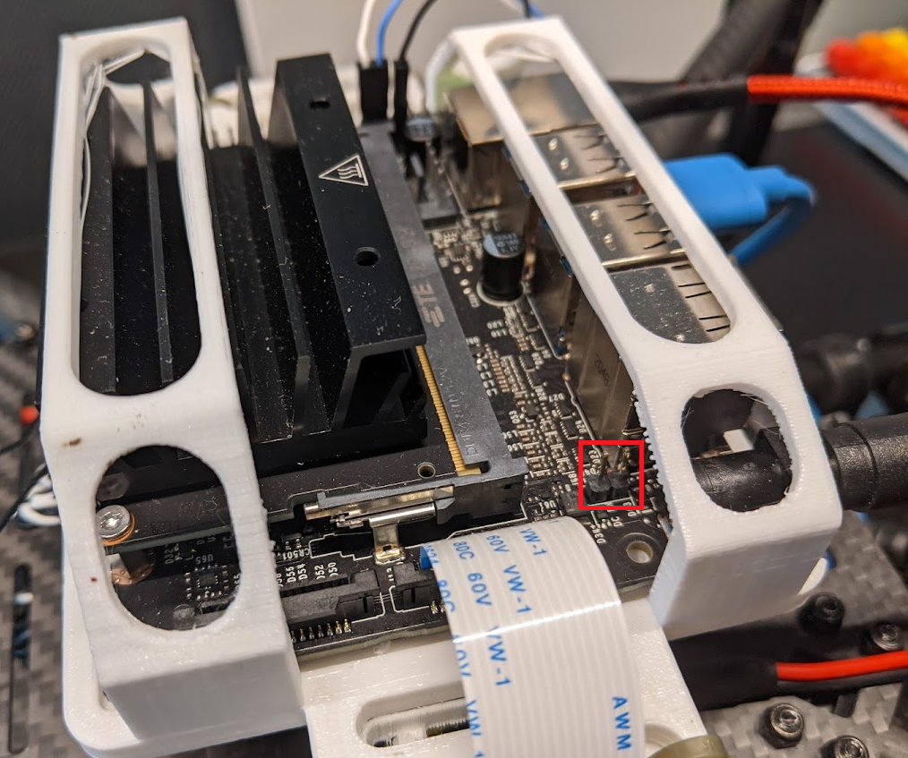
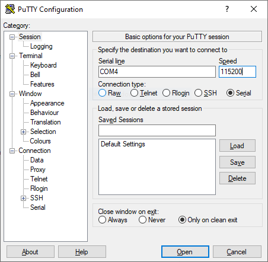
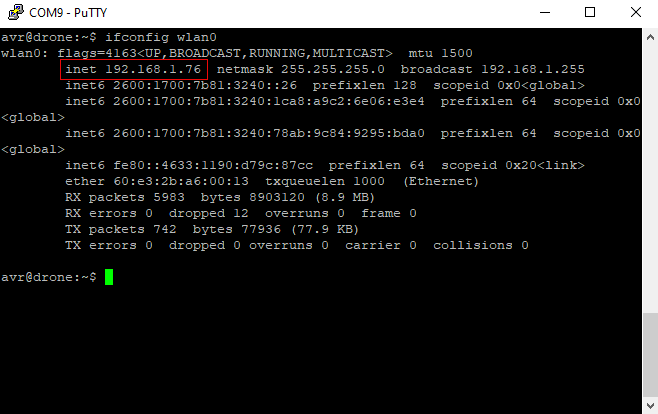

You'll need to login to your Jetson many times to setup and run software.
Out of the box, your Jetson will have a default user account called
`avr` with a password of `bellavr22`.

Here are 3 possible methods you can use.

## Monitor and Keyboard

---

Possibly the simplest way to connect to your Jetson is with
a monitor and keyboard. You'll just need a monitor that has HDMI or DisplayPort
that you can plug in to the Jetson.

Once at the desktop,
you can open a terminal by clicking the application launcher
in the bottom left (the 9 squares) or with the keyboard shortcut
<kbd>Ctrl</kbd>+<kbd>Alt</kbd>+<kbd>t</kbd>.

## Serial

---

If you do not have a monitor and keyboard, another method of logging in to your Jetson is over a serial connection.
To do this, you'll need a serial client.

### Installing Serial Client

---

#### Installing Serial Client on Windows

For Windows, we recommend PuTTy.
Go to [this page](https://www.chiark.greenend.org.uk/~sgtatham/putty/latest.html)
and download and install the `putty-64bit-<version>-installer.msi` file.




#### Installing Serial Client on MacOS

Rather than using PuTTy, it's much easier to open a terminal and simply run:

```bash
screen ttyACM0 115200
```

#### Installing Serial Client on Linux

You can follow the same steps as on MacOS
(after installing `screen` with `sudo apt install screen`),
but if you like a GUI, you can
install PuTTy with:

```bash
sudo apt install putty
```

and launch PuTTy with:

```bash
sudo putty
```

### Connecting to Jetson via Serial Client

---

Now, if you want to power the Jetson via USB (if the Jetson is not connected to
a wall adapter or a battery) remove the jumper behind the barrel jack.



{}
Keep this somewhere safe, like sticking it to a piece of tape, it's very easy to lose!
{}

Plug in a MicroUSB cable to the Jetson,


and then into your computer.

{}
For Windows, open up Device Manager,


and find out what COM port your Jetson is on.


{}

Open up PuTTy, choose the COM port or the serial device `/dev/ttyACM0` for the
Serial line, and put in `115200` as speed.



Click "Open". You should now see the Jetson's terminal.

{}
This method can also be helpful if you've already configured the
Jetson to connect to a network, but don't know what the IP address is.
{}

## SSH

---

{}
This only works if you've already configured the operating system on the Jetson.
If you're setting up your Jetson from scratch, you'll first need to start by
using Monitor/Keyboard or Serial.
{}

In the future, you'll want to use SSH to login to your Jetson,
as it is far more convenient. SSH is way to login to a Linux system
over a network. However, to do so, you'll need to know
the IP address of your Jetson. The simplest way to figure this out if
you don't know is to login via serial, and then run the command

```bash
ifconfig eth0
```

if you've connected the Jetson to ethernet or

```bash
ifconfig wlan0
```

if you've connected the Jetson to WiFi.



If you have yet to connect your jetson to the WiFi you can follow instructions for
[connecting to internet]()
prior to returning to connect through ssh.

### `ssh` Command

The quickest way to login to yor Jetson over SSH, is to use the builtin `ssh` command
in Windows. Open up a command prompt or PowerShell, and run

```powershell
ssh <user>@<ip>
```

The first time you log in to your Jetson, you'll be prompted to accept
the host's key. Enter `yes`. You'll thenbe prompted for your password,
and then you'll be put into a terminal.


### PuTTy

If you're not comfortable with the command line, you can install PuTTy to connect
over SSH. Select the "SSH" button in PuTTy, put in the hostname field `<user>@<ip>`
and then click the "Open" button.


You'll need to accept that you trust a key the first time.


### SSH Troubleshooting

#### Connection closed/reset

If you try to SSH into your Jetson, and you immediately get a connection
timed out error, here's how to fix it.

First, login to your Jetson via serial. Run the command

```bash
tail /var/log/auth.log
```

and see that you're getting errors about invalid formats:

```text
Jun 28 18:42:26 drone sshd[8547]: error: key_load_private: invalid format
Jun 28 18:42:26 drone sshd[8547]: error: key_load_public: invalid format
Jun 28 18:42:26 drone sshd[8547]: error: Could not load host key: /etc/ssh/ssh_host_ecdsa_key
Jun 28 18:42:26 drone sshd[8547]: error: key_load_private: invalid format
Jun 28 18:42:26 drone sshd[8547]: error: key_load_public: invalid format
Jun 28 18:42:26 drone sshd[8547]: error: Could not load host key: /etc/ssh/ssh_host_ed25519_key
Jun 28 18:42:26 drone sshd[8547]: fatal: No supported key exchange algorithms [preauth]
```

If so, run the command

```bash
sudo /usr/bin/ssh-keygen -A
```

to generate a new host key.

{}
You may need to delete or edit your ~/.ssh/known_hosts file after you do this.


{}
