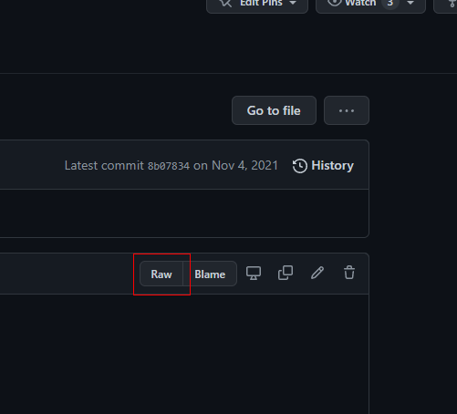
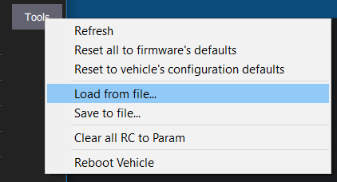

After configuring the AVR software on your Jetson,
you need to also load custom parameters into your flight controller as well.
These settings configure how the flight controller processes sensor input,
and we need to tell it to unconditionally trust the data the AVR software feeds it.

First, download this parameter file from GitHub:
[https://github.com/bellflight/AVR-2022/blob/main/PX4/Params/AVR2022Params.params](https://github.com/bellflight/AVR-2022/blob/main/PX4/Params/AVR2022Params.params)

The easiest way to download the file is to click the "Raw" button,
then right-click the page, and select "Save page as".

Like flashing the flight controller firmware, you'll need to plug in the FC
to your computer with the MicroUSB cable.

Now, open QGroundControl, click the "Q" in the top left, then
"Vehicle Setup" then "Parameters" at the bottom of the list.

Click on "Tools" in the top right then select "Load from file..."
and select the AVR parameter file you downloaded.

Then click "Ok" to load the parameters.

Then click "Ok" a bunch of times as QGroundControl informs
you that many parameter changes requires a vehicle reboot.

Then go back to "Tools" and select "Reboot Vehicle" at the
bottom of the list to restart the flight controller for the parameters to take effect.
