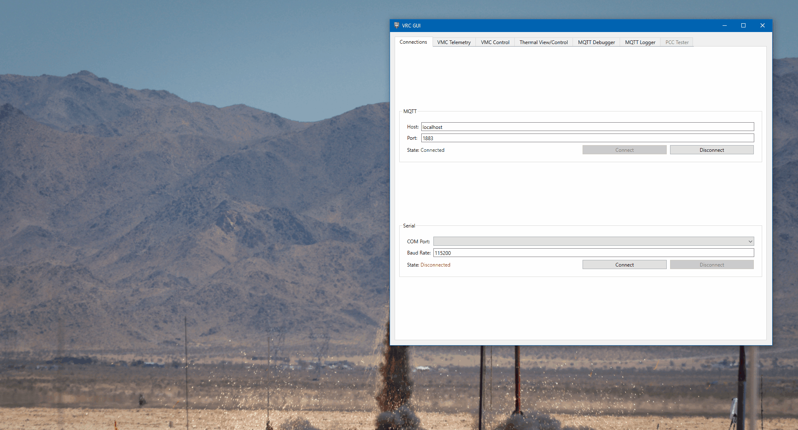
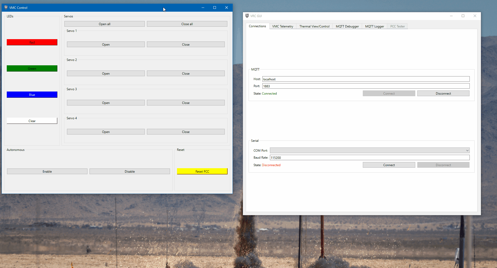
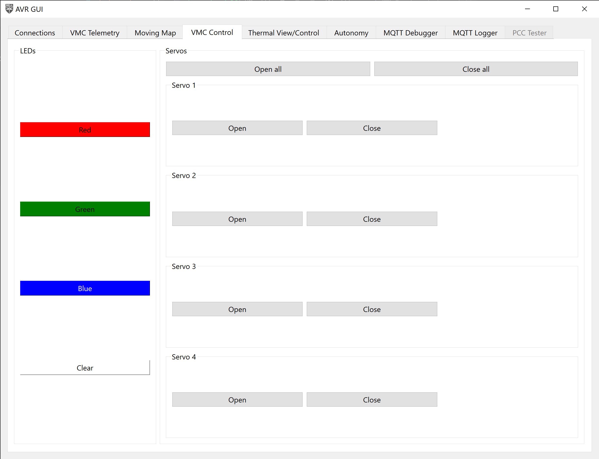
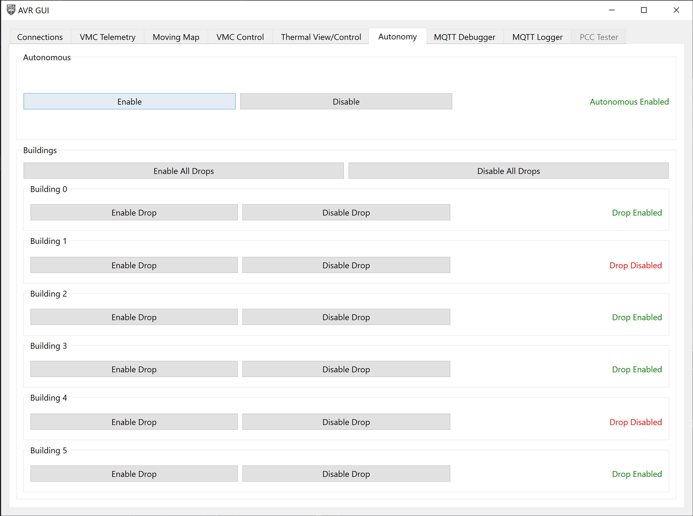
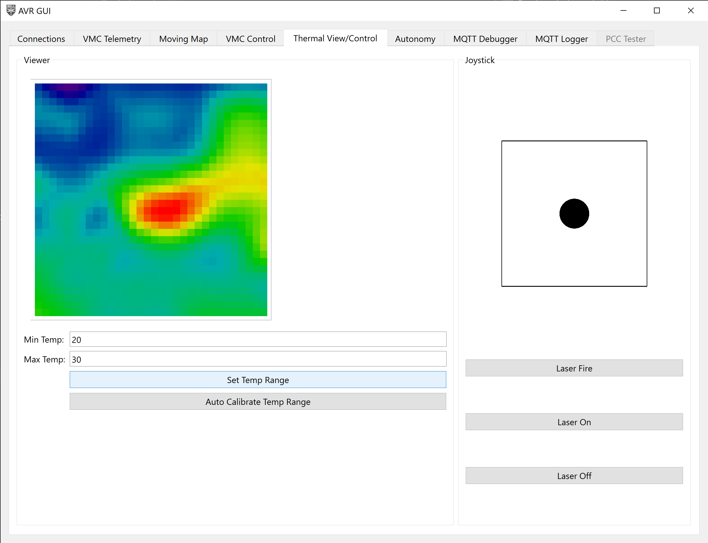
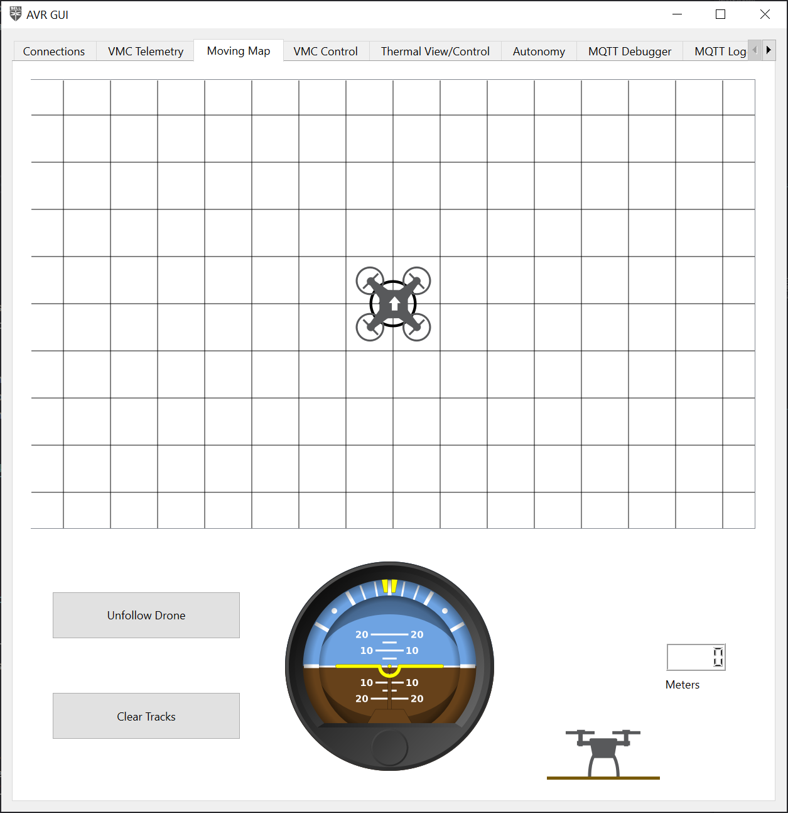
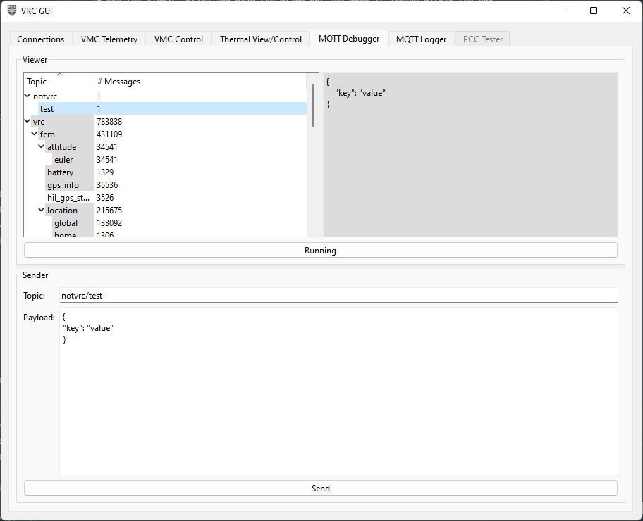
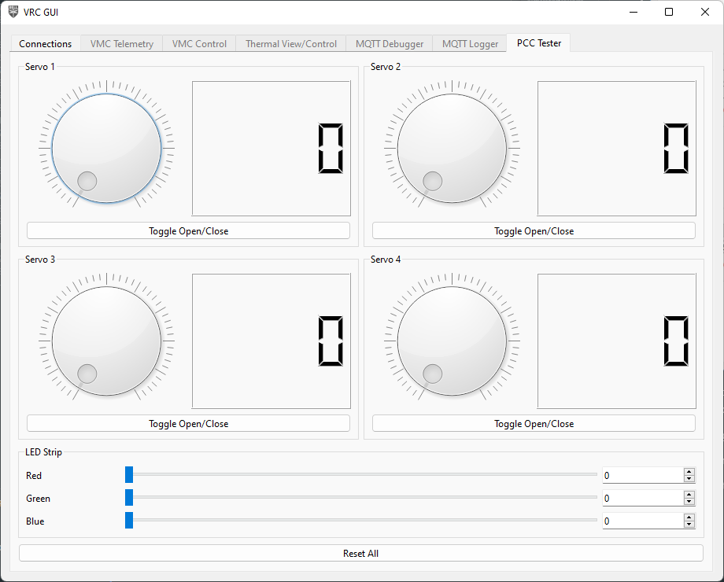

## Setup

You should have already setup the AVR GUI when testing your PCC
[here]().

## Usage

Open the application. You'll be brought to the Connections tab.
After starting the AVR software on your Jetson, put in the Jetson's
IP address under the "MQTT" section. Leave the port as is.


Click "Connect", and make sure the application properly connects.


If the application is unable to connect to your drone, the state will show as
"Failure". Make sure the software is running, and you got the IP address correct.

After the application connects, all the VMC-related tabs will become enabled.

## Tabs

The functionality of the application is broken up into multiple tabs. These
tabs are automatically enabled/disabled based on the connectivity currently
available. These tabs can be re-ordered as desired. Additionally,
the tabs can be popped out into separate windows to create a multi-pane
view, either by double clicking the tab, or right-clicking and selecting "Pop out".



To reattach a tab, just close the window.



### VMC Telemetry


This tab is a sort of QGroundControl "Lite" that shows the most important
telemetry information from the drone. This is **NOT** a full replacement for
QGroundControl, but quick view of important information while your drone is flying.

At the top is the status of the flight controller, with information about
the current GPS fix, battery level and voltage, armed status, and selected
flight mode.

In the middle is the current location of the drone in local and global coordinates,
along with the current attitude of the drone in roll, pitch, yaw.

Finally, at the bottom is a display of the status of the software modules
required for stabilized flight and April Tag detection. These indicators will
turn green once MQTT messages are received from a module, and will
turn red if more than a second has elapsed since the last received message.


If all 4 indicators are green, you are good to fly!

### VMC Control



This tab allows you to control various aspects of the drone, including the
LEDs, and servos connected to the PCC.

Click the individual open/close buttons to open/close individual servos, or click
the open/close all buttons at the top of open/close all of the servos at once.

Click the color buttons to change the color of the LEDs
to one of the presets (red, green, blue). The "clear" button at the bottom
turns off the LEDs.

### Autonomy Control



#### Autonomous Enable

The "Autonomous" buttons in the tab,
this is purely optional for the teams that have chosen to write autonomous code.
These buttons send a message to the MQTT topic `avr/autonomous` with a payload of:

```json
// enable button
{
    "enable": true,
}

// disable button
{
    "enable": false,
}
```

For any teams writing their own autonomous code,
they can write a listener for this topic to enable/disable their
autonomous code at certain points, rather than have it run continuously
the entire time.

Example implementation:

```python
from bell.avr.mqtt.client import MQTTModule
from bell.avr.mqtt.payloads import AvrAutonomousPayload

class Sandbox(MQTTModule):
    def __init__(self) -> None:
        self.enabled = False
        self.topic_map = {"avr/autonomous": self.on_autonomous_message}

    ...

    def on_autonomous_message(self, payload: AvrAutonomousPayload) -> None:
        self.enabled = payload["enable"]

    def autonomous_code(self) -> None:
        while self.enabled:
            do_stuff()
```

#### Building Autonomous Enable Drop

Additionally, buttons for enabling/disabling autonomous water drops are provided on this
page.
These buttons send a message to the MQTT topic `avr/autonomous/building/drop` with
a payload of:

```json
{
  "id": 0,
  "enabled": true
}
```

This message can be used to tell you drone what buildings are on fire and if you want to
drop water on it or not. For a full list of which buildings have water drops please
refer to the game manual. The activity of using the `avr/autonomous/building/drop`
will be implemented by the students in the sadbox module.
[Hint: the above example can also be used in this scenario]

### Thermal View/Control



This tab shows a view of the thermal camera, and provides a means of
controlling the gimbal and turning the associated laser on and off.

You can either calibrate your thermal cameras range manual by typing in a min and max
value, or you can use the auto calibrate feature to get a dynamic range.

To use the gimbal, click and drag the black dot and move it around within the box.
The bounds of the box are the gimbal's limit.

### Moving Map



A map of your drones movements has been included for reference while flying.
You can use this to reference your location, roll, pitch, yaw, or altitude.

### MQTT Debugger


This tab is a debugging tool that shows all MQTT messages
that are passing through the AVR software, along with giving
you the ability to manually send messages.

In the top half of the tab is the message viewer. On the left side
is a tree view of all the topics with the levels deonting "/"s in the topic name.
When you click on a topic, on the right side will show the last payload recieved
on that topic, and will update live.


To show or hide topics, click the arrow on the left of the trip item to expand or hide
the next level, or right-click the topic and select
"Expand Children" or "Collapse Children". To expand or collapse everything, select
"Expand All" or "Collapse All".


At the bottom of the viewer is a "Running"/"Paused" button that will cause the
viewer to update live, or freeze the current view. This is not associated with the
MQTT connection in the Connections tabs. This only stops the viewer from updating
when trying to look at data.


In the bottom half of the tab is the message sender. You can put in the topic
you want to send a message to and the payload of the message. Click the "Send"
button at the bottom to send the message, and you will see it show up above
in the message viewer.



{}
Send MQTT messages at your own risk! This is a debugging tool,
and incorrectly formatted messages, or messages with bogus data
may cause the flight software to crash, digitially and/or physically.
{}

If you want to copy an existing message, right-click on an item in the message
viewer and select "Preload data". This will prefill the topic and payload
of the message into the message sender.


Alternatively, you can select "Copy Topic" or "Copy Payload" to copy the topic
or payload to your clipboard.

### MQTT Logger


This tab is another debugging tool, that can be used to create
a log of MQTT data that can be analyzed at a later time.

Clicking the "Record" button at the bottom
will create a folder called "logs" next to the `.exe` and create a new
log file with the starting timestamp in the name. The log file is just a `.csv` file
with 3 columns:

1. Timestamp that the message was sent
2. Topic of the message
3. Payload of the message (JSON data as a string)

Short example:

```csv
Timestamp,Topic,Payload
2022-05-15T16:05:21.861220,avr/fcm/location/local,"{""dX"": -2.5455074310302734, ""dY"": -1.5015729665756226, ""dZ"": 2.0492169857025146, ""timestamp"": ""2022-05-15T18:43:51.529153""}"
2022-05-15T16:05:21.865960,avr/fcm/attitude/euler,"{""roll"": 0.3597148656845093, ""pitch"": -1.1968730688095093, ""yaw"": -115.29061126708984, ""timestamp"": ""2022-05-15T18:43:51.533150""}"
2022-05-15T16:05:21.867091,avr/fcm/location/global,"{""lat"": 32.8085261, ""lon"": -97.1563602, ""alt"": -0.1720000058412552, ""hdg"": -6245.665443087664, ""timestamp"": ""2022-05-15T18:43:51.534187""}"
2022-05-15T16:05:21.867533,avr/fcm/velocity,"{""vX"": 0.009999999776482582, ""vY"": 0.0, ""vZ"": -0.009999999776482582, ""timestamp"": ""2022-05-15T18:43:51.535720""}"
2022-05-15T16:05:21.886569,avr/fusion/hil_gps,"{""time_usec"": 1652640231557357, ""fix_type"": 3, ""lat"": 328085260, ""lon"": -971563603, ""alt"": 165206, ""eph"": 20, ""epv"": 5, ""vel"": 0, ""vn"": 0, ""ve"": 0, ""vd"": 0, ""cog"": 24600, ""satellites_visible"": 13, ""heading"": 24638}"
2022-05-15T16:05:21.890844,avr/fcm/location/global,"{""lat"": 32.8085261, ""lon"": -97.1563602, ""alt"": -0.1720000058412552, ""hdg"": -6245.528183606103, ""timestamp"": ""2022-05-15T18:43:51.557302""}"
2022-05-15T16:05:21.891264,avr/fcm/velocity,"{""vX"": 0.009999999776482582, ""vY"": 0.0, ""vZ"": -0.009999999776482582, ""timestamp"": ""2022-05-15T18:43:51.560023""}"
2022-05-15T16:05:21.901353,avr/fcm/location/local,"{""dX"": -2.5456197261810303, ""dY"": -1.5016621351242065, ""dZ"": 2.049142837524414, ""timestamp"": ""2022-05-15T18:43:51.571278""}"
2022-05-15T16:05:21.909915,avr/vio/position/ned,"{""n"": -254.60606976676002, ""e"": -143.7991712686676, ""d"": -370.6543833582757}"
2022-05-15T16:05:21.913765,avr/vio/orientation/eul,"{""psi"": -2.870100228693062, ""theta"": 0.7509557925331154, ""phi"": -1.982899257543946}"
2022-05-15T16:05:21.914391,avr/fusion/position/ned,"{""n"": -254.60606976676002, ""e"": -143.7991712686676, ""d"": -370.6543833582757}"
2022-05-15T16:05:21.914799,avr/vio/heading,"{""degrees"": 246.38824134310744}"
2022-05-15T16:05:21.915277,avr/vio/velocity/ned,"{""n"": 0.006583199572207324, ""e"": -0.020817144593196127, ""d"": 0.02579902535054221}"
2022-05-15T16:05:21.915846,avr/vio/confidence,"{""tracker"": 41}"
```

To stop recording, click the "Stop recording" button. This will stop writing to the
log file.

You can do a lot of things with this data. For example,
you can plot how your drone flew through 3D space using
`matplotlib` and `pandas`:

```python
import json

import matplotlib.pyplot as plt
import pandas as pd

# load in the CSV file
df = pd.read_csv("MQTTLog_2022-05-10_17-08-27.csv")
# parse the JSON data into the Pandas dataframe
df = df.join(df["Payload"].apply(json.loads).apply(pd.Series))
# filter to only data from the avr/fcm/location/global topic
px4_data = df[df["Topic"] == "avr/fcm/location/global"]

fig = plt.figure()
ax = plt.axes(projection='3d')

ax.plot3D(px4_data["lat"], px4_data["lon"], px4_data["alt"], label="PX4")

ax.set_xlabel("Latitude")
ax.set_xlabel("Longitude")
ax.set_zlabel("Altitude")

plt.legend()
plt.show()
```


Another example is plotting the drone's battery remaining over time:

```python
import csv
import datetime
import json

import matplotlib.pyplot as plt

filename = "MQTTLog_2022-05-15_16-05-21.csv"

x = []
y = []

with open(filename, "r") as fp:
    # create a DictReader to read the CSV file
    reader = csv.DictReader(fp)
    for row in reader:
        # only get data from the avr/fcm/battery topic
        if row["Topic"] == "avr/fcm/battery":
            # parse the JSON data
            payload = json.loads(row["Message"])

            # convert the timestamp to a Python datetime object
            x.append(datetime.datetime.fromisoformat(row["Timestamp"]))
            y.append(payload["soc"])

fig = plt.figure()

plt.plot(x, y)

plt.xlabel("Time")
plt.ylabel("Battery %")

plt.ylim(0, 105)
plt.grid(True)

plt.show()
```


### PCC Tester



This is covered when
[testing the PCC]()
